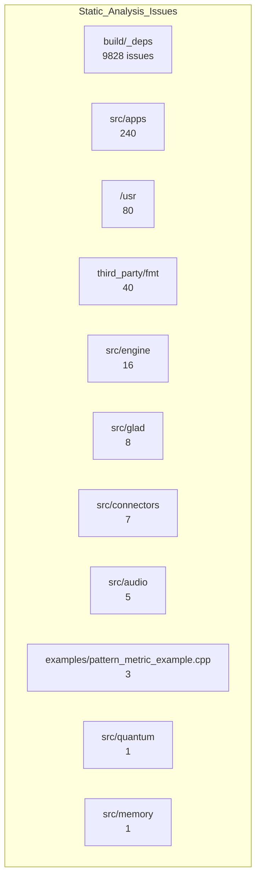

# Diagnostic Issue Map

```mermaid
graph TD
    subgraph Static_Analysis_Issues
        A["build/_deps\n9828 issues"]
        B["src/apps\n240"]
        C["/usr\n80"]
        D["third_party/fmt\n40"]
        E["src/engine\n16"]
        F["src/glad\n8"]
        G["src/connectors\n7"]
        H["src/audio\n5"]
        I["examples/pattern_metric_example.cpp\n3"]
        J["src/quantum\n1"]
        K["src/memory\n1"]
    end
```
