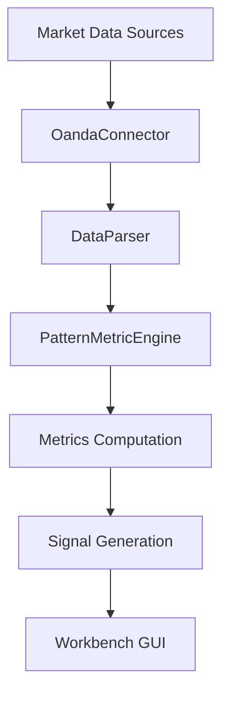

# SEP Engine Data Pipeline

```mermaid
graph TD
    MD[Market Data Sources] --> OC[OandaConnector]
    OC --> DP[DataParser]
    DP --> PME[PatternMetricEngine]
    PME --> MC[Metrics Computation]
    MC --> SG[Signal Generation]
    SG --> GUI[Workbench GUI]
```
