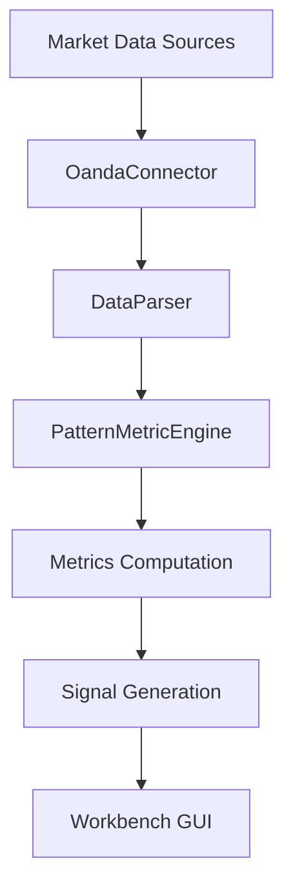

# SEP Engine Data Pipeline

## Testbed Promotion Workflow

Experimental components start in `_sep/testbed/`. Once validated by tests and
benchmarks, they are moved to `src/` for full integration with the main engine.
