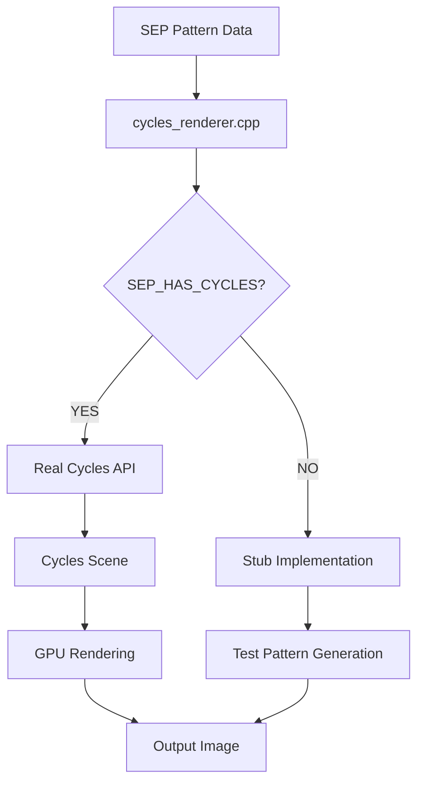

# SEP Cycles Integration

## Current State (January 2025)

The SEP project has a partially implemented Cycles integration that needs to be completed. This document outlines the current state, issues, and path forward.

### What Exists

1. **Cycles Source**: Located in `extern/cycles/` 
2. **Build Configuration**: `cmake/FindCycles.cmake` attempts to build Cycles standalone
3. **Renderer Implementation**: `src/blender/cycles_renderer.cpp` with pattern-to-render pipeline
4. **Header Stubs**: `include/compat/cycles.h` provides mock classes (needs replacement)

### Current Issues

1. **Stub Classes**: The project uses mock Cycles classes instead of real API
2. **No Library Linking**: FindCycles.cmake builds Cycles but doesn't properly link it
3. **Missing Dependencies**: Several Cycles dependencies need proper configuration
4. **Blender Module Disabled**: `SEP_HAS_BLENDER=0` in CMakeLists.txt

## Integration Architecture

### Pattern-Driven Rendering Pipeline



### Key Components

1. **CyclesRenderer Class** (`include/blender/cycles_renderer.h`)
   - Pattern-to-scene conversion
   - Render parameter management
   - Scene updates based on pattern evolution

2. **Pattern Bridge** (`include/blender/pattern_bridge.h`)
   - Converts SEP patterns to renderable geometry
   - Manages pattern-material relationships

3. **Cycles Compatibility** (`include/compat/cycles.h`)
   - Currently: Mock implementations
   - Target: Real Cycles API headers

## Required Dependencies

From `setup_cycles_env_fixed.sh` and `FindCycles.cmake`:

### System Packages (via dnf)
```bash
# Core dependencies
python3-devel
boost-devel
tbb-devel
OpenImageIO-devel
OpenColorIO-devel
OpenEXR-devel
OpenSubdiv-devel
OpenShadingLanguage-devel
embree-devel
openvdb-devel

# Additional libraries
glog-devel
gflags-devel
pugixml-devel
yaml-cpp-devel
jemalloc-devel
```

### Build Configuration Issues

1. **OptiX Path**: `/sep/extern/optix-dev` (needs OptiX SDK)
2. **Library Paths**: Many hardcoded to `/usr/lib64/`
3. **Python Version**: Hardcoded to 3.11

## Action Items

### 1. Fix Cycles Header Integration
Replace stub classes in `include/compat/cycles.h` with proper includes:

```cpp
// Instead of mock classes, include real Cycles headers
#include <scene/scene.h>
#include <session/session.h>
#include <scene/camera.h>
#include <scene/mesh.h>
```

### 2. Update FindCycles.cmake
- Fix library linking after build
- Add proper include directories
- Handle build artifacts correctly

### 3. Implement Real Cycles API Usage
Update `cycles_renderer.cpp` to use actual Cycles API:

```cpp
// Real implementation example
void CyclesRenderer::createSceneFromPatterns() {
    ccl::Scene* scene = new ccl::Scene(scene_params);
    
    // Convert patterns to geometry
    for (const auto& pattern : patterns) {
        ccl::Mesh* mesh = scene->create_node<ccl::Mesh>();
        // Pattern-driven mesh generation
        convertPatternToMesh(pattern, mesh);
    }
    
    // Set up camera from pattern coherence
    ccl::Camera* cam = scene->camera;
    setupCameraFromPatterns(cam, patterns);
}
```

### 4. Enable Blender Module
In `CMakeLists.txt`:
```cmake
set(SEP_HAS_BLENDER 1)  # Currently 0
```

### 5. Pattern Visualization Features

Priority features for pattern-driven rendering:

1. **Coherence Mapping**: Map pattern coherence to material properties
2. **Stability Visualization**: Use particle systems for unstable patterns  
3. **Entropy Effects**: Apply volumetric shaders based on entropy
4. **Temporal Evolution**: Animate scenes based on pattern evolution

## Build Commands

```bash
# Clean build with Cycles
rm -rf cycles-build cycles-install
mkdir build && cd build
cmake .. -DSEP_HAS_CYCLES=1
make -j$(nproc)

# Test Cycles integration
./sep_engine --test-cycles-render
```

## Testing Strategy

1. **Unit Tests**: Test pattern-to-scene conversion
2. **Integration Tests**: Verify Cycles library calls
3. **Render Tests**: Compare output images
4. **Performance Tests**: GPU utilization metrics

## Future Enhancements

1. **Real-time Preview**: Live pattern visualization
2. **Distributed Rendering**: Multi-GPU support
3. **AI Denoising**: Pattern-aware denoising
4. **Material Library**: Pattern-driven procedural materials