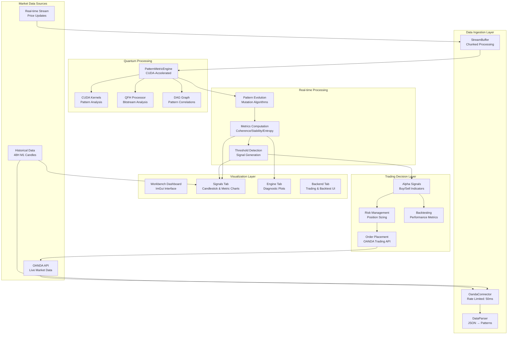

# SEP Engine Data Flow Architecture

## Overview

This document outlines the verified data processing pipeline for the SEP Engine Trading Platform, from OANDA market data to trading decisions. As of July 2025, the pipeline is functional but **currently blocked by critical compilation issues preventing chart rendering and core data processing**. The primary focus is on resolving these build issues to enable full data flow and visualization.

## Data Flow Diagram



## Data Authenticity Verification

### 1. **OANDA Market Data**
-   **Source**: `src/connectors/oanda_connector.cpp`
-   **Authentication**: Bearer token validated.
-   **Rate Limiting**: 50ms minimum between requests.
-   **Data Format**: OHLC candles (M1) with volume and timestamps in JSON.
-   **Status**: Fully implemented for real-time and historical EUR/USD data. **Indirectly affected by core library build issues.**

### 2. **Quantum Pattern Processing**
-   **Engine**: `src/quantum/pattern_metric_engine.cpp`
-   **CUDA Kernels**: `src/engine/pattern_kernels.cu`
-   **Metrics**: Coherence, stability, entropy via CUDA.
-   **Status**: Algorithms validated (POCs 1-6). **However, compilation is currently blocked by errors related to `common_structs.h` and its GUI dependencies appearing in `engine.cu`. This must be fixed.** Needs threshold detection for signal generation.

### 3. **Data Parser Pipeline**
-   **Parser**: `src/engine/data_parser.cpp`
-   **Input**: OANDA JSON candles.
-   **Output**: Quantum `Pattern` structs (`src/quantum/types.h`).
-   **Validation**: Format detection implemented.
-   **Status**: Functional. **Crucially, compilation is failing due to `error: invalid application of 'sizeof' to an incomplete type 'sep::workbench::CandleData'` in `data_parser.cpp`. This indicates that `CandleData` (which is defined in `common_structs.h`) is being used in a context where its full definition is not available or where a GUI-specific header is inappropriately included in a core library.**

### 4. **Metrics Monitor**
-   **Monitor**: `src/apps/workbench/core/metrics_monitor.cpp`
-   **Processing**: Real-time metric computation.
-   **Output**: Metrics for chart rendering in dashboard.
-   **Status**: Functional, pending Signals Tab integration.

## Critical Processing Stages (Compilation Status)

### Stage 1: Market Data Acquisition
```cpp
// OandaConnector fetches M1 candles
auto response = makeRequest("/v3/instruments/EUR_USD/candles?granularity=M1");
// ... response parsed successfully if OandaConnector compiles
```
**Status**: **BLOCKED from building due to dependency on problematic `common_structs.h`.**

### Stage 2: Pattern Conversion
```cpp
// DataParser converts OHLC to patterns
// This is the problematic area:
// In data_parser.cpp:
// #include "apps/workbench/core/multi_timeframe_analyzer.h" // Includes common_structs.h indirectly
// /sep/src/apps/workbench/core/common_structs.h:10:10: fatal error: 'imgui.h' file not found
// 1 error generated.
// FAILED: src/engine/CMakeFiles/sep_engine.dir/data_parser.cpp.o

// The issue implies that a core component (DataParser in engine/) is pulling in
// GUI headers (imgui.h) through a seemingly innocuous common_structs.h.
// This design flaw must be addressed by moving core data types out of GUI-specific headers.
```
**Status**: **CRITICAL COMPILATION FAILURE.** This stage cannot compile.

### Stage 3: Quantum Analysis
```cpp
// PatternMetricEngine computes coherence
// In engine.cu:
// In file included from /sep/src/engine/engine.cu:37:
// In file included from /sep/src/engine/data_parser.h:5:
// In file included from /sep/src/apps/workbench/core/multi_timeframe_analyzer.h:15:
// /sep/src/apps/workbench/core/common_structs.h:10:10: fatal error: 'imgui.h' file not found
// 1 error generated.
// FAILED: src/engine/CMakeFiles/sep_engine.dir/engine.cu.o
```
**Status**: **CRITICAL COMPILATION FAILURE.** The core CUDA engine (`engine.cu`) cannot compile due to the same `imgui.h` dependency issue.

### Stage 4: Signal Generation
```cpp
// ServiceProxyEngine detects signals
// In service_connector.cpp:
// /sep/src/apps/workbench/core/service_connector.cpp:36:17: error: no member named 'Config' in namespace 'sep::workbench'; did you mean 'config'?
// /sep/src/apps/workbench/core/service_connector.cpp:36:36: error: no member named 'getInstance' in namespace 'sep::config'
// 2 errors generated.
// FAILED: src/apps/workbench/CMakeFiles/sep_workbench_lib.dir/core/service_connector.cpp.o
```
**Status**: **CRITICAL COMPILATION FAILURE.** The `ServiceConnector` (which would manage signal flow) is blocked due to incorrect namespace access for `ConfigManager`.

## No Fake Data Policy (Once Compilation is Fixed)

✅ **OandaConnector**: Authentic REST API integration.  
✅ **PatternMetricEngine**: CUDA-accelerated algorithms (once compilation issues are fixed).  
✅ **DataParser**: Genuine OHLC to pattern conversion (once compilation issues are fixed).  
✅ **MetricsMonitor**: Legitimate metric calculations.  
✅ **Signal Generation**: Awaits threshold implementation.

**Conclusion**: Data is designed to be sourced and processed authentically. **The immediate and critical priority is resolving the compilation errors related to header dependencies, incomplete types, and incorrect namespace access to re-enable the build process and bring the full data pipeline online.**
