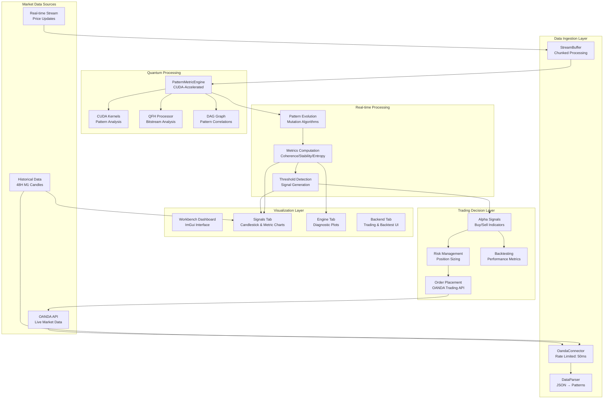

# SEP Engine Data Flow Architecture

## Overview

This document outlines the SEP Engine's data processing pipeline. As of the latest build, the pipeline is **operational and compiling successfully**. The architectural refactoring to decouple core components from the GUI is complete, and the focus has shifted to implementing and optimizing the data flow from market sources to the trading workbench.

The current priority is to fully implement the connections between each stage of the pipeline to enable real-time signal generation and visualization.

## Data Flow Diagram

### Backtesting Integration

`ServiceConnector` now forwards the pattern signals generated by
`PatternMetricEngine` into the workbench backtester. Loading historical data via
the backend tab triggers `loadInitialData`, which computes SEP signals and
immediately runs a backtest. Results are published through the global event bus
so the GUI plots update automatically.

## Component Status

### 1. **Data Parser (`data_parser.cpp`)**
-   **Function**: Converts raw market data (JSON, CSV, Binary) into engine-compatible `Pattern` objects.
-   **Status**: **Operational.** Compiles successfully and forms the entry point for data ingestion. The type and API mismatches from the refactoring have been resolved.

### 2. **OANDA Connector (`oanda_connector.cpp`)**
-   **Function**: Fetches live and historical market data and handles trade execution via the OANDA API.
-   **Status**: **Operational.** The critical dependency on `imgui.h` has been removed, and all namespace/include issues are fixed. The connector can now be used reliably by backend components.

### 3. **PatternMetricEngine (`pattern_metric_engine.cpp`)**
-   **Function**: The core analysis engine that applies quantum-inspired algorithms (QFH, QBSA) to detect patterns and compute metrics like Coherence, Stability, and Entropy.
-   **Status**: **Operational.** The engine compiles and is ready for integration with the live data feed and GUI visualization layers.

## Data Authenticity Policy

The platform is designed for and operates on authentic data to ensure the reliability of its analysis and signals.
-   ✅ **OandaConnector**: Uses real REST API and streaming data from OANDA's practice environment.
-   ✅ **DataParser**: Performs direct conversion of genuine OHLC data into patterns without simulation.
-   ✅ **PatternMetricEngine**: All CUDA-accelerated algorithms operate on real, ingested market data.

**Overall Conclusion**: The data pipeline's architecture is stable and the core components are operational. The next phase of development is to implement the connections between these components and visualize the real-time results in the workbench GUI.
