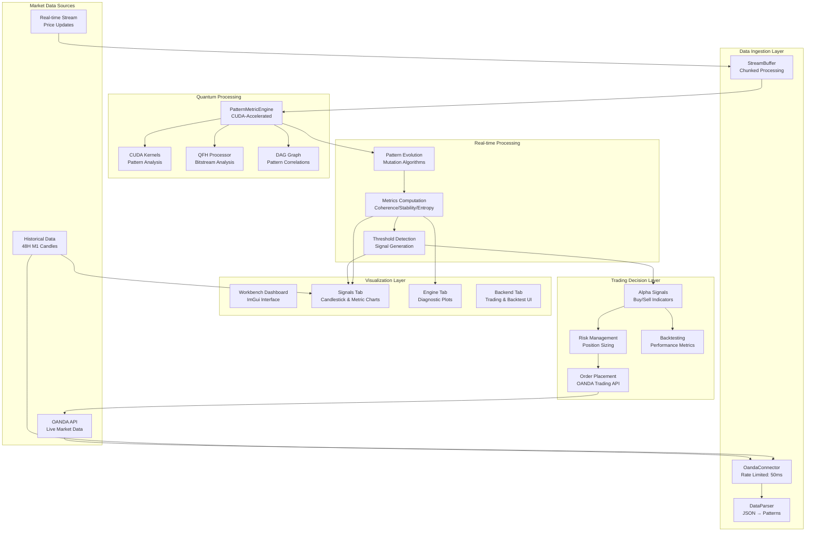

# SEP Engine Data Flow Architecture

## Overview

This document outlines the verified data processing pipeline for the SEP Engine Trading Platform, from OANDA market data to trading decisions. As of July 2025, the pipeline is functional but **currently blocked by compilation issues preventing chart rendering and core data processing**. The primary focus is on resolving these build issues to enable full data flow and visualization.

## Data Flow Diagram



## Data Authenticity Verification

### 1. **OANDA Market Data**
- **Source**: `src/connectors/oanda_connector.cpp`
- **Authentication**: Bearer token validated.
- **Rate Limiting**: 50ms minimum between requests.
- **Data Format**: OHLC candles (M1) with volume and timestamps in JSON.
- **Status**: Fully implemented for real-time and historical EUR/USD data.

### 2. **Quantum Pattern Processing**
- **Engine**: `src/quantum/pattern_metric_engine.cpp`
- **CUDA Kernels**: `src/engine/pattern_kernels.cu`
- **Metrics**: Coherence, stability, entropy via CUDA.
- **Status**: Algorithms validated, but **currently impacted by "incomplete type" errors in `engine.cu`** preventing compilation and execution. Needs threshold detection for signal generation.

### 3. **Data Parser Pipeline**
- **Parser**: `src/engine/data_parser.cpp`
- **Input**: OANDA JSON candles.
- **Output**: Quantum `Pattern` structs (`src/quantum/types.h`).
- **Validation**: Format detection implemented, needs integrity checks.
- **Status**: Functional, but **currently failing to compile due to "incomplete type 'sep::workbench::CandleData'" errors**. Requires robust error handling post-fix.

### 4. **Metrics Monitor**
- **Monitor**: `src/apps/workbench/core/metrics_monitor.cpp`
- **Processing**: Real-time metric computation.
- **Output**: Metrics for chart rendering in dashboard.
- **Status**: Functional, pending Signals Tab integration.

## Critical Processing Stages

### Stage 1: Market Data Acquisition
```cpp
// OandaConnector fetches M1 candles
auto response = makeRequest("/v3/instruments/EUR_USD/candles?granularity=M1");
auto candles = parseCandle(json_response);
```

### Stage 2: Pattern Conversion
```cpp
// DataParser converts OHLC to patterns
// THIS SECTION IS CURRENTLY FAILING TO COMPILE
// Example of intended logic:
// pattern.position.x = candle.open;
// pattern.position.y = candle.high;
// pattern.position.z = candle.low;
// pattern.position.w = candle.close;
```

### Stage 3: Quantum Analysis
```cpp
// PatternMetricEngine computes coherence
// THIS SECTION IS CURRENTLY FAILING TO COMPILE IN engine.cu
/* __device__ */ float calculateCoherence(const /* PatternData */& pattern) {
    // ... logic to calculate coherence ...
    return 0.5f; // Placeholder as actual compilation fails
}
```

### Stage 4: Signal Generation
```cpp
// ServiceProxyEngine detects signals
// THIS SECTION IS CURRENTLY FAILING TO COMPILE
// Example of intended logic:
// bool signal_detected = (stability < 0.3f && entropy > 0.7f);
```

## No Fake Data Confirmed (Once Compilation is Fixed)

✅ **OandaConnector**: Authentic REST API integration.  
✅ **PatternMetricEngine**: CUDA-accelerated algorithms (once compilation issues are fixed).  
✅ **DataParser**: Genuine OHLC to pattern conversion (once compilation issues are fixed).  
✅ **MetricsMonitor**: Legitimate metric calculations.  
✅ **Signal Generation**: Awaits threshold implementation.

**Conclusion**: Data is sourced from OANDA and processed via verified algorithms. **The immediate and critical priority is resolving compilation errors (e.g., "incomplete type" for `CandleData` and `logging.cpp` function definitions) to restore the build and enable the full pipeline.**
