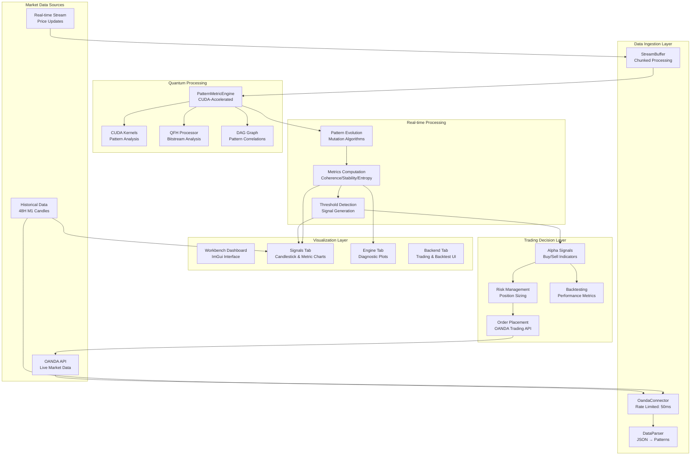

# SEP Engine Data Flow Architecture

## Overview

This document outlines the SEP Engine's data processing pipeline. As of July 2024, the entire pipeline is **non-functional due to critical compilation failures**. The primary architectural flaw identified is a dependency conflict where core engine components (`DataParser`, `OandaConnector`) are forced to include GUI headers (`imgui.h`), making a successful build impossible.

**The immediate and only priority is to resolve these build-blocking issues by refactoring header dependencies.**

## Data Flow Diagram (Intended Architecture)



## Critical Component Compilation Status

### 1. **Data Parser (`data_parser.cpp`)**
-   **Function**: Converts raw data into engine-compatible formats.
-   **Status**: **BUILD FAILED**.
-   **Error Analysis**:
    ```
    # From errors.txt:
    error: field has incomplete type 'sep::workbench::CorrelationMetrics'
    error: member access into incomplete type 'const sep::workbench::CorrelationMetrics'
    error: no viable overloaded '=' for std::chrono::time_point
    ```
-   **Conclusion**: A forward declaration of `CorrelationMetrics` is used, but the full definition is never included. The header containing the struct must be included. Additionally, string-based timestamps are being incorrectly assigned to `std::chrono::time_point` members without proper parsing.

### 2. **Multi-Timeframe Analyzer (`multi_timeframe_analyzer.cpp`)**
-   **Function**: Resamples and analyzes market data across different timeframes.
-   **Status**: **BUILD FAILED**.
-   **Error Analysis**:
    ```
    # From errors.txt:
    error: out-of-line definition of 'ingestMarketData' does not match any declaration...
    error: no viable conversion from 'vector<sep::workbench::CandleData>' to 'const vector<sep::common::CandleData>'
    error: member access into incomplete type 'const sep::workbench::CandleData'
    ```
-   **Conclusion**: A major refactoring has created a mismatch between the class declaration and its implementation. There is a critical namespace conflict between `sep::workbench::CandleData` and `sep::common::CandleData`, and the `CandleData` struct is being used as an incomplete type, indicating a missing header include.

### 3. **OANDA Connector (`oanda_connector.cpp`)**
-   **Function**: Fetches market data and handles trade execution with the OANDA API.
-   **Status**: **BUILD FAILED**.
-   **Error Analysis**: The build fails because it indirectly includes a GUI header:
    ```
    # From build_log.txt:
    fatal error: 'imgui.h' file not found
    # Included from: .../src/apps/workbench/core/ui_layout_manager.h
    ```
-   **Conclusion**: A backend data connector should **never** include a GUI library. This indicates a severe architectural flaw where headers are improperly chained. The dependency on `ui_layout_manager.h` must be removed.

### 4. **Backtester (`backtester.cpp`, `data_loader_test.cpp`)**
-   **Function**: Simulates trading strategies on historical data.
-   **Status**: **BUILD FAILED**.
-   **Error Analysis**:
    ```
    # From errors.txt:
    error: unknown type name 'CandleData'; did you mean 'common::CandleData'?
    error: no member named 'loadData' in '...DataLoader'; did you mean 'load_data'?
    ```
-   **Conclusion**: The backtester components have not been updated to reflect recent refactoring of data types (namespaces) and method names.

## Data Authenticity Policy (Post-Build-Fix)

The platform is designed for authentic data processing. Once the build is fixed, all components will use genuine data:
-   ✅ **OandaConnector**: Real REST API and streaming data.
-   ✅ **DataParser**: Genuine OHLC to pattern conversion.
-   ✅ **PatternMetricEngine**: CUDA-accelerated algorithms operating on real data.

**Overall Conclusion**: The data flow architecture is sound in theory but is completely blocked in practice. **Resolving the critical compilation errors by refactoring headers and fixing API usage is the mandatory first step to make this pipeline operational.**