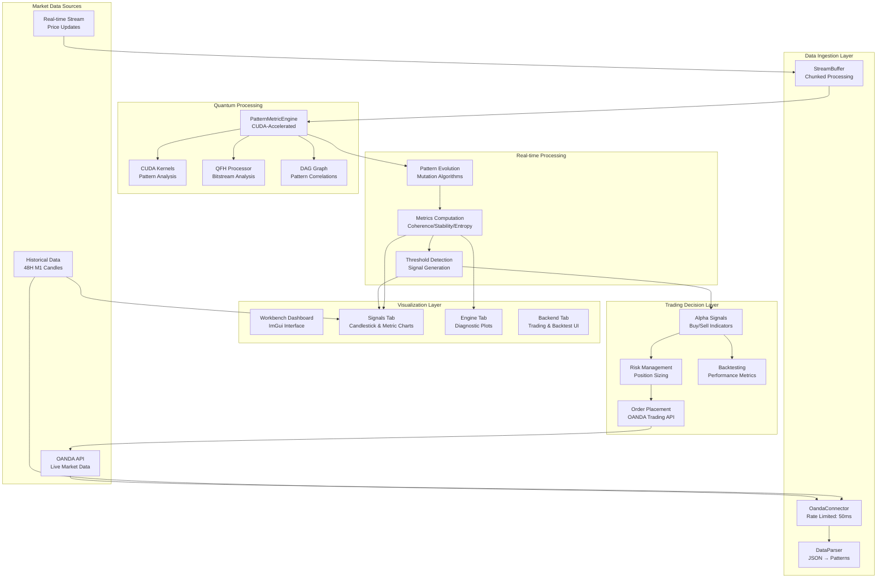

# SEP Engine Data Flow Architecture

## Overview

This document outlines the SEP Engine's data processing pipeline. As of July 2024, the pipeline is **non-functional due to compilation failures that arose after a major architectural refactoring.** The previous critical issue where core engine components depended on GUI headers has been resolved. The current blockers are type mismatches, API inconsistencies, and namespace errors resulting from this refactoring.

**The immediate priority is to resolve these new build-blocking issues to make the data pipeline operational.**

## Data Flow Diagram (Intended Architecture)



## Critical Component Compilation Status

### 1. **Data Parser (`data_parser.cpp`)**
-   **Function**: Converts raw data into engine-compatible formats.
-   **Status**: **BUILD FAILED**.
-   **Error Analysis**:
    ```
    # From errors.txt:
    error: assigning to 'uint64_t' from incompatible type 'std::chrono::system_clock::time_point'
    error: no member named 'parseTimestamp' in namespace 'sep::common'
    error: no member named 'coherence_pearson' in 'sep::common::CorrelationMetrics'
    ```
-   **Conclusion**: The refactoring introduced a major type mismatch for timestamps. `std::chrono::time_point` objects must be converted to a `uint64_t` representation before assignment. The `CorrelationMetrics` struct and timestamp parsing utility have also been changed, requiring updates at all call sites.

### 2. **OANDA Connector (`oanda_connector.cpp`)**
-   **Function**: Fetches market data and handles trade execution with the OANDA API.
-   **Status**: **BUILD FAILED**.
-   **Error Analysis**:
    ```
    # From errors.txt:
    error: unknown type name 'OrderInfo'; did you mean 'common::OrderInfo'?
    ```
-   **Conclusion**: Progress has been made; the connector no longer has a fatal dependency on `imgui.h`. The current failure is a namespace/include issue. The `OrderInfo` struct was moved to the `sep::common` namespace, and this file must be updated to include the correct header and use the new namespace.

### 3. **Backtester & Workbench Components**
-   **Function**: Simulates trading and provides UI.
-   **Status**: **BUILD FAILED**.
-   **Error Analysis**:
    ```
    # From errors.txt:
    error: no matching constructor for initialization of 'sep::common::CandleData'
    error: no member named 'coherence' in 'sep::common::SEPSignalData'
    error: unknown type name 'OrderInfo'; did you mean 'common::OrderInfo'?
    ```
-   **Conclusion**: These components were not fully updated after the refactoring. They are using incorrect constructors, accessing outdated struct members, and referencing types from old namespaces.

## Data Authenticity Policy (Post-Build-Fix)

The platform is designed for authentic data processing. Once the build is fixed, all components will use genuine data:
-   ✅ **OandaConnector**: Real REST API and streaming data.
-   ✅ **DataParser**: Genuine OHLC to pattern conversion.
-   ✅ **PatternMetricEngine**: CUDA-accelerated algorithms operating on real data.

**Overall Conclusion**: The data pipeline's core architecture has been improved, but the implementation is broken due to widespread, secondary errors from the refactoring. **Resolving these type, API, and namespace errors is the mandatory first step to make this pipeline operational.**
