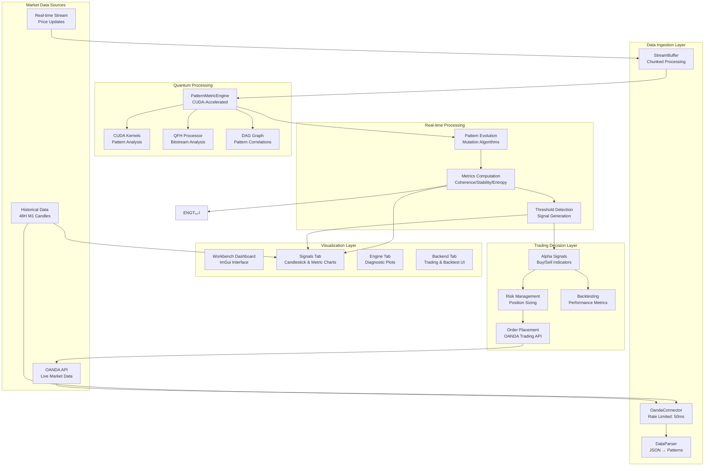

# SEP Engine Data Flow Architecture

## Overview

This document outlines the SEP Engine's data processing pipeline. As of July 2024, the entire pipeline is **non-functional due to critical compilation failures**. The primary architectural flaw identified is a dependency conflict where core engine components (`DataParser`, `PatternMetricEngine`) are forced to include GUI headers (`imgui.h`), making a successful build impossible.

**The immediate and only priority is to resolve these build-blocking issues by refactoring header dependencies.**

## Data Flow Diagram (Intended Architecture)



## Critical Component Compilation Status

### 1. **Data Parser (`data_parser.cpp`)**
-   **Function**: Converts OANDA JSON candles into `Pattern` structs.
-   **Status**: **BUILD FAILED**. This core component is blocked by a fatal dependency issue.
-   **Error Analysis**:
    ```
    # From build_log.txt:
    # The include chain is: data_parser.cpp -> data_parser.h -> multi_timeframe_analyzer.h -> common_structs.h
    # In /sep/src/apps/workbench/core/common_structs.h:
    # fatal error: 'imgui.h' file not found
    ```
-   **Conclusion**: A core engine component cannot be coupled with a GUI library. Core data types like `CandleData` must be moved out of `common_structs.h` into a neutral location.

### 2. **Quantum Engine (`engine.cu`, `pattern_metric_engine.cpp`)**
-   **Function**: Performs CUDA-accelerated analysis of patterns to compute coherence, stability, and entropy.
-   **Status**: **BUILD FAILED**. The CUDA engine and the C++ metric engine are both blocked.
-   **Error Analysis (`engine.cu`)**:
    ```
    # From build_log.txt:
    # The include chain is: engine.cu -> data_parser.h -> multi_timeframe_analyzer.h -> common_structs.h
    # fatal error: 'imgui.h' file not found
    ```
-   **Error Analysis (`pattern_metric_engine.cpp`)**:
    ```
    # From errors.txt:
    /sep/src/quantum/pattern_metric_engine.cpp:431:9: error: use of undeclared identifier 's'
    ```
-   **Conclusion**: The CUDA engine is blocked by the same GUI dependency as the parser. The C++ engine has a simple typo but is also fundamentally blocked by the header issue.

### 3. **Service Connector (`service_connector.cpp`)**
-   **Function**: Manages communication between the workbench and the backend engine/APIs.
-   **Status**: **BUILD FAILED**. Blocked by incorrect namespace usage and missing definitions.
-   **Error Analysis**:
    ```
    # From errors.txt:
    /sep/src/apps/workbench/core/service_connector.cpp:38:59: error: no member named 'oanda' in 'sep::config::ConfigManager'
    /sep/src/apps/workbench/core/service_connector.cpp:68:17: error: unknown type name 'DataLoader'
    ```
-   **Conclusion**: Code needs to be updated to use the correct `ConfigManager` API and include necessary headers for components like `DataLoader`.

### 4. **OANDA Connector (`oanda_connector.cpp`)**
-   **Function**: Fetches market data and handles trade execution with the OANDA API.
-   **Status**: **BUILD FAILED**. Blocked by missing event system definitions.
-   **Error Analysis**:
    ```
    # From errors.txt:
    /sep/src/connectors/oanda_connector.cpp:562:28: error: no member named 'globalEventBus' in namespace 'sep::workbench'
    /sep/src/connectors/oanda_connector.cpp:562:64: error: no member named 'OrderUpdateEvent' in namespace 'sep::workbench'
    ```
-   **Conclusion**: The connector's attempt to publish events is failing because the event bus and event types are not defined in a shared context. A central event header is required.

## Data Authenticity Policy (Post-Build-Fix)

The platform is designed for authentic data processing. Once the build is fixed, all components will use genuine data:
-   ✅ **OandaConnector**: Real REST API and streaming data.
-   ✅ **DataParser**: Genuine OHLC to pattern conversion.
-   ✅ **PatternMetricEngine**: CUDA-accelerated algorithms operating on real data.

**Overall Conclusion**: The data flow architecture is sound in theory but is completely blocked in practice. **Resolving the critical compilation errors by refactoring headers and fixing API usage is the mandatory first step to make this pipeline operational.**
