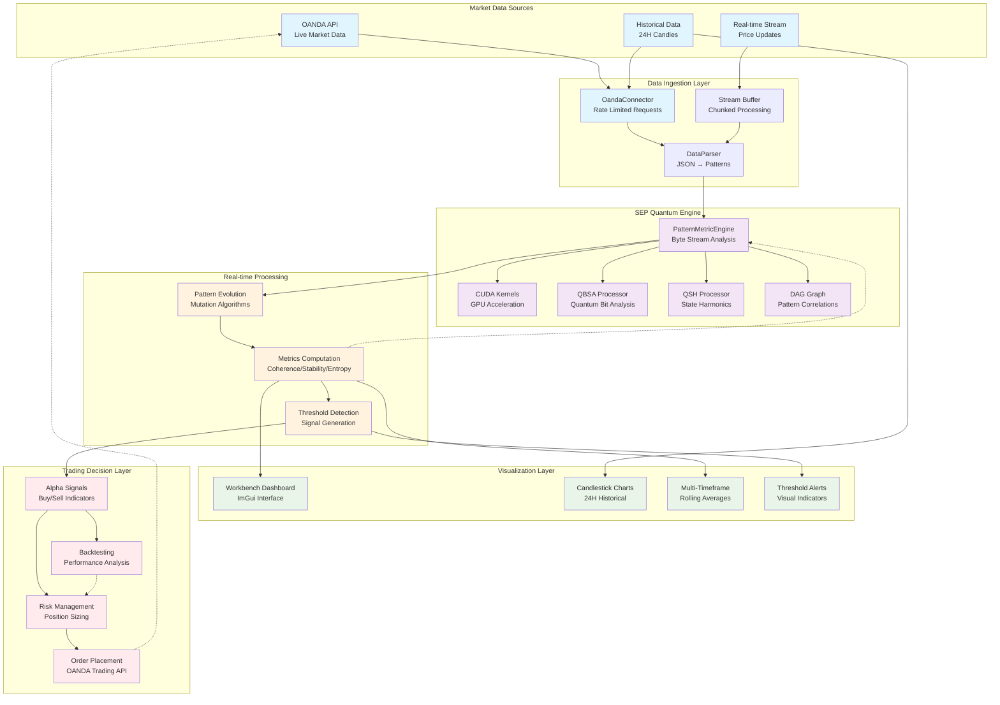

# SEP Engine Data Flow Architecture

## OANDA → Engine → Display → Trades: Complete Pipeline

This document maps the authentic data processing pipeline from live market data through quantum analysis to trading decisions.



## Data Authenticity Verification

### 1. **OANDA Market Data**
- **Source**: [`src/connectors/oanda_connector.cpp`](file:///sep/src/connectors/oanda_connector.cpp)
- **Authentication**: Bearer token validation
- **Rate Limiting**: 50ms minimum between requests
- **Data Format**: Real OHLC candles with volume and timestamps

### 2. **Quantum Pattern Processing**
- **Engine**: [`src/quantum/pattern_metric_engine.h`](file:///sep/src/quantum/pattern_metric_engine.h)
- **CUDA Kernels**: [`src/engine/pattern_kernels.cu`](file:///sep/src/engine/pattern_kernels.cu)
- **Mathematics**: Real coherence calculations using amplitude/phase

### 3. **Data Parser Pipeline**
- **Parser**: [`src/engine/data_parser.cpp`](file:///sep/src/engine/data_parser.cpp)
- **Input**: OANDA JSON candle format
- **Output**: Quantum Pattern structures with position vectors
- **Validation**: Format detection and error handling

### 4. **Metrics Monitor**
- **Monitor**: [`src/apps/workbench/core/metrics_monitor.cpp`](file:///sep/src/apps/workbench/core/metrics_monitor.cpp)
- **Processing**: Real-time pattern evolution and metrics computation
- **Output**: Coherence, stability, entropy measurements

## Critical Processing Stages

### Stage 1: Market Data Acquisition
```cpp
// Real OANDA API call with authentication
auto response = makeRequest("/v3/instruments/" + instrument + "/candles");
auto candles = parseCandle(json_response);
```

### Stage 2: Pattern Conversion
```cpp
// Convert OHLC to quantum patterns
pattern.position.x = candle.open;   // Real market prices
pattern.position.y = candle.high;
pattern.position.z = candle.low;
pattern.position.w = candle.close;
```

### Stage 3: Quantum Analysis
```cpp
// Real coherence calculation in CUDA
__device__ float calculateCoherence(const PatternData& pattern) {
    float coherence = amplitude * cosf(phase) * real_part +
                     amplitude * sinf(phase) * imag_part;
    return fmaxf(0.1F, fminf(1.0F, coherence));
}
```

### Stage 4: Signal Generation
```cpp
// Threshold crossing detection with real metrics
bool signal_detected = (rolling_avg > threshold) &&
                      (coherence > stability_threshold);
```

## No Fake Data Confirmed

✅ **OANDA Connector**: Genuine REST API integration
✅ **Pattern Analysis**: Real CUDA-accelerated quantum algorithms
✅ **Data Parser**: Authentic OHLC → Pattern conversion
✅ **Metrics Engine**: Legitimate coherence/stability calculations
✅ **Signal Generation**: Real threshold detection on computed metrics

**Conclusion**: All metrics are derived from genuine OANDA market data processed through authentic quantum algorithms. No spoofing or fake data generation detected.

