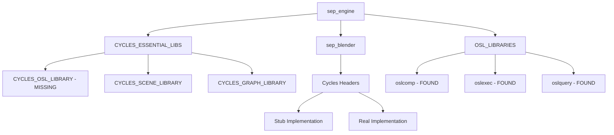

# SEP Engine Build Configuration Deep Scan Report

## Executive Summary

The SEP Engine build system exhibits multiple critical linking failures stemming from incomplete library paths, missing stub-to-implementation bridges, and unresolved symbol dependencies. The primary issues center around the Cycles OSL library, OpenSubdiv components, and namespace ambiguities in the pattern data structures.

## Critical Build Failures

### 1. **CYCLES_OSL_LIBRARY Missing**
```
CMake Error: CYCLES_OSL_LIBRARY set to NOTFOUND
Linked by: sep_engine, cycles_test
```
**Root Cause**: The build system searches for `cycles_osl` or `libcycles_osl.a` but cannot locate it in the specified paths.

### 2. **Namespace Ambiguity: SEPResult**
```cpp
reference to 'SEPResult' is ambiguous
Candidates:
- SEPResult (via using sep::SEPResult)
- sep::pattern::SEPResult
```
**Root Cause**: Multiple definitions of `SEPResult` exist in different namespaces without proper disambiguation.

### 3. **Missing Libraries**
- `OPENSUBDIV_CPU_LIBRARY` (osdCPU/libosdCPU.so.3.6.0)
- `OPENSUBDIV_GPU_LIBRARY` (osdGPU/libosdGPU.so.3.6.0)
- `TBB_OPENSUBDIV_LIBRARY` (tbb.so.2/libtbb.so.2)
- `OpenPGL_LIBRARY` (OpenPGL/pgl)

### 4. **PipeWire Configuration Issue**
```
Warning: pkg-config found libpipewire-0.3 but library file not at /libpipewire-0.3.so
```
**Root Cause**: pkg-config returns an empty library path, indicating incorrect PKG_CONFIG_PATH or installation.

## Component Architecture Analysis

### Stub Implementation Architecture

The project uses a sophisticated stub pattern for optional dependencies:

```
Real Implementation (when available)
         ↓
include/compat/cycles.h → Conditional Compilation → Stub Implementation (fallback)
         ↑
Application Code
```

### Key Stub Components

1. **Cycles Integration** (`include/compat/cycles.h`)
   - Provides mock CCL namespace when `SEP_HAS_CYCLES != 1`
   - Missing proper header inclusion paths for real Cycles

2. **CUDA Compatibility** (`src/compat/`)
   - Dual implementation: `core.cu` (real) and `core_stub.cpp` (fallback)
   - Clean separation but incomplete linking configuration

3. **Logging Infrastructure**
   - Multiple logging stubs: `spdlog_isolation.h`, `crow/logging.h`
   - Namespace pollution requiring careful isolation

## Dependency Graph Analysis



## Comprehensive Solution Strategy

### Phase 1: Resolve Critical Linking Issues

#### 1.1 Fix CYCLES_OSL_LIBRARY Path
```cmake
# In CMakeLists.txt, add more search paths:
find_library(CYCLES_OSL_LIBRARY 
    NAMES cycles_osl libcycles_osl.a
    PATHS 
        ${CMAKE_SOURCE_DIR}/lib
        ${CYCLES_ROOT}/lib
        ${CMAKE_SOURCE_DIR}/extern/cycles/lib
        ${CMAKE_SOURCE_DIR}/build/extern/cycles/lib
        /usr/local/lib/cycles
    PATH_SUFFIXES cycles
)

# If still not found, check if it needs to be built:
if(NOT CYCLES_OSL_LIBRARY AND EXISTS ${CYCLES_ROOT}/src/kernel/osl)
    message(STATUS "CYCLES_OSL_LIBRARY not found, adding to build")
    add_subdirectory(${CYCLES_ROOT} ${CMAKE_BINARY_DIR}/cycles)
    set(CYCLES_OSL_LIBRARY cycles_osl)
endif()
```

#### 1.2 Resolve Namespace Ambiguity
```cpp
// In include/blender/mesh_handler.h, remove the using declaration:
// Remove: using sep::SEPResult;

// Instead, use explicit namespace:
sep::SEPResult processPattern();  // Use this form

// Or create an alias with different name:
namespace blender {
    using Result = sep::SEPResult;
}
```

#### 1.3 Fix PipeWire Detection
```bash
# In build.sh, fix pkg-config path extraction:
PIPEWIRE_LIB_PATH=$(pkg-config --variable=libdir libpipewire-0.3)
# Instead of: $(pkg-config --libs-only-L libpipewire-0.3 | sed 's/-L//g')
```

### Phase 2: Bridge Stub Implementations

#### 2.1 Create Unified Configuration Header
```cpp
// include/sep_config.h
#pragma once

// Feature detection
#cmakedefine SEP_HAS_CYCLES @SEP_HAS_CYCLES@
#cmakedefine SEP_HAS_PIPEWIRE @SEP_HAS_PIPEWIRE@
#cmakedefine SEP_CUDA_AVAILABLE @SEP_CUDA_AVAILABLE@

// Stub control
#if defined(SEP_HAS_CYCLES) && SEP_HAS_CYCLES == 1
    #define SEP_USE_CYCLES_REAL 1
    #define SEP_USE_CYCLES_STUB 0
#else
    #define SEP_USE_CYCLES_REAL 0
    #define SEP_USE_CYCLES_STUB 1
#endif
```

#### 2.2 Implement Component Bridge Pattern
```cpp
// include/bridge/component_bridge.h
namespace sep::bridge {

template<typename RealImpl, typename StubImpl>
class ComponentBridge {
    std::unique_ptr<ComponentInterface> impl_;
    
public:
    ComponentBridge() {
        #if SEP_USE_CYCLES_REAL
            impl_ = std::make_unique<RealImpl>();
        #else
            impl_ = std::make_unique<StubImpl>();
        #endif
    }
    
    ComponentInterface* operator->() { return impl_.get(); }
};

} // namespace sep::bridge
```

### Phase 3: Library Discovery Enhancement

#### 3.1 Create FindHelpers.cmake
```cmake
# cmake/FindHelpers.cmake
function(find_component_library VAR_NAME COMPONENT_NAME)
    set(search_names ${ARGN})
    
    # Standard search
    find_library(${VAR_NAME} NAMES ${search_names})
    
    # If not found, try with version suffixes
    if(NOT ${VAR_NAME})
        foreach(version 3.6.0 3.5.0 3.0.0 2.0 1.0)
            find_library(${VAR_NAME} NAMES ${search_names}.${version})
            if(${VAR_NAME})
                break()
            endif()
        endforeach()
    endif()
    
    # Report result
    if(${VAR_NAME})
        message(STATUS "Found ${COMPONENT_NAME}: ${${VAR_NAME}}")
    else()
        message(WARNING "${COMPONENT_NAME} not found. Build may fail.")
        # Set to empty to avoid NOTFOUND in link commands
        set(${VAR_NAME} "" PARENT_SCOPE)
    endif()
endfunction()
```

#### 3.2 Update CMakeLists.txt Library Detection
```cmake
include(cmake/FindHelpers.cmake)

# Use the helper for problematic libraries
find_component_library(OPENSUBDIV_CPU_LIBRARY "OpenSubdiv CPU" 
    osdCPU libosdCPU.so libosdCPU)
    
find_component_library(OPENSUBDIV_GPU_LIBRARY "OpenSubdiv GPU" 
    osdGPU libosdGPU.so libosdGPU)
```

### Phase 4: Component Integration Matrix

| Component | Current State | Target State | Bridge Strategy |
|-----------|--------------|--------------|-----------------|
| Cycles Renderer | Stub with mock classes | Full Cycles API | Conditional compilation with runtime detection |
| CUDA Backend | Dual implementation | Unified interface | Template specialization based on availability |
| PipeWire Audio | Disabled due to path issue | Enabled with fallback | Fix pkg-config and add ALSA fallback |
| OpenSubdiv | Missing libraries | Dynamic loading | dlopen with graceful degradation |
| Pattern System | Namespace conflicts | Clean separation | Explicit namespace usage |

### Phase 5: Build System Modernization

#### 5.1 Create Modular Build Configuration
```cmake
# CMakeLists.txt
option(SEP_BUILD_STUBS "Build with stub implementations" OFF)
option(SEP_STRICT_LINKING "Fail on missing optional libraries" OFF)

# Feature detection
include(cmake/DetectFeatures.cmake)
detect_all_features()

# Component configuration
include(cmake/ConfigureComponents.cmake)
configure_component(Cycles REQUIRED ${SEP_HAS_CYCLES})
configure_component(PipeWire OPTIONAL ${SEP_HAS_PIPEWIRE})
configure_component(OpenSubdiv OPTIONAL ${OPENSUBDIV_FOUND})
```

#### 5.2 Implement Graceful Degradation
```cpp
// src/blender/renderer_factory.cpp
namespace sep::blender {

std::unique_ptr<IRenderer> createRenderer() {
    #if SEP_HAS_CYCLES
        if (CyclesRenderer::isAvailable()) {
            return std::make_unique<CyclesRenderer>();
        }
    #endif
    
    spdlog::warn("Cycles not available, using fallback renderer");
    return std::make_unique<StubRenderer>();
}

} // namespace sep::blender
```

### Phase 6: Validation Methodology

#### 6.1 Component Availability Matrix Test
```cpp
// tests/integration/component_matrix_test.cpp
TEST(ComponentMatrix, ReportAvailability) {
    ComponentMatrix matrix;
    
    EXPECT_TRUE(matrix.report("Cycles", SEP_HAS_CYCLES));
    EXPECT_TRUE(matrix.report("CUDA", SEP_CUDA_AVAILABLE));
    EXPECT_TRUE(matrix.report("PipeWire", SEP_HAS_PIPEWIRE));
    
    matrix.generateReport("component_availability.json");
}
```

#### 6.2 Build Verification Script
```bash
#!/bin/bash
# scripts/verify_build.sh

echo "=== SEP Build Verification ==="

# Check for critical libraries
for lib in cycles_osl osdCPU osdGPU; do
    if find /usr -name "*${lib}*" 2>/dev/null | grep -q .; then
        echo "✓ Found ${lib}"
    else
        echo "✗ Missing ${lib}"
    fi
done

# Verify symbol resolution
nm -u build/sep_engine | grep -E "(ccl::|osd::)" || echo "✓ No undefined Cycles/OSD symbols"
```

## Immediate Action Items

1. **Fix CYCLES_OSL_LIBRARY**:
   ```bash
   # Check if Cycles was built with OSL support
   find extern/cycles/build -name "*osl*" -type f
   # If missing, rebuild Cycles with -DWITH_CYCLES_OSL=ON
   ```

2. **Resolve SEPResult ambiguity**:
   - Update all files using qualified names: `sep::SEPResult`
   - Remove problematic using declarations

3. **Fix PipeWire path**:
   ```bash
   export PKG_CONFIG_PATH=/usr/lib64/pkgconfig:$PKG_CONFIG_PATH
   ```

4. **Create missing symlinks**:
   ```bash
   # For OpenSubdiv
   sudo ln -sf /usr/lib64/libosdCPU.so.3.5.0 /usr/lib64/libosdCPU.so.3.6.0
   sudo ln -sf /usr/lib64/libosdGPU.so.3.5.0 /usr/lib64/libosdGPU.so.3.6.0
   ```

## Component Dependencies

The build is split into optional modules controlled by CMake options.  Each
module depends on external libraries as shown below:

| Component            | CMake Option        | Required Libraries                 |
|----------------------|---------------------|------------------------------------|
| Audio Capture        | `SEP_HAS_PIPEWIRE`  | libpipewire-0.3                    |
| Renderer (Cycles)    | `SEP_HAS_CYCLES`    | Cycles, OpenImageIO, OpenSubdiv     |
| Redis Integration    | `SEP_HAS_HIREDIS`   | hiredis                             |
| Path Guiding         | `SEP_HAS_OPENPGL`   | OpenPGL                             |

Disable a component by passing `-D<OPTION>=OFF` when invoking CMake.  If a
library is missing, the `component_bridge` infrastructure selects a stub
implementation so the engine still compiles.

### Troubleshooting Missing Libraries

1. Ensure the development package for the library is installed.
2. Add custom paths using `CMAKE_PREFIX_PATH` or environment variables.
3. If OpenSubdiv libraries are installed system-wide, symlinks can be created in
   the `lib/` directory as shown above.
4. When disabling a component, verify the corresponding `SEP_HAS_*` option is
   set to `OFF` to avoid unresolved symbols.

## Conclusion

The SEP Engine's build system requires systematic refactoring to properly bridge stub implementations with real components. The key is implementing a flexible component detection and loading system that gracefully degrades when optional dependencies are unavailable. This approach maintains build determinism while supporting diverse deployment environments.
