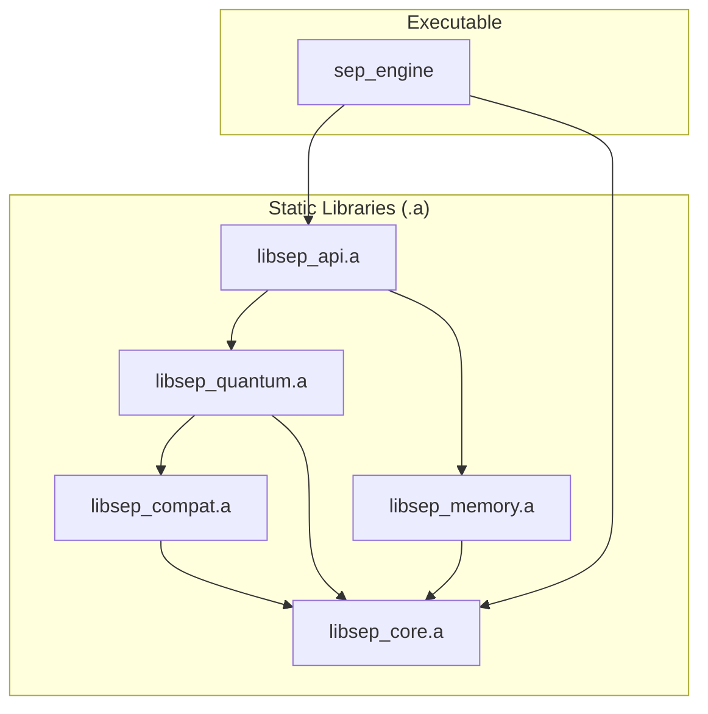
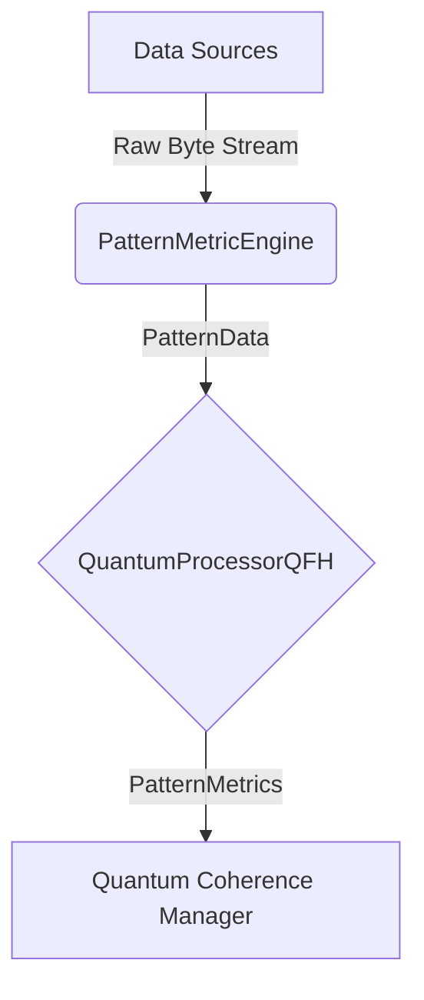

# SEP Engine: Project Overview

## 1. Introduction

The SEP Engine is a high-performance C++ framework for quantum-inspired pattern analysis and evolution. This project focuses on applying the SEP Engine to develop and validate a predictive financial gauge using historical forex data. The architecture is designed to be modular and scalable, prioritizing a clear separation of concerns to allow for independent development and testing of its core components.

### Guiding Principles

*   **Clear Component Boundaries**: Each module has a distinct responsibility and a well-defined public interface.
*   **Unidirectional Dependencies**: High-level modules can depend on low-level modules, but not the other way around, preventing circular dependencies.
*   **Consolidation of Core Logic**: Cross-cutting concerns like logging, metrics, and error handling are unified into a single, foundational `core` library.
*   **Isolate External Dependencies**: Third-party libraries are kept separate from the engine's source code.

## 2. System Architecture

The SEP Engine is compiled into a single executable, `sep_engine`, which links a set of self-contained static libraries. This design ensures modularity and a clean, unidirectional dependency graph.

### Component Breakdown

*   **`core`**: Provides foundational utilities, data structures, and managers required by all other engine modules.
*   **`compat`**: Provides the CUDA backend for GPU acceleration and compatibility shims for non-GPU environments.
*   **`quantum`**: Contains the quantum-inspired algorithms for analyzing and evolving patterns, including QBSA and QFH.
*   **`memory`**: Manages the three-tiered memory hierarchy (STM, MTM, LTM) and handles optional pattern persistence via Redis.
*   **`api`**: Exposes the engine's functionality via an HTTP server and a stable C-style bridge.

## 3. Pattern Metric Engine

The Pattern Metric Engine is a core component of the SEP system, designed for datatype-agnostic analysis of incoming data streams. It operates on raw byte streams, making it universally compatible with any data type.

### Architecture

The engine integrates into the SEP architecture as a specialized `PatternProcessor`. It receives data, processes it through a Quantum Fourier Hierarchy (QFH) processor, and produces metrics used by other system components.

### API

The main class is `sep::quantum::PatternMetricEngine`, which provides methods for data ingestion, pattern evolution, and metric computation. The key metrics are returned in a `sep::quantum::PatternMetrics` struct, which includes:

*   `float coherence`: A measure of the pattern's internal consistency.
*   `float stability`: A measure of how resistant the pattern is to change.
*   `float entropy`: A measure of the pattern's complexity and randomness.

## 4. Project Roadmap

### Phase 1: System Optimization & Foundation (Complete)

*   **Achievement**: A datatype-agnostic pattern analysis engine capable of ingesting and analyzing any form of data by treating it as a raw byte stream.
*   **Key Design Decisions**:
    *   Adopted a "raw bytes" approach for all data ingestion to ensure universal applicability.
    *   Used fixed-size chunking for computationally efficient pattern extraction.
    *   Leveraged the existing QFH processor for powerful and well-tested metric computation.

### Phase 2: Financial Analysis & Backtesting (Current)

*   **Financial Data Integration**: Implement proper parsing of financial data (e.g., Oanda JSON/CSV) and create a streaming ingestion pipeline for real-time tick data.
*   **Pattern Processing Refinement**: Enhance the coherence algorithm with a sliding window for pattern comparison, temporal weighting, and pattern decay.
*   **Performance Optimization**: Profile for bottlenecks, implement SIMD optimizations, and add multi-threading for parallel processing.
*   **Advanced Metrics**: Implement metrics beyond coherence, such as Rupture Ratio, Flip Ratio, Entropy, and a Stability Score.
*   **GPU Acceleration**: Port QFH kernels to CUDA to achieve significant speedup for large-scale analysis.

For a more detailed breakdown of the current and future tasks, see [`docs/TODO.md`](docs/TODO.md).