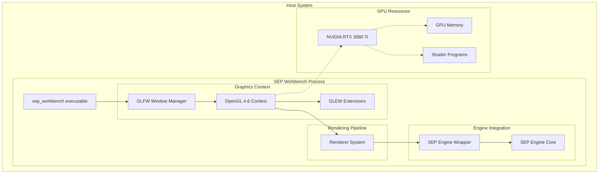
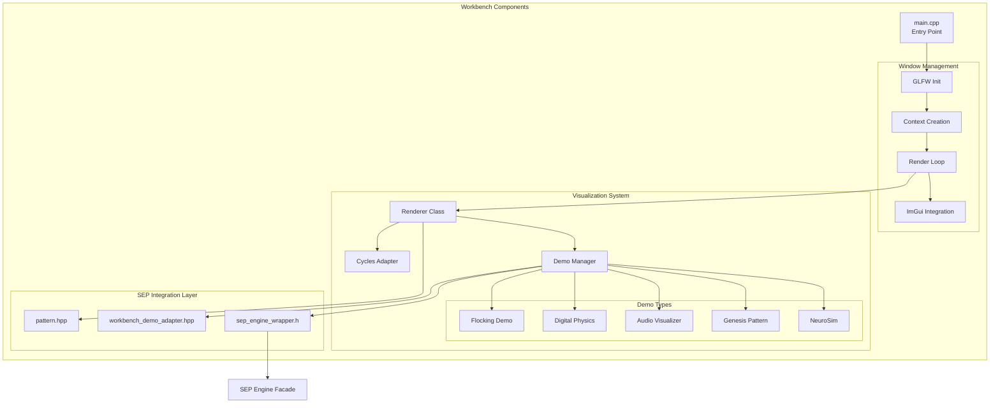
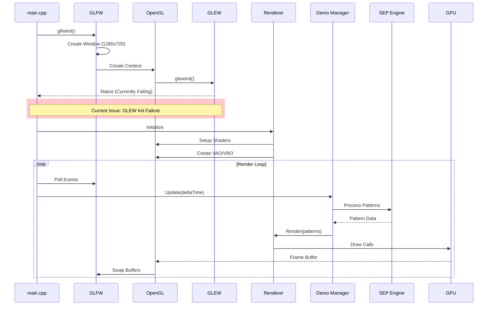
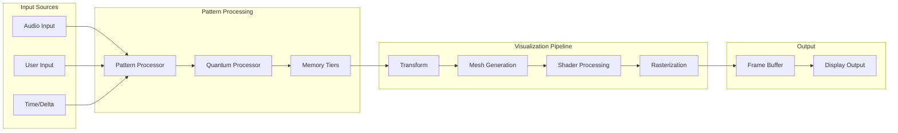
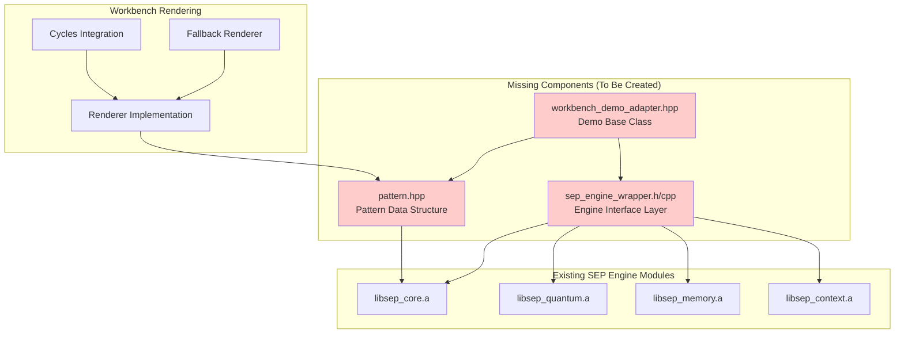
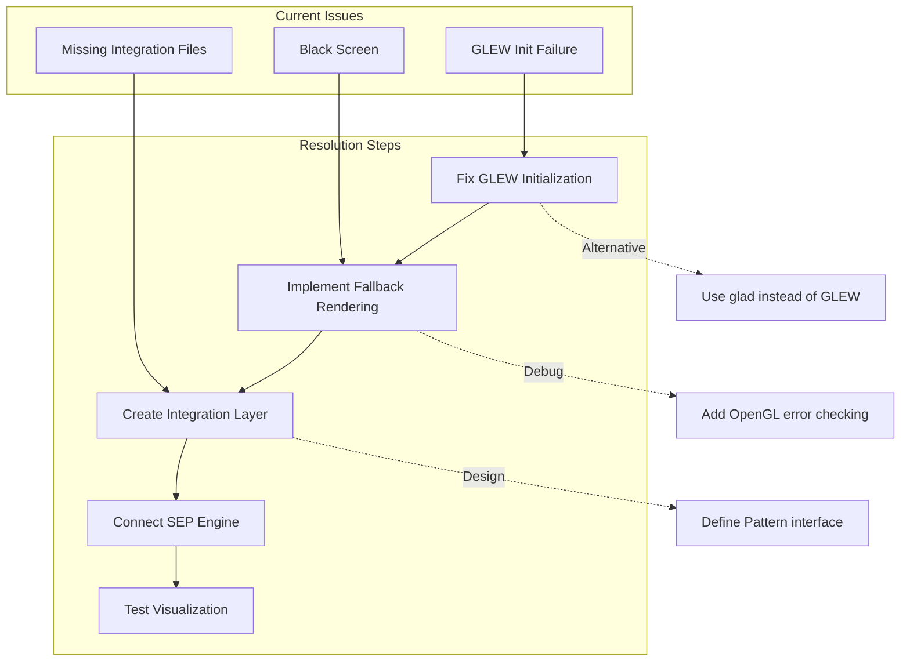

## SEP Workbench Architecture: Multi-Dimensional Layout

### Level 1: System Overview (Outermost Layer)

### Level 2: Workbench Component Architecture

### Level 3: Rendering Pipeline Detail

### Level 4: Data Flow Architecture

### Level 5: Integration Architecture Plan

### Level 6: Problem Resolution Strategy

## Architectural Summary

The SEP Workbench serves as a visualization frontend for the SEP Engine, providing real-time rendering of quantum-inspired patterns through various demonstration modes. The architecture consists of:

1. **Graphics Layer**: GLFW window management with OpenGL 4.6 rendering
2. **Integration Layer**: Wrapper components bridging the workbench and engine
3. **Visualization System**: Demo manager coordinating multiple visualization modes
4. **Rendering Pipeline**: Multi-stage processing from pattern data to pixels
5. **SEP Engine Core**: The underlying quantum processing and memory management

