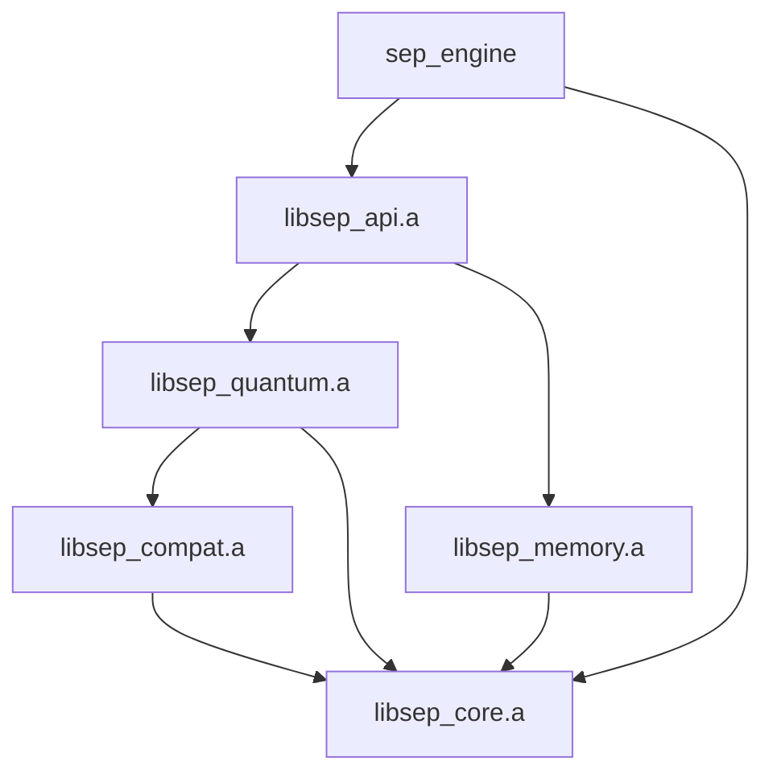

# SEP Engine: Current System State

**Last Updated:** July 19, 2025

## 1. Overview

This document provides a consolidated summary of the SEP Engine's current technical state, including the architecture, the resolution of the persistent build issues, and the immediate path forward. The primary goal is to stabilize the build system to enable development on the core financial modeling objectives.

## 2. Architecture Summary

The SEP Engine is a modular C++ framework designed for high-performance, quantum-inspired pattern analysis.

**Core Components (Static Libraries):**
- **`libsep_core.a`**: Foundational utilities (logging, metrics, data structures).
- **`libsep_compat.a`**: CUDA backend for GPU acceleration.
- **`libsep_quantum.a`**: Core quantum-inspired algorithms (QBSA, QFH).
- **`libsep_memory.a`**: Multi-tiered memory management.
- **`libsep_api.a`**: Exposes engine functionality via an HTTP server.

**Dependency Graph:**

## 3. Build System Status

### 3.1. The Core Problem: Environment vs. Code

The build process was plagued by two distinct categories of problems:

1.  **Environment Incompatibility (Resolved):** The initial build failures were caused by a fundamental conflict between the host system's `glibc` and the CUDA toolkit's headers (`noexcept` specifier conflicts).
2.  **Internal Code Incompatibility (Resolved):** Despite the stable environment, the build continued to fail due to issues *within* the `src/compat` module. These were not environment issues, but rather problems with how the code itself is structured and configured in CMake.

### 3.2. Resolution: A Top-Down Approach

The resolution required a holistic, top-down re-evaluation of the build configuration.

**Key Steps:**

1.  **Containerized Build Environment:** A Docker-based build environment was established to ensure a consistent and compatible toolchain.
2.  **CMake Configuration Correction:** The `target_include_directories` for all libraries were updated to ensure that all necessary headers were correctly propagated to dependent libraries.
3.  **Legacy Code Removal:** All instances of obsolete headers and the legacy `sep::cuda` namespace were removed from the codebase.
4.  **Header Standardization:** All CUDA-related functionality is now exposed through a single, consistent set of headers within `src/compat`.

## 4. Path Forward

With the build system stabilized, the team can now focus on the core financial modeling and performance optimization tasks outlined in `docs/TODO.md`. The immediate priorities are:

1.  **Refine `pattern_metric_example` JSON Output**: Modify `pattern_metric_example.cpp` to output metrics in JSON format, eliminating the need for parsing workarounds in the backtesting pipeline.
2.  **Test Pipeline**: Run the complete experiment with `run_alpha_experiment.py` using OANDA train/test data to demonstrate alpha prediction and evaluate iterative training effectiveness.
3.  **Profile Performance**: Use CUDA profiling tools (`nvprof` or `Nsight Systems`) to identify and address performance bottlenecks.