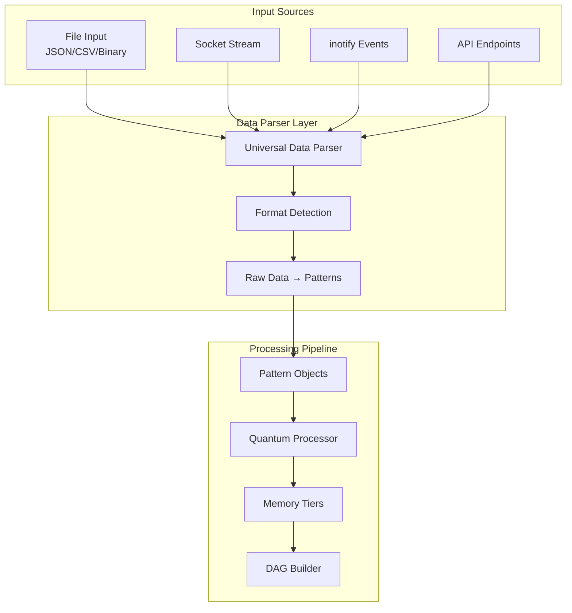

## Critical Fixes Before Next Iteration
Based on the latest static analysis (61 defects: 22 CRITICAL, 30 MEDIUM, 6 LOW, 3 HIGH) and build failures, prioritize compilation blockers and critical defects in quantum/pattern_metric_engine.cpp and quantum_processor_qfh_common.cpp:

1. **Resolve Compilation Errors in pattern_metric_engine.cpp** (Primary blocker - 25 defects):
   - Add missing members: Declare `std::mutex engine_mutex_;` and `std::vector<uint8_t> stream_buffer_;` as private in PatternMetricEngine class (pattern_metric_engine.h).
   - Define `processBuffer(bool is_final_chunk = false)`: Implement as private method to chunk stream_buffer_ into patterns (e.g., 64-byte fixed, convert to vec3 via memcpy/normalize).
   - Fix vexing-parse on locks: Use `std::lock_guard<std::mutex> lock{engine_mutex_};` (curly braces for init).
   - Add entropy to QFHResult struct (qfh.h): `float entropy{0.0f};`.

2. **Fix Defects in quantum_processor_qfh_common.cpp** (3 CRITICAL):
   - Add entropy to QFHResult (as above).
   - In analyzePatternBits(): Use `std::log2(p0 + 1e-6f)` to avoid log(0); clamp entropy [0,1].

3. **Address MEDIUM Defects Across Files**:
   - Double-promotion (e.g., dag_graph_quant.cpp L106): Cast to float `std::log1p(static_cast<float>(node.generation))`.
   - Unused returns (e.g., engine.cpp fflush): Cast `(void)fflush(stdout);`.
   - Reserved macros (cuda_unified_fix.h): Rename `__CUDA_NO_*` to `SEP_CUDA_NO_*`.
   - Vexing-parse/unused-vars: Fix locks as above; remove/comment unused like cleanup_threshold (memory_tier.cpp L741).

4. **Handle HIGH Defects**:
   - Stack address escape (cuda_api_unified.cpp L158): Return std::string copy `return std::string(error.message);`.
   - Uninitialized in cetintrin.h: Init `unsigned int t = 0;`.

5. **Build System Tweaks**:
   - Link cuFFT in CMakeLists.txt for quantum (add `target_link_libraries(sep_quantum PRIVATE CUDA::cufft)`).
   - Fix include paths if missing (e.g., for glm/M_PI—define `_USE_MATH_DEFINES` on Windows).
   - Run clang-tidy post-build to catch remaining.

## Universal Data Parser Refinements
Build on the designed parser (auto-detect, binary mapping, streaming state, PinState compat):

1. **Enhance Detection/Conversion**:
   - In detectFormat(): Add signatures (e.g., JSON '{', CSV headers, binary entropy > threshold).
   - Binary to Pattern: Chunk bytes to vec4 (reinterpret as floats, normalize); derive coherence from variance.

2. **Streaming Improvements**:
   - Buffer partial JSON/CSV across chunks; use nlohmann::json::parse with try-catch for incompletes.

3. **Integration**:
   - Call parser in engine.cpp ingest; convert Patterns to PinStates if legacy flag set.

4. **Testing**:
   - Add units for parse methods (invalid formats throw, partial streams buffer correctly).

## Questions Resolved:
From previous TODO:
1. **Data Format**: Auto primary, explicit override.
2. **Binary Data**: Bytes to position/energy; byte-level no strings.
3. **Streaming**: Minimal state for continuity; independent where possible.
4. **PinState Integration**: Optional; Patterns primary.

## Proposed Universal Data Parser Design:
```
class DataParser {
public:
    std::vector<Pattern> parseFile(const std::string& path);
    std::vector<Pattern> parseBuffer(const uint8_t* data, size_t size, DataFormat format = DataFormat::AUTO);
    std::vector<Pattern> parseStream(std::istream& stream, DataFormat format = DataFormat::AUTO);
    std::vector<PinState> toPinStates(const std::vector<Pattern>& patterns);
private:
    DataFormat detectFormat(const uint8_t* data, size_t size);
    std::vector<uint8_t> buffer_;  // For streaming state
};
```

## Next TODOs
Group by priority: Fixes → Features → Opts → Tests. Reference defects/build log for specifics.

### Immediate Fixes (Get Building/Non-Zero Metrics)
- Implement processBuffer in PatternMetricEngine: Chunk buffer to patterns, call processPattern.
- Add entropy to QFHResult struct; compute in analyzePatternBits via Shannon (fix CRITICAL no-member).
- Normalize vec3 in vectorCoherence/processPattern to avoid low sim/zeros.
- Fix locks: Use {} init for std::lock_guard in all files (e.g., pattern_metric_engine.cpp L50/57/62/213/219/223).
- Resolve undeclared: Add engine_mutex_/stream_buffer_ to class; define missing methods.

### Core Feature Expansions (Phase 2 Alignment)
- Full QBSA: In qbsa_qfh.cpp analyze, add quantum correction (e.g., simulate bit flips via QBSA, use QFH rupture for collapse).
- Higher-Order Patterns: In computeMetrics, recurse on relationships (detect clusters via k-means on vec3).
- Memory Tiers: In updateMemoryTier (processor.cpp), use determineMemoryTier from quantum_processor_qfh.cpp; integrate with MemoryTierManager promote/demote.
- Ingestion Phase 2: Add ingestFromFile/Directory/Socket as methods; use filesystem for dir recursion, asio for non-block sockets.

### Performance & Optimization
- GPU Accel: In analyzePatternBits, add cuFFT branch for large bits (>1024); batch patterns.
- Profiling: Add Prometheus metrics for processPattern time; target <10ms for 1k patterns.
- Entropy/Stability Tuning: Scale with input size (e.g., entropy *= log(size)/log(1024) for normalization).

### Testing & Validation
- Assert Non-Zeros: In PatternMetricEngineTest, EXPECT_GT(metrics[0].coherence, 0.0f) for structured data; EXPECT_LT for random.
- Fintech Demo: Add test with market CSV (bytes → patterns → high coherence for trends).
- Edge Cases: Large files (1MB+), invalid streams (partial JSON throws recoverable error).

### Broader System Ties
- Bridge Integration: In bridge_c.cpp process_context, feed JSON patterns to engine.ingestData after byte convert.
- API Exposure: Add endpoints in server.cpp for ingest/evolve/computeMetrics.
- Docs Update: Sync pattern_metric_engine.md with real metrics (e.g., entropy from Shannon).

Track progress with static analyzer—aim for <10 CRITICAL defects next run.