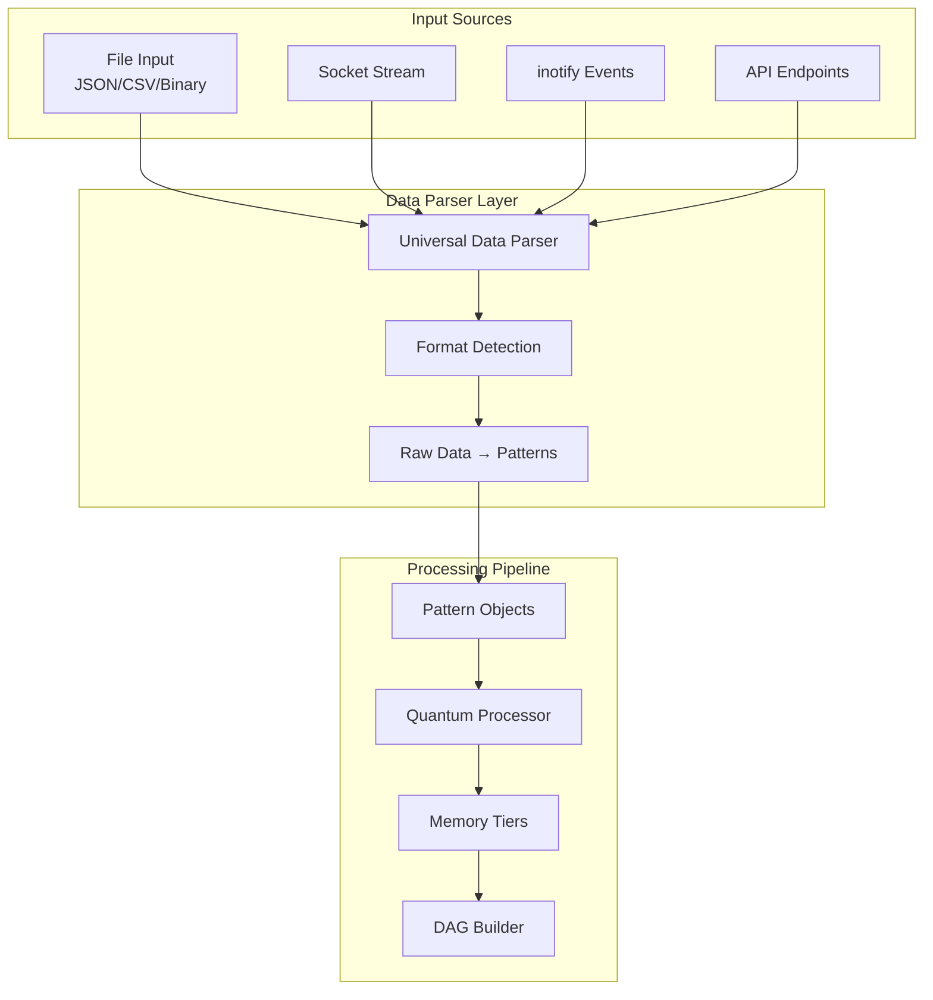

## Critical Fixes Before Implementation
Based on the static analysis report (94 defects: 51 CRITICAL, 20 LOW, 21 MEDIUM, 2 HIGH) and build failures, prioritize resolving compilation blockers and critical defects:

1. **Resolve CUDA Compatibility Issues** (Primary build blocker - affects most files):
   - Fix circular dependencies in CUDA headers (cuda_runtime.h, cuda_types.h, cuda_fwd.h).
     - Refactor include guards and forward declarations to break cycles (e.g., use forward decls consistently without redefinitions).
   - Address redefinitions and ambiguous calls (e.g., cudaMemcpy, cudaGetDeviceProperties_v2).
     - Use qualified namespaces (sep::cuda::) consistently in wrappers.
     - Remove redundant inline wrappers in cuda_wrappers.h that conflict with cuda_runtime.h.
   - Fix expected unqualified-id errors from macro expansions (cudaSuccess, cudaErrorMemoryAllocation).
     - Avoid defining macros that conflict with enum values; use enums directly.
   - Define missing identifiers (SEP_cudaStreamNonBlocking, SEP_cudaStreamDefault).
     - Add these as constants in cuda_defs.h or use CUDA's cudaStreamNonBlocking directly.
   - Handle typedef conflicts (cudaError_t, cudaStream_t).
     - Standardize on void* for opaque handles as in forward decls.

2. **Fix Missing Includes and Dependencies**:
   - Add missing "audio/capture.h" or remove if unused (engine.cpp:33).
   - Resolve 'SEPBlenderBridge' typo in engine.h:89 (should be pattern::BlenderBridge).
   - Fix no member errors in pattern_data.h (add entropy, stability, flags to sep::Pattern if needed).

3. **Address Circular Dependencies** (misc-header-include-cycle - 18 LOW defects):
   - In cuda_runtime.h and cuda_types.h: Use include guards and minimize bidirectional includes.
   - General: Forward declare where possible instead of including full headers.

4. **Resolve CRITICAL Clang Errors** (clang-diagnostic-error - 51 defects):
   - Expected identifiers/qualifiers: Due to macro expansions; undefine conflicting macros before including CUDA headers.
   - Redefinitions: Guard against multiple inclusions of compat headers.
   - Ambiguous calls: Explicitly qualify CUDA functions (e.g., ::cudaMemcpy).
   - Unknown types: Ensure all dependent headers are included in correct order.

5. **Handle MEDIUM/HIGH Defects**:
   - Double promotion (clang-diagnostic-double-promotion): Cast to double explicitly where needed.
   - Unused return values (cert-err33-c, bugprone-unused-return-value): Cast to void or handle returns.
   - Reserved macros (clang-diagnostic-reserved-macro-identifier): Rename __CUDA_* macros to SEP_CUDA_*.
   - Uninitialized values (core.CallAndMessage - HIGH): Initialize variables in cetintrin.h.
   - Circular deps: As above.

6. **Build System Fixes**:
   - Update CMakeLists.txt to handle CUDA compilation properly (e.g., enable CUDA language if needed).
   - Ensure all dependencies (CUDA, TBB, etc.) are found and linked correctly.
   - Fix failed compilations in engine.cpp, qbsa.cpp, qbsa_qfh.cpp, metrics_collector.cpp, stream.cpp, evolution.cpp, pattern_processor_interface.cpp, quantum_coherence_manager.cpp, api_main.cpp, server.cpp, sep_engine.cpp, bridge_c.cpp.

## Universal Data Parser Implementation
Once builds succeed, implement the parser as designed:

1. **Core Class Implementation** (DataParser in data_parser.cpp):
   - Implement parseFile(): Open file, detect format, read buffer, call parseBuffer().
   - Implement parseBuffer(): Handle AUTO detection via detectFormat(), then convert to Patterns.
   - Implement parseStream(): Maintain state for partial data, buffer incomplete chunks.
   - Implement toPinStates(): Convert Patterns to uint64_t PinStates via hashing.

2. **Format Detection** (detectFormat()):
   - Check magic bytes/signatures for binary/JSON/CSV.
   - Fallback to explicit format if provided.

3. **Binary Handling**:
   - Map raw bytes to Pattern.position (e.g., chunk to vec4 floats).
   - Derive quantum_state from byte entropy/stats.

4. **Streaming State**:
   - Use internal buffer for incomplete JSON/CSV lines across chunks.
   - Reset on errors or explicit calls.

5. **Integration**:
   - Update engine.cpp to use DataParser for input processing.
   - Add PinState compatibility flag for legacy mode.

6. **Testing**:
   - Unit tests for each parse method (file, buffer, stream).
   - Edge cases: Empty input, invalid formats, partial streams.
   - Performance: Large files/streams.

## Questions Resolved:
From previous TODO:
1. **Data Format**: Auto-detect primary, with optional explicit param for overrides.
2. **Binary Data**: Map bytes to position vectors/energy; avoid string conversion.
3. **Streaming**: Maintain minimal state for continuity; process independently where possible.
4. **PinState Integration**: Optional conversion; keep Patterns primary.
