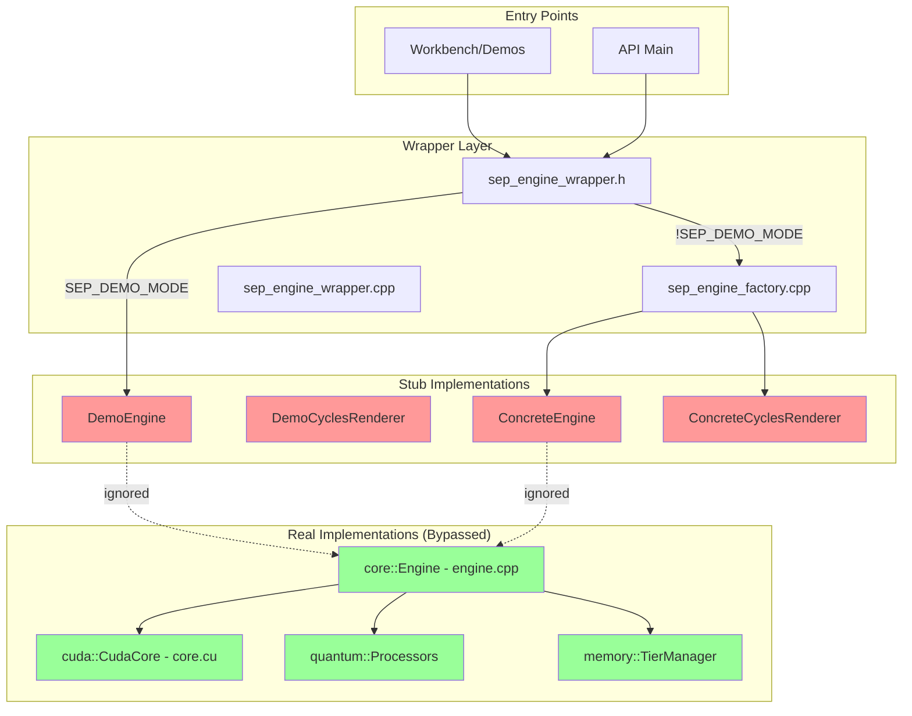
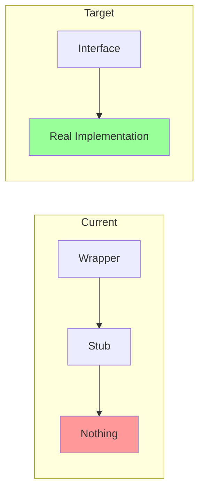
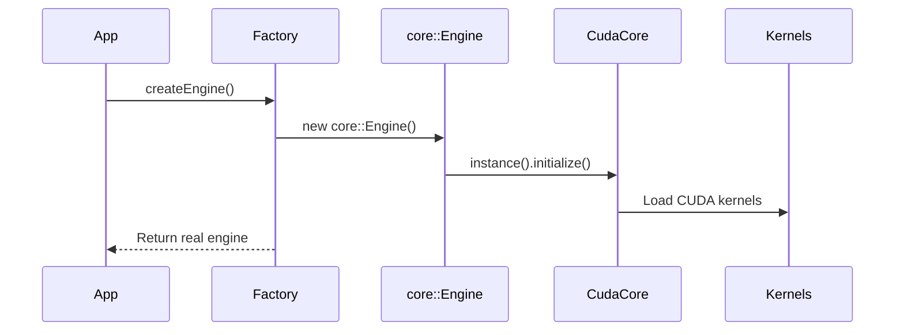
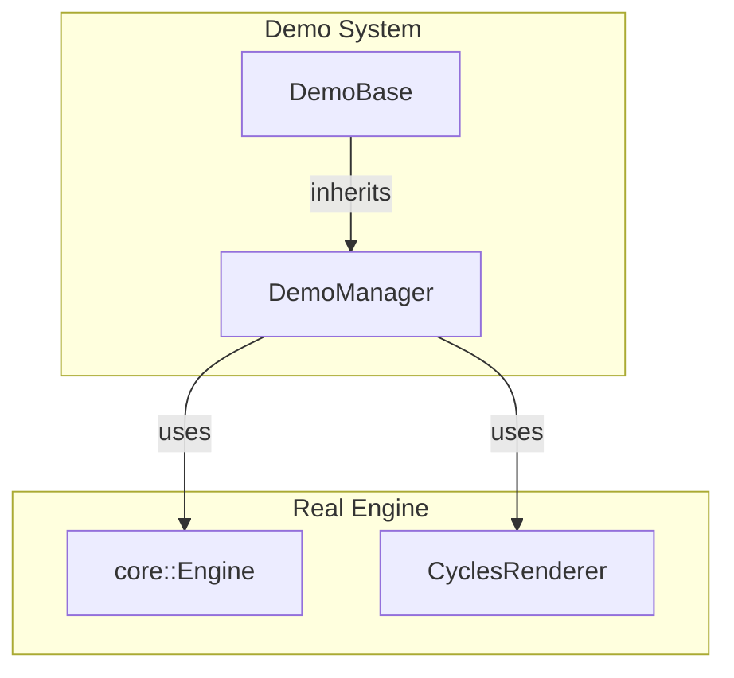

Based on my investigation of the SEP engine codebase, I've identified a significant architectural issue with multiple wrapper layers creating stub implementations instead of properly routing to the real implementations. Let me create a comprehensive analysis and roadmap to "de-stub" this project.

## SEP Engine Wrapper Architecture Analysis

### Current Stub Architecture

### Key Findings

1. **Multiple Wrapper Layers**: The system has created unnecessary abstraction layers that bypass real implementations:
   - `sep_engine_wrapper.h` defines base classes and demo implementations
   - `sep_engine_factory.cpp` creates stub "concrete" implementations
   - The real `core::Engine` in `src/core/engine.cpp` is completely bypassed

2. **Real Implementations Exist**: The actual engine components are fully implemented:
   - `src/core/engine.cpp` - Real engine with CUDA support detection
   - `src/compat/core.cu` - Real CudaCore singleton with kernel implementations
   - Quantum processors with QBSA/QFH algorithms
   - Memory tier management system

3. **Disconnected Components**:
   - The wrapper creates its own dummy `core::Engine` class instead of using the real one
   - Factory pattern creates empty stub methods that don't call real implementations
   - Demo manager expects wrapper interfaces but gets stubs

## De-Stubbing Roadmap

### Phase 1: Remove Redundant Wrappers

**Actions:**
1. Eliminate the dummy `core::Engine` class in `sep_engine_wrapper.cpp`
2. Update factory to return real implementations instead of stubs
3. Remove redundant abstraction layers

### Phase 2: Connect Real Implementations

**Actions:**
1. Modify `createEngine()` to instantiate the real `core::Engine`
2. Ensure proper initialization chain through CudaCore
3. Connect quantum processors and memory managers

### Phase 3: Verify Kernel Integration

The CUDA kernels appear to be complete in `src/compat/core.cu`:
- QBSA kernel for quantum bit state analysis
- QSH kernel for quantum state history
- Pattern processing kernels

**Actions:**
1. Verify kernel compilation in build system
2. Ensure proper device memory allocation
3. Test kernel launches through the real engine

### Phase 4: Update Demo Manager Integration

**Actions:**
1. Update DemoManager to use real engine interfaces
2. Ensure proper initialization sequence
3. Connect visualization pipeline

## Implementation Priority

1. **High Priority - Core Engine Connection**
   - Remove wrapper's dummy Engine class
   - Connect factory to real core::Engine
   - Verify CudaCore initialization

2. **Medium Priority - Component Integration**
   - Connect quantum processors
   - Enable memory tier management
   - Wire up metrics and logging

3. **Low Priority - Feature Enablement**
   - Audio capture integration
   - Blender visualization
   - API endpoints

## Specific Code Changes Needed

1. **sep_engine_wrapper.cpp**: Delete the dummy `core::Engine` implementation
2. **sep_engine_factory.cpp**: Replace stub implementations with real ones
3. **main.cpp**: Ensure proper initialization sequence
4. **build.sh**: Verify CUDA compilation flags are set correctly
