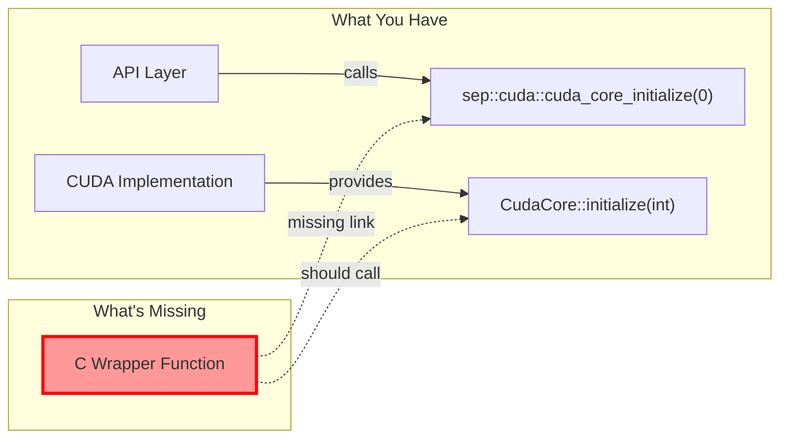
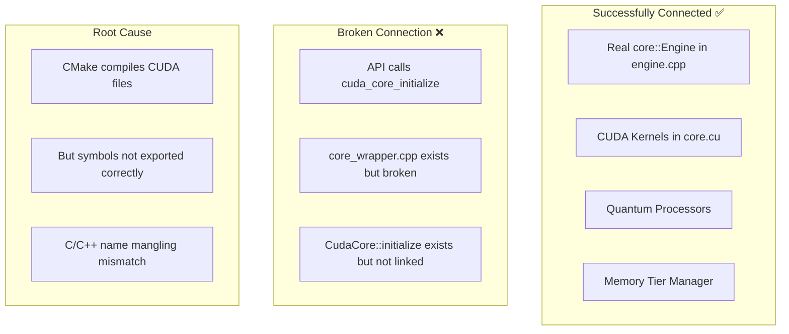

Based on my analysis of the linking error, I've identified the core issue and created a comprehensive assessment:

## Updated SEP Engine Linking Architecture Analysis

### The Issue: Missing C/CUDA Bridge Function

The error shows that `cuda_core_initialize` is undefined. The problem is that your API calls a C-style function but the actual implementation is a C++ class method in CUDA.

### Current Architecture After Your Overhaul

### Solution Options:

1. **Fix CMake to properly export CUDA symbols** (Proper fix)
2. **Change API to call C++ directly** (Alternative approach)
