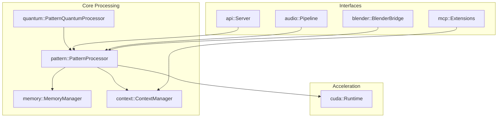
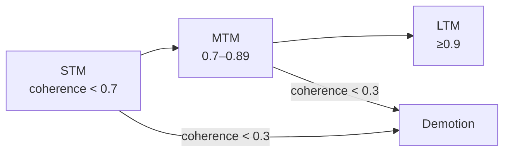

# Architecture Overview

The SEP Engine organizes processing into discrete modules with GPU acceleration and optional visualization support. The diagram below highlights the major subsystems and how they interact.

## Memory Tiers

Patterns move between tiers based on coherence and stability:

- **STM → MTM** when coherence ≥ 0.7
- **MTM → LTM** when coherence ≥ 0.9 and stability ≥ 0.85 after 100 generations
- **Removal** occurs when coherence drops below 0.3
- **Minimum viability** is 0.1 with relationship strength ≥ 0.6

## Configuration and Concurrency

A single `MemoryManager` instance is shared across worker threads and guarded by standard library mutexes. Configuration values are loaded from JSON files and can be overridden via environment variables or command-line arguments.

`SepEngine::extractEmbeddings` can delegate to a helper script that generates vector embeddings. When unavailable, deterministic vectors are produced to keep results consistent.

Isolation headers in `include/sep/` provide lightweight shims for external libraries to keep the codebase portable until full dependencies are available.

