# ====== api.md ======


# Api Module Overview

The headers and source files reside in `src/api`.

## Header Details

This document summarizes the contents of the `src/api/` directory. It shows how data enters and leaves the API layer and highlights the key structures and functions in each header. The diagrams use Mermaid syntax.

## Data Flow

The API layer acts as an interface between external clients (HTTP requests or C/JS bindings) and the internal engine. The high level data path is:

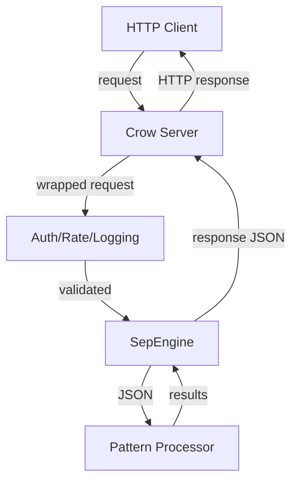

## Header Breakdown

### `api_exception.h`
Defines `APIException`, a custom `std::runtime_error` with a `transient_` flag to signal retryable errors.

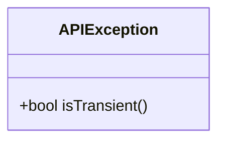

### `auth_middleware.h`
Provides `AuthMiddleware` that checks bearer tokens before a request reaches the engine.

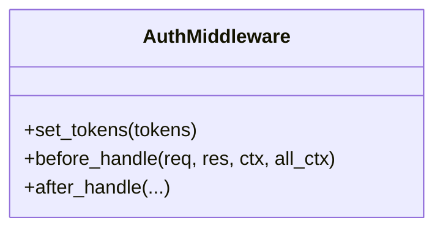

### `background_cleanup.h`
Runs background maintenance tasks such as cleaning rate‑limit windows.

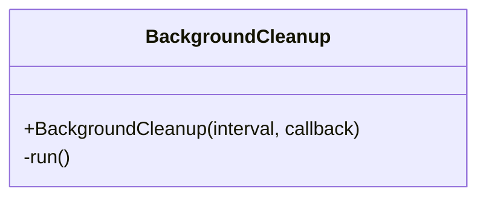

### `bridge.h` / `bridge.hpp`
Expose a C interface for native or JS callers. Functions like `sep_bridge_init` and `sep_process_context` marshal JSON to the engine.

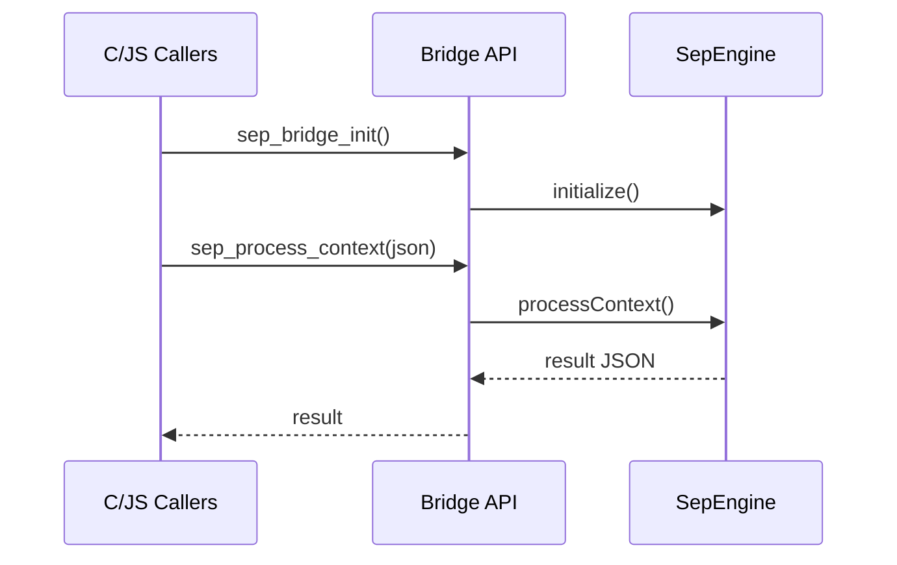
```

### `bridge_internal.hpp`
Holds global state used by the bridge (last error, callbacks, processor instance). Provides helpers for setting errors and buffer sizes.

### `client.h`
HTTP client utilities with `Client` and `CurlHttpClient` used by internal services to call out to other APIs.

### `connection_manager.h`
Abstracts socket pooling and connection reuse for outbound calls.

### `crow_adapter.h` / `crow_adapter_impl.h`
Adapters that convert Crow framework requests/responses to the generic `HttpRequest` and `HttpResponse` interfaces.

### `crow_request.h`
Implementation of `IRequest` for Crow, exposing headers, method, URL and body.

### `crow_request_adapter.h`
Wraps a `crow::request` in the generic `HttpRequest` interface used by the
middleware chain.

### `js_integration.h`
Provides a minimal wrapper (`JSIntegration`) for JavaScript bindings. `processContextCheck` takes JSON strings and returns JSON.

### `json_helpers.h`
Convenience functions for parsing/serializing JSON strings.

### `lock_free_rate_limiter.h`
Implements `IRateLimiter` with per-client windows and adaptive throttling based on system metrics.

### `logging_middleware.h`
Middleware that logs each request and response using the engine's logging facilities.

### `ollama_types.h`
Structures describing requests/responses for the Ollama client (e.g., embeddings or text generation).

### `ollama_client.h`
High-level HTTP client that calls an Ollama server using the structures defined above.

### `rate_limit_middleware.h`
Crow middleware integrating the rate limiter before the engine processes requests.

### `rate_limiter.h`
Abstract interface for rate limiter implementations.

### `request_interface.h`
Defines the abstract `IRequest` base class used across adapters.

### `sep_engine.h`
Singleton providing the main API for pattern processing, embeddings, and other high level operations.

### `server.h`
Defines `SEPApiServer` which ties together the Crow server, middleware, and `SepEngine` to form the running HTTP API service.

### `types.h`
Common enums and structures for HTTP status codes, request/response types, and health metrics.


## Implementation Details

This document outlines how HTTP requests travel through the SEP Engine's API layer and how the API hooks into lower modules.

## Key Implementation Files

- `src/api/server.cpp` – boots the Crow server, configures middleware, and registers routes.
- `src/api/sep_engine.cpp` – facade that connects to quantum processing and the memory manager.
- `src/api/auth_middleware.cpp` – validates bearer tokens.
- `src/api/rate_limit_middleware.cpp` and `src/api/lock_free_rate_limiter.cpp` – enforce per-client quotas.
- `src/api/crow_adapter.cpp` – minimal adapter for exposing the engine through the Crow framework.
- `src/api/bridge.cpp` and `src/api/bridge_c.cpp` – C-compatible bridge used by `js_integration.cpp`.
- `src/api/client.cpp` and `src/api/curl_http_client.cpp` – outgoing HTTP client used by `ollama_client.cpp`.

## Request Flow

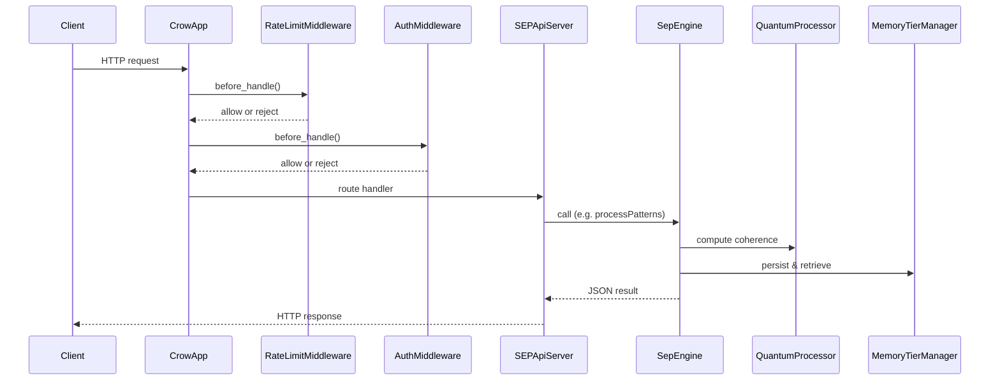

## Middleware Responsibilities

- **RateLimitMiddleware** wraps a lock-free rate limiter. When enabled, it checks each request and returns a `429` response if the limit is exceeded.
- **AuthMiddleware** optionally verifies a list of bearer tokens. If no tokens are configured, all requests pass through.

## Connections to Core and Quantum Modules

`SepEngine` instantiates a `QuantumProcessor` and a `PatternProcessor` while holding a reference to the `MemoryTierManager` singleton. Route handlers in `server.cpp` delegate to `SepEngine` methods which in turn invoke quantum algorithms and manage pattern history. Responses may be modulated for coherence before being returned.

Bridging files expose similar capabilities through a C ABI so that external languages can interact with the engine without linking against C++ directly.


# ====== architecture.md ======


# ====== audio.md ======


# Audio Module Overview

The headers and source files reside in `src/audio`.

## Header Details

This diagram summarizes how the headers under `src/audio/` interact with each other and with the rest of the engine. The flow focuses on data movement from audio capture through pattern extraction.

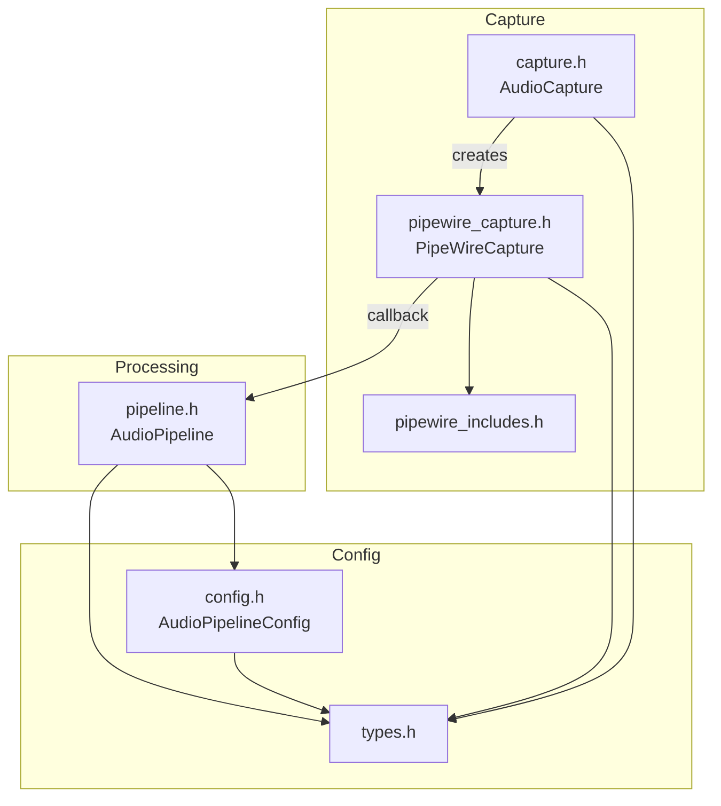

`AudioCapture` defines the virtual interface for audio input. `PipeWireCapture` implements this interface using the PipeWire API (wrapped by `pipewire_includes.h`). Captured sample buffers are forwarded via callback into `AudioPipeline`, which performs FFT analysis and spectral feature calculations. Configuration and metrics types originate from `types.h` and are reused across the module. `config.h` extends these basics with pipeline settings and coherence helpers that guide processing in `pipeline.h`.

## Implementation Details

This diagram outlines how audio data moves through the SEP engine. Raw samples originate from a PipeWire stream and are transformed into pattern vectors that other modules consume.

## Stages
1. **PipeWireCapture** – Connects to a PipeWire device and reads audio frames.
2. **AudioPipeline** – Buffers frames, applies a Hann window, runs an FFT, and extracts spectral features.
3. **Pattern Conversion** – Spectral features are mapped into `glm::vec3` pattern vectors which are enqueued for the engine.

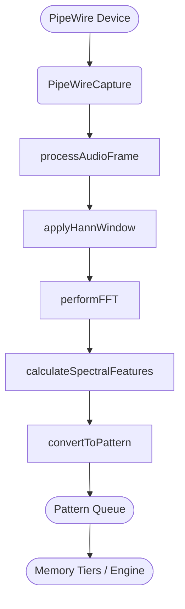


# ====== Big.md ======


# ====== blender.md ======


# Blender Module Overview

The headers and source files reside in `src/blender`.

## Header Details

This document diagrams how headers in `src/blender/` interact with the rest of the engine. It focuses on the objects instantiated by these headers and the outputs that flow to other modules such as `core` and `api`.

## Overview

The Blender integration layer exposes a thin C interface in `src/blender/api.cpp` while the majority of the logic resides in headers under `src/blender/`.
Key components are:

- **`api.h`** – C bindings that external modules (e.g. the API library) use.
- **`bridge.h` / `pattern_bridge.h`** – Implementation of the `BlenderBridge` class and helpers.
- **`base_types.h`** – Fundamental types used across the Blender bridge.
- **`pattern_observer.h`** – Observer interface notified about pattern updates.

These headers depend on utilities from `core/`, `memory/`, and `quantum/`.

## Communication Diagram

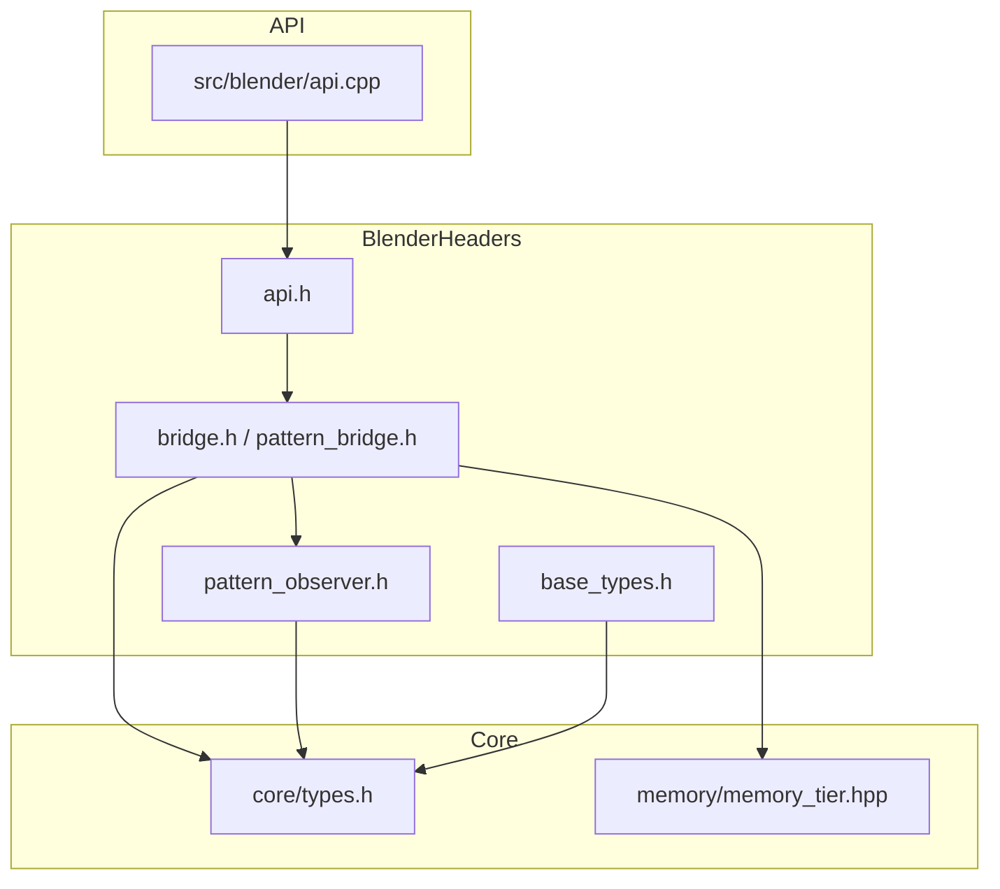

## Objects and Outputs

- **`SEPBlenderBridge`** (defined in `src/blender/types.h`)
  - Holds a `std::shared_ptr<sep::pattern::BlenderBridge>` instance.
  - Provides access to `SEPAudioMetrics` and `SEPPatternMetrics` produced during processing.
- **`sep::pattern::BlenderBridge`** (declared in `bridge.h`)
  - Coordinates pattern processing via `PatternProcessor` from `quantum/`.
  - Notifies `PatternObserver` instances when pattern metrics change.
  - Outputs updated `PatternMetrics` structures that may promote patterns across memory tiers.

External modules, especially the API layer, call the C functions in `api.h` which delegate to the `BlenderBridge` class. The results—such as updated meshes or audio metrics—are then returned through these structures and consumed by the rest of the engine.


## Implementation Details

This document outlines the key files involved in the SEP Blender integration and shows how pattern data flows through the system.

## Directory Overview

```
src/blender/
├── api.cpp                 # C API for registering objects and updating patterns
├── blender_integration.cpp # Entry point for linking SEP with Blender runtime
├── mesh_handler.cpp        # Creates, updates and deforms Blender meshes
├── gpu_context.cpp         # Manages compute shader and GPU buffers
├── pattern_visualization_pipeline.cpp # Converts pattern data into mesh updates
├── cycles_renderer.cpp     # Pattern-driven rendering using Cycles (when SEP_HAS_CYCLES=1)
├── compression.cpp         # Pattern data compression utilities
└── compression_utils.cpp   # Helper functions for compression
```

## Data Flow

1. **Pattern Receipt**
   - `api.cpp` exposes C functions such as `sep_register_mesh` and `sep_update_mesh`.
   - Blender calls these to send mesh handles and pattern metrics into the engine.

2. **Processing and Storage**
   - `blender_integration.cpp` creates a `PatternBridge` instance which stores object handles and pattern state.
   - `gpu_context.cpp` ensures GPU resources are ready for compute shaders.
   - `mesh_handler.cpp` converts SEP pattern data into Blender mesh structures.

3. **Visualization Pipeline**
   - `pattern_visualization_pipeline.cpp` orchestrates projection from N‑dimensional pattern coordinates to 3D space and updates meshes via `MeshHandler`.
   - Optional overlays such as coherence history are set via GPU uniform layers.

4. **Rendering Pipeline (when SEP_HAS_CYCLES=1)**
   - `cycles_renderer.cpp` provides pattern-driven rendering capabilities:
     - Converts patterns to Cycles scenes
     - Maps pattern properties (coherence, stability, entropy) to visual elements
     - Supports real-time scene updates based on pattern evolution
   - Currently uses stub implementation when Cycles is not available

5. **Handoff to Other Modules**
   - After mesh updates or rendering, control can return to higher‑level modules (e.g., the Python addon in `blender_addon`) or custom visualization code.
   - Metrics and pattern identifiers are passed back through the API to track engine state.

This pathway allows patterns produced by the SEP engine to be visualized inside Blender while keeping the integration modular.


# ====== compat.md ======


# Compat Module Overview

The headers and source files reside in `src/compat`.

## Header Details

This overview highlights how the engine's compatibility layer (the `compat` headers) is imported by other parts of the code base. Modules pull in CUDA helpers, memory RAII utilities and shim types to remain portable. Below is a summary of the primary connections.

## Key Imports

- **Core module** (`src/core`)
  - `compat/core.h` for the `CudaCore` singleton
  - `compat/memory.h` and `compat/raii.h` for `DeviceMemory` and RAII buffers
  - `compat/stream.h` for the `Stream` wrapper
- **Memory module** (`src/memory` and `src/memory`)
  - `compat/raii.h` and `compat/memory.h` to implement `UnifiedMemory`
- **Quantum and Blender modules**
  - `compat/math_common.h` and `compat/shim.h` to compile kernels or utility code on both CPU and GPU

The `compat` headers expose unified abstractions so that the rest of the project can allocate device buffers, launch kernels and synchronize streams without direct CUDA dependencies.

## Include Relationships

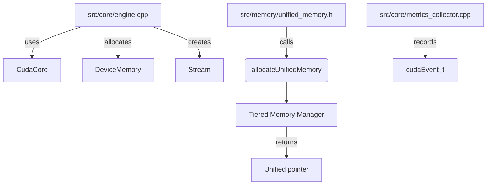

The diagram shows how core engine code instantiates CUDA resources. Memory helpers forward to the tiered memory manager and deliver unified pointers back to the caller. Metrics collection relies on CUDA events when available.

## Implementation Details

This document outlines the main files that implement the CUDA backend under `src/compat/` and shows how other parts of the engine invoke them.

## Overview

The **compat** module provides the GPU implementation and the CPU fallback used when CUDA is not available. The headers live under `src/compat/` and the implementation files are in `src/compat/`.

```
src/compat/   # public headers
src/compat/       # CUDA and fallback implementations
src/memory/       # explicit instantiations for unified memory
```

Modules such as `core` and `quantum` use these interfaces through `CudaCore` or the C API in `cuda_api.cu`.

## Key Implementation Files

| File | Purpose |
| --- | --- |
| `src/compat/core.cu` | Implements the `CudaCore` singleton which manages device state, streams, memory info and launches kernels. |
| `src/compat/core_stub.cpp` | CPU-only stub that satisfies the same interface when `SEP_CUDA_AVAILABLE` is false. |
| `src/compat/cuda_api.cu` | C-style entry points (`sep_cuda_*`) for legacy callers. Internally it allocates device buffers and invokes the kernel wrappers. |
| `src/compat/event.cu` | Light RAII wrapper around `cudaEvent_t`. |
| `src/compat/raii.cpp` | RAII utilities for streams, events, and device buffers. |
| `src/compat/stream.cpp` | `Stream` class that forwards to `impl::StreamImpl` and wraps `cudaStream_t`. |
| `src/compat/utils.cu` | Helper functions such as `checkMemory` and `validateKernelDimensions`. |
| `src/compat/quantum_kernels.cu` | Contains kernels for QBSA, QSH, similarity, and blending along with host launch wrappers. |
| `src/compat/pattern_kernels.cu` | Kernel that processes pattern data with evolution logic. |
| `src/memory/memory.cu` | Provides explicit template instantiations for the `UnifiedMemory` utility. |

### Headers

Relevant headers provide the public API:

- `compat/core.h` – definition of `CudaCore` and metrics structures.
- `compat/kernels.h` – declarations of the kernel launch wrappers.
- `compat/raii.h` – RAII classes (`StreamRAII`, `EventRAII`, `DeviceBufferRAII`).
- `compat/memory.h` – device memory helpers used by other modules.
- `compat/macros.h` and `compat/cuda_common.h` – compile-time macros and error helpers used across the implementation.

## Kernel Launch Flow

1. Callers in `src/core/engine.cpp` or the C API allocate device buffers using the RAII classes.
2. Data is copied to the device with helpers in `compat/memory.h` or direct `cudaMemcpyAsync` calls.
3. `CudaCore` exposes methods like `launchQBSA`, `launchQSH`, `launchSimilarity`, and `launchBlend` which internally call the corresponding wrappers (`launchQBSAKernel`, `launchQSHKernel`, etc.) from `quantum_kernels.cu`.
4. Each wrapper configures the grid, invokes the CUDA kernel, and returns a `cudaError_t` to the caller.
5. Results are copied back to host memory and processed by the calling module.

The pattern kernel is invoked via `launch_pattern_processing` declared in `src/compat/kernels.cuh`. Other modules do not call the CUDA kernels directly; they use these high-level entry points to keep the GPU details isolated within the compat layer.

## Usage by Other Modules

- **Core Engine** – `src/core/engine.cpp` retrieves the singleton `CudaCore::instance()` and uses it to run QBSA and QSH during batch processing. It also uses `Stream` and `DeviceMemory` helpers for transfers.
- **Tests** – `tests/cuda/kernels_test.cpp` allocates `DeviceBufferRAII` objects and calls the kernel launch wrappers directly to validate behavior.
- **C API** – `src/compat/cuda_api.cu` exposes functions like `sep_cuda_process_batch` which allocate buffers, call the launch wrappers, and copy results for consumption by external programs.

By funneling all GPU interaction through this module, the rest of the engine can remain agnostic of the CUDA runtime while still benefiting from accelerated kernels when available.


# ====== core.md ======


# Core Module Overview

The headers and source files reside in `src/core`.

## Header Details

This document illustrates how data flows through the headers inside
`src/core` and how they connect to higher level modules such as
`api`, `quantum`, and `memory`. Each header is represented by a Mermaid
node. Arrows show the primary direction of data or control flow.

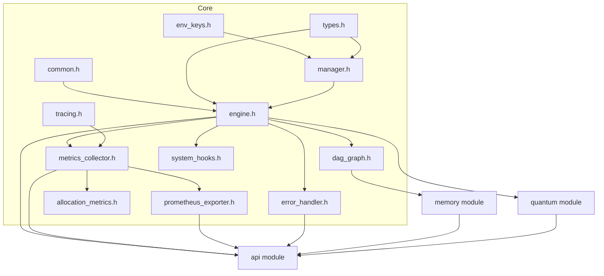

### Notes

- **Configuration flow**: `env_keys.h`, `types.h`, and `manager.h` work
together to load configuration values which are then consumed by
`engine.h` and other modules.
- **Metrics flow**: `metrics_collector.h` gathers performance data. It
feeds `prometheus_exporter.h` and `allocation_metrics.h` so metrics can
be published through the `api`.
- **DAG updates**: `dag_graph.h` tracks pattern lineage and is mainly
manipulated by the engine and `memory` module.
- **Error handling**: `error_handler.h` centralizes reporting from core
and higher-level modules.
- **System hooks**: `system_hooks.h` provides callbacks that modules can
implement to observe engine events.

## Implementation Details

This document illustrates how data moves through the main subsystems inside `src/core`.
Each section provides a high level flowchart describing the major interactions.

## Engine Initialization

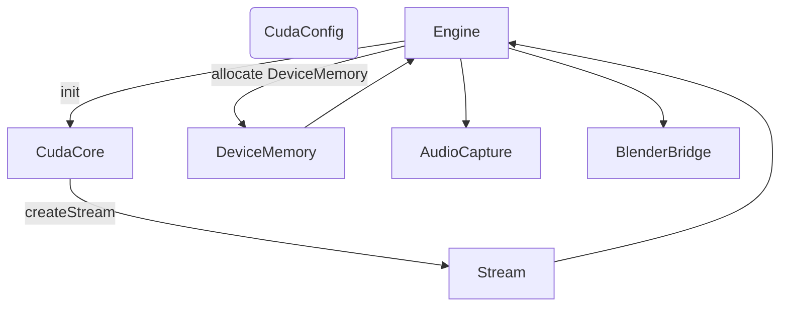

- The `Engine` loads configuration, initializes the CUDA runtime via `CudaCore`, and creates the default stream.
- Device memory buffers are allocated for bitfields, probe indices, expectations, and other working data.
- Optional subsystems such as audio capture and the Blender bridge are created if available.
- Once complete, the engine is ready to process batches of quantum state data.

## Metrics Collection

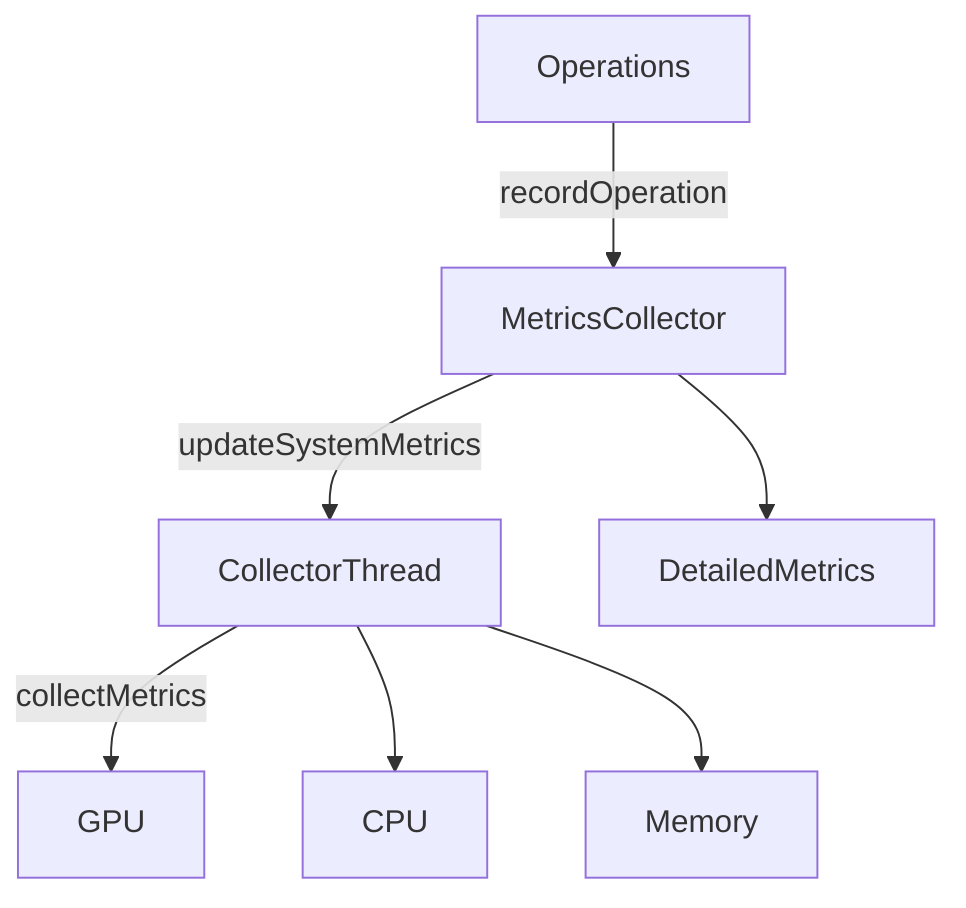

- User operations call `recordOperation`, `incrementCounter`, or `setGauge` which update in-memory metrics.
- A background collector thread periodically gathers GPU, CPU, and memory usage, storing the latest values in `DetailedMetrics`.
- Kernel start/stop events feed execution timing information back into the metrics structures.

## Error Handling

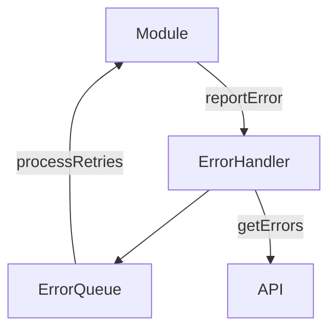

- Any module can report an error with optional retry logic to the singleton `ErrorHandler`.
- Errors are stored in an internal queue. On each report, the handler attempts retries up to three times.
- External callers can query or clear the error list via the API layer.

## DAG Graph System

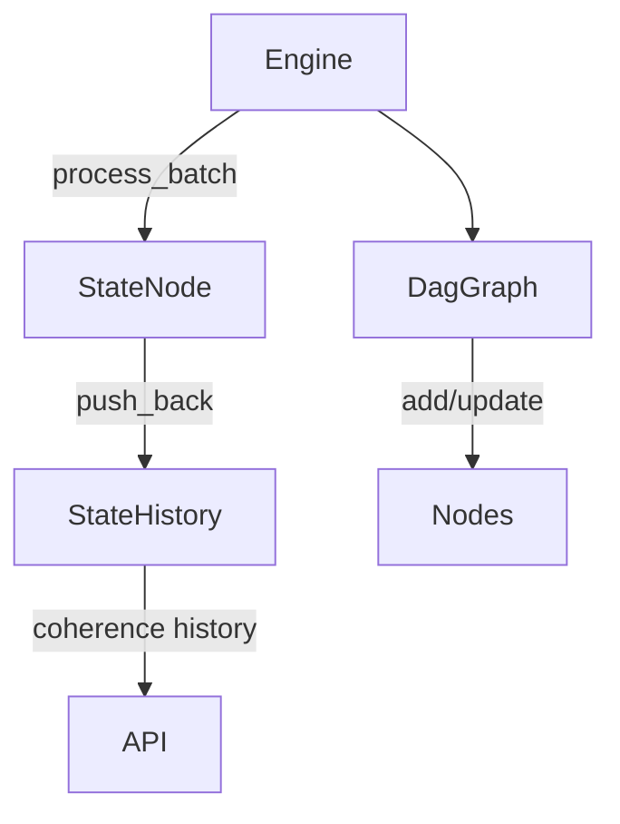

- During batch processing, the engine computes collapse indices and coherence information, creating a new `StateNode`.
- The node is appended to `StateHistory`, allowing inspection of coherence over time.
- A separate `DagGraph` tracks relationships between patterns, storing parent links and coherence values.
- Clients can access both the state history and graph data to visualize system evolution.


# ====== crow.md ======


# Crow Integration Overview

This document illustrates how the Crow HTTP framework is integrated into the SEP Engine and
what data each piece exposes or consumes from other components. Crow is used to provide the
HTTP API layer that external clients interact with.

## High-Level Flow

```
+-----------+        +-------------+        +----------------+
| External  | -----> |  Crow App   | -----> |   Route        |
| Clients   | HTTP   | (src/api)   |        |  Handlers      |
+-----------+        +------+------+        +----+-----------+
                               |                   |
                               v                   v
                         +-----+-------+     +-----+---------+
                         | Crow Adapter|     | SepEngine API |
                         | (src/api)   |     | (src/api)     |
                         +-----+-------+     +-----+---------+
                               |                   |
                               v                   v
                       +-------+---------+  +------+------+
                       | Memory Manager  |  | Quantum     |
                       | (memory)        |  | Module      |
                       +-----------------+  +-------------+
```

1. **Crow App** – Configured in `src/api/server.cpp` and `crow_adapter.cpp`. It
   receives HTTP requests from external clients.
2. **Route Handlers** – Defined in `crow_adapter.cpp` and `server.cpp`. They parse
   incoming JSON, invoke `SepEngine` methods, and build responses.
3. **Crow Adapter** – `crow_adapter.h/cpp` bridges Crow’s `request` and `response`
   objects with the internal `HttpRequest`/`HttpResponse` interfaces.
4. **SepEngine API** – Implements the high‑level operations. It consumes pattern
   data and returns JSON results. Located under `src/api` and uses
   headers in `src/api`.
5. **Memory Manager / Quantum Modules** – Lower‑level modules (`src/memory`,
   `src/quantum`). These modules provide data storage and algorithmic
   processing. The `SepEngine` API passes data from HTTP requests down to these
   subsystems and aggregates their results.

## Data Exposed and Consumed

- **HTTP JSON Payloads** – Route handlers accept JSON bodies containing context
  objects, pattern data, or control commands. Parsing utilities in
  `json_helpers.h` convert them to C++ structures.
- **Engine Responses** – Results from `SepEngine` (e.g., similarity scores, pattern
  history) are serialized back to JSON and sent through `CrowResponseAdapter` to
  the client.
- **Metrics and Health Data** – `server.cpp` exposes health endpoints and gathers
  metrics such as request counts and error codes, which other components can
  query via the API.
- **Configuration** – `config::CudaConfig` values are consumed by `SEPApiServer`
  to set up ports, logging, and optional middlewares (authentication and rate
  limiting).

This integration keeps the Crow framework isolated from core engine logic. The
`crow` headers live under `src/crow`, while API-specific adapters and
servers reside under `src/api` and `src/api`. External components interact
with the engine solely through the defined HTTP routes.


# ====== cycles_src.md ======


# Cycles Source Symlink

`src/cycles_src` is a convenience link to the Blender Cycles source tree. It allows the engine's `blender` module to reference Cycles headers without hardcoding absolute paths.

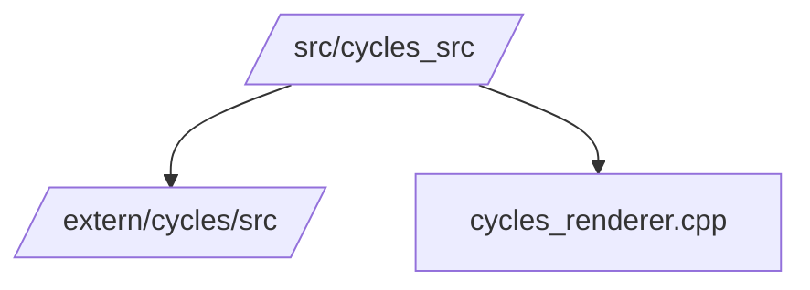

The symlink mirrors `extern/cycles/src` so that files like `src/blender/cycles_renderer.cpp` can include headers such as `kernel/kernel.h` when `SEP_HAS_CYCLES` is enabled.


# ====== embeddings.md ======


# Embeddings Module Overview

The headers and source files reside in `src/embeddings`.

## Header Details

## Header Breakdown

### `simple_embedding_model.h`
Defines `sep::embeddings::SimpleEmbeddingModel`, a lightweight class that transforms a string into a fixed‑size vector.

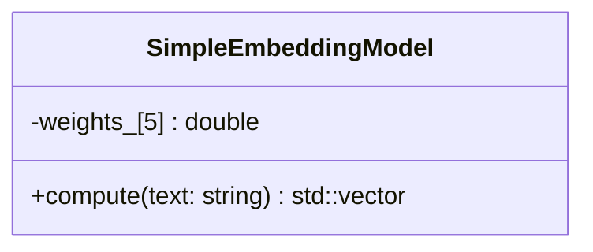

## Implementation Details

The `src/embeddings` folder currently contains a single implementation file providing a toy text embedding model.

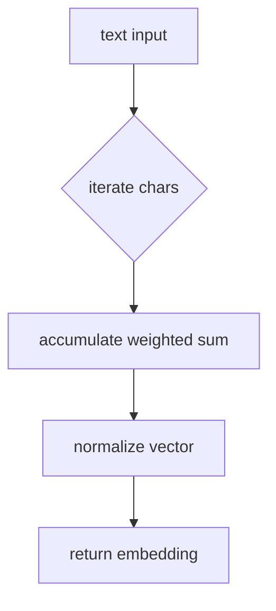

`simple_embedding_model.cpp` multiplies each character code by a constant weight vector and normalizes the result. The function is deterministic and serves as a placeholder until a real model is integrated.

## Processing Steps

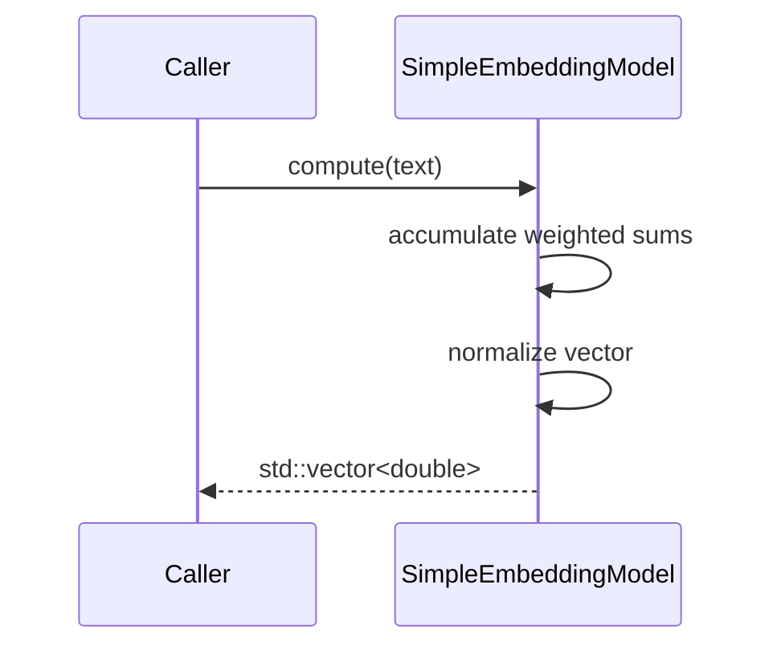

1. **Initialization**: The constructor fills `weights_` with deterministic constants.
2. **Accumulation**: `compute` iterates over characters, multiplies by each weight and sums into a vector of length `kDim`.
3. **Normalization**: After accumulation the vector is normalized to unit length.

The CMake file exports this object as `sep_embeddings`, allowing other modules to link against the library.


# ====== memory.md ======


# Memory Module Overview

The headers and source files reside in `src/memory`.

## Header Details

This document diagrams the relationships between the headers in `src/memory` and highlights their APIs. The tiered memory system exposes several classes that coordinate allocations between Short‑Term (STM), Medium‑Term (MTM), and Long‑Term (LTM) memory pools.

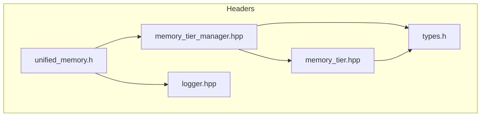

## Key APIs

### memory_tier.hpp
- **`MemoryBlock`** – structure describing a block's pointer, size and metadata.
- **`MemoryTier`** – manages a contiguous pool; provides `allocate`, `deallocate`, and `defragment`.

### memory_tier_manager.hpp
- **`MemoryTierManager`** (singleton)
  - `allocate(std::size_t, TierType)` and `deallocate(MemoryBlock*)`
  - `getSTM()`, `getMTM()`, and `getLTM()` to access tier objects
  - Promotion/demotion: `promoteBlock()` and `demoteBlock()`
  - Pattern operations like `launch_pattern_processing()` tie into `quantum` and `core` modules via `dag_graph` and `pattern` APIs.

### unified_memory.h
- **`UnifiedMemory<T>`** – RAII wrapper for CUDA unified memory.
- **CUDA helpers** `allocateDeviceMemory()`, `freeDeviceMemory()`, `allocateUnifiedMemory()`, `freeUnifiedMemory()` use the CUDA runtime when available and fall back to standard allocations on the host when CUDA is disabled.

### logger.hpp
- Minimal logger interface used by the memory subsystem for diagnostics.

### types.h
- Shared types for patterns, relationship metadata, and the `RedisManager` used by the long‑term tier.

## Module Interactions

The memory subsystem collaborates with other modules:

- **`core`** – Supplies the `dag_graph` and hooks for metrics and system events.
- **`quantum`** – Defines `Pattern` structures and coherence calculations used when promoting or pruning blocks.
- **`compat`** – Provides CUDA wrappers and RAII helpers used throughout the memory code.

Each tier monitors fragmentation and utilization. When thresholds are crossed, `MemoryTierManager` triggers promotion or demotion across STM, MTM, and LTM, optionally persisting data via the `RedisManager`.

## Implementation Details

This document illustrates how the `memory` module is organized inside `src/` and how it interacts with the `quantum` and `core` components.

## Tiered Memory System

The engine implements a three‑tier memory hierarchy:

| Tier | Purpose | Backing |
| --- | --- | --- |
| **Short‑Term Memory (STM)** | Fast storage for new or transient patterns. | Host or unified memory. |
| **Medium‑Term Memory (MTM)** | Holds patterns with moderate coherence and stability. | Host, device, or unified memory. |
| **Long‑Term Memory (LTM)** | Persistent storage for highly coherent patterns. Can be backed by Redis. | Device/unified memory + optional Redis. |

Each tier is implemented by `memory::MemoryTier` (see `src/memory/memory_tier.cpp`). The tiers allocate blocks from a dedicated memory pool and track fragmentation, utilization, and pattern metadata.

## MemoryTierManager

`memory::MemoryTierManager` (in `src/memory/memory_tier_manager.cpp`) is a singleton that orchestrates all tiers. Its responsibilities include:

- Allocating and freeing `MemoryBlock` objects in a specific tier.
- Promoting/demoting blocks when coherence, stability, or generation counts cross thresholds.
- Maintaining a lookup table so blocks can be found by pointer.
- Exposing metrics for utilization and fragmentation.
- Managing pattern relationships via a `dag::DagGraph` from the `core` module.
- Optionally persisting LTM patterns through `persistence::RedisManager`.

```
+-------------------------+         +---------------------+
|  quantum algorithms     | <-----> | memory::MemoryTier  |
|  (pattern evolution)    |         | - STM / MTM / LTM   |
+-----------+-------------+         +----------+----------+
            |                                 ^
            | produce PatternData             |
            v                                 |
   +--------+---------+                uses metrics,
   | MemoryTierManager|  --(DAG, logs)-->  core utilities
   +------------------+
```

The quantum module determines the initial tier for a pattern (see `src/quantum/pattern_processor.cpp`). Once stored, the manager monitors coherence and stability to promote from STM → MTM → LTM or demote in the opposite direction. All promotion/demotion decisions rely on configuration values stored in `MemoryTierManager::Config`.

The core module supplies:

- `dag::DagGraph` for tracking relationships between patterns.
- Logging via `logging::Manager`.
- Allocation metrics and error handling utilities.
- Utilization metrics use a small epsilon (~1%) so that tiny rounding
  errors after tier defragmentation don't appear as lingering usage in
  tests.

## File Locations

- `src/memory/memory_tier.cpp` – Implementation of the tier class (allocation, defragmentation, pattern storage).
- `src/memory/memory_tier_manager.cpp` – Singleton manager coordinating tiers and pattern promotion.
- `src/memory/redis_manager.cpp` – Optional persistence layer for LTM.

These files form the backbone of the memory subsystem and are closely tied to the quantum algorithms that generate pattern data and the core services that collect metrics and maintain the DAG.


# ====== quantum.md ======


# Quantum Module Overview

The headers and source files reside in `src/quantum`.

## Header Details

This chart outlines how data moves through the quantum-processing headers in the SEP engine. Patterns originate either from in-memory data structures or via the engine's HTTP API. They then pass through several stages of analysis before results are stored back in memory or returned through the API.

```mermaid
flowchart TD
    Mem["Memory / API"]
    processor_h["processor.h"]
    qbsa_h["qbsa.h"]
    qfh_h["qfh.h"]
    qbsa_qfh_h["qbsa_qfh.h"]
    qp_qfh_h["quantum_processor_qfh.h"]
    qp_h["quantum_processor.h"]
    cycles_h["cycles.h"]
    evolution_h["evolution.h"]
    pattern_h["pattern.h"]
    pattern_evolution_h["pattern_evolution.h"]
    pattern_evolution_bridge_h["pattern_evolution_bridge.h"]
    relationship_h["relationship.h"]
    resource_predictor_h["resource_predictor.h"]
    qmo_h["quantum_manifold_optimizer.h"]
    data_h["data.hpp"]
    gpu_context_h["gpu_context.h"]
    priority_h["priority.h"]
    types_h["types.h"]

    Mem --> processor_h
    data_h --> pattern_h
    types_h --> pattern_h
    gpu_context_h --> processor_h
    priority_h --> processor_h
    pattern_h --> processor_h
    evolution_h --> pattern_evolution_h --> processor_h
    pattern_evolution_bridge_h --> processor_h
    processor_h --> qbsa_h
    qbsa_h --> qbsa_qfh_h
    qfh_h --> qbsa_qfh_h
    qbsa_qfh_h --> qp_qfh_h
    cycles_h --> qp_qfh_h
    qp_qfh_h --> qp_h
    relationship_h --> qp_h
    resource_predictor_h --> qmo_h --> qp_h
    processor_h --> qp_h
    qp_h --> Mem
```

**Header Roles**

- `cycles.h` – Implements `QuantumRenderer` for iterative scene evolution.
- `data.hpp` – Core structures describing quantum states and pattern metrics.
- `evolution.h` – Utility helpers to drive pattern evolution cycles.
- `gpu_context.h` – Abstraction layer for GPU resources used by kernels.
- `pattern.h` – Basic pattern containers shared across modules.
- `pattern_evolution.h` – High‑level helpers for evolving patterns.
- `pattern_evolution_bridge.h` – Connects evolution helpers with the API layer.
- `priority.h` – Scheduling weights for processing patterns.
- `processor.h` – Base `PatternProcessor` orchestrating evolution.
- `qbsa.h` – Quantum Binary State Analysis algorithms.
- `qbsa_qfh.h` – Extension combining QBSA with QFH results.
- `qfh.h` – Quantum Fourier Hierarchy transform routines.
- `quantum_manifold_optimizer.h` – Optimizes quantum states across memory tiers.
- `quantum_processor.h` – Public interface for quantum pattern processing.
- `quantum_processor_qfh.h` – Processor variant leveraging QFH.
- `relationship.h` – Manages relationships and similarity calculations between patterns.
- `resource_predictor.h` – Estimates resource needs for context batches.
- `types.h` – Shared type definitions for quantum structures.

Data fed through these headers ultimately flows into `quantum_processor.h` where final results are produced and returned to memory or the API.

## Implementation Details

This diagram illustrates how data moves through the quantum-processing implementation in `src/quantum`. Pattern information originates in the tiered memory system and is processed through several layers before being written back.

```
+---------------------+
| Memory/Core         |
| (MemoryTierManager, |
|  DagGraph, Hooks)   |
+----------+----------+
           |
           v
+----------+----------+
| Pattern Processor   |
+----------+----------+
           |
           v
+---------------------+
| Pattern Quantum     |
| Processor (PQP)     |
+----------+----------+
           |
           v
+---------------------+
| Quantum Processor   |
|  (QBSA/QFH logic)   |
+----------+----------+
           |
           v
+---------------------+
| GPU/Core Algorithms |
|  (Evolution, Kernels)|
+----------+----------+
           |
           v
+----------+----------+
| Updated States      |
| -> Memory/Core      |
+---------------------+
```

1. **Memory/Core**: `MemoryTierManager` stores `PatternData` with associated `QuantumState`. Core utilities (hooks, DAG) provide system services.
2. **Pattern Processor**: Coordinates evolution and mutation of patterns; interacts with `MemoryTierManager` to fetch or store data.
3. **Pattern Quantum Processor**: Bridges high-level pattern logic with the lower-level `QuantumProcessor` API.
4. **Quantum Processor**: Implements coherence/stability calculations using QBSA and QFH algorithms. It updates the in-memory state of each pattern.
5. **GPU/Core Algorithms**: When GPU support is enabled, kernels in `compat` accelerate calculations.
6. **Updated States**: Results are written back to the memory tiers and the DAG for future processing cycles.

The flow forms a loop: patterns are retrieved from memory, processed through these layers, and the updated results are stored back, ready for the next iteration.

