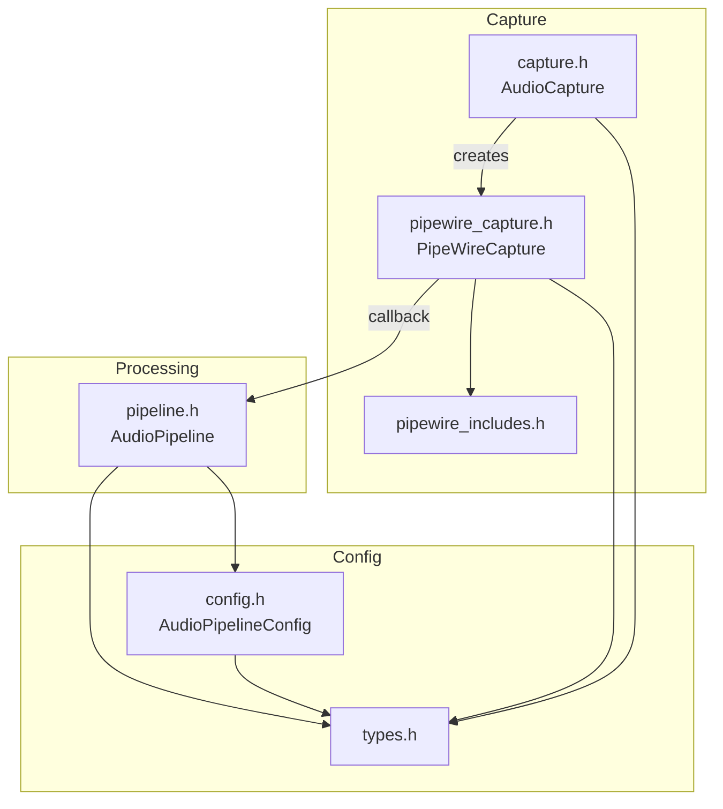
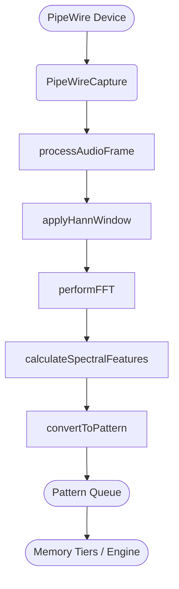

# Audio Module Overview

The headers and source files reside in `src/audio`.

## Header Details

This diagram summarizes how the headers under `src/audio/` interact with each other and with the rest of the engine. The flow focuses on data movement from audio capture through pattern extraction.

`AudioCapture` defines the virtual interface for audio input. `PipeWireCapture` implements this interface using the PipeWire API (wrapped by `pipewire_includes.h`). Captured sample buffers are forwarded via callback into `AudioPipeline`, which performs FFT analysis and spectral feature calculations. Configuration and metrics types originate from `types.h` and are reused across the module. `config.h` extends these basics with pipeline settings and coherence helpers that guide processing in `pipeline.h`.

## Implementation Details

This diagram outlines how audio data moves through the SEP engine. Raw samples originate from a PipeWire stream and are transformed into pattern vectors that other modules consume.

## Stages
1. **PipeWireCapture** – Connects to a PipeWire device and reads audio frames.
2. **AudioPipeline** – Buffers frames, applies a Hann window, runs an FFT, and extracts spectral features.
3. **Pattern Conversion** – Spectral features are mapped into `glm::vec3` pattern vectors which are enqueued for the engine.

