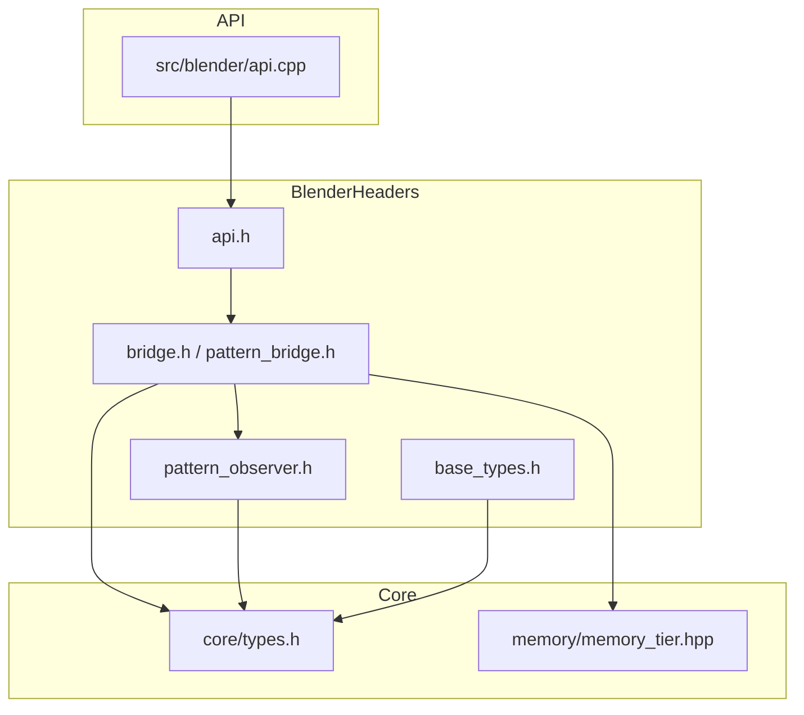

# Blender Module Overview

The headers and source files reside in `src/blender`.

## Header Details

This document diagrams how headers in `src/blender/` interact with the rest of the engine. It focuses on the objects instantiated by these headers and the outputs that flow to other modules such as `core` and `api`.

## Overview

The Blender integration layer exposes a thin C interface in `src/blender/api.cpp` while the majority of the logic resides in headers under `src/blender/`.
Key components are:

- **`api.h`** – C bindings that external modules (e.g. the API library) use.
- **`bridge.h` / `pattern_bridge.h`** – Implementation of the `BlenderBridge` class and helpers.
- **`base_types.h`** – Fundamental types used across the Blender bridge.
- **`pattern_observer.h`** – Observer interface notified about pattern updates.

These headers depend on utilities from `core/`, `memory/`, and `quantum/`.

## Communication Diagram



## Objects and Outputs

- **`SEPBlenderBridge`** (defined in `src/blender/types.h`)
  - Holds a `std::shared_ptr<sep::pattern::BlenderBridge>` instance.
  - Provides access to `SEPAudioMetrics` and `SEPPatternMetrics` produced during processing.
- **`sep::pattern::BlenderBridge`** (declared in `bridge.h`)
  - Coordinates pattern processing via `PatternProcessor` from `quantum/`.
  - Notifies `PatternObserver` instances when pattern metrics change.
  - Outputs updated `PatternMetrics` structures that may promote patterns across memory tiers.

External modules, especially the API layer, call the C functions in `api.h` which delegate to the `BlenderBridge` class. The results—such as updated meshes or audio metrics—are then returned through these structures and consumed by the rest of the engine.


## Implementation Details

This document outlines the key files involved in the SEP Blender integration and shows how pattern data flows through the system.

## Directory Overview

```
src/blender/
├── api.cpp                 # C API for registering objects and updating patterns
├── blender_integration.cpp # Entry point for linking SEP with Blender runtime
├── mesh_handler.cpp        # Creates, updates and deforms Blender meshes
├── gpu_context.cpp         # Manages compute shader and GPU buffers
├── pattern_visualization_pipeline.cpp # Converts pattern data into mesh updates
├── cycles_renderer.cpp     # Pattern-driven rendering using Cycles (when SEP_HAS_CYCLES=1)
├── compression.cpp         # Pattern data compression utilities
└── compression_utils.cpp   # Helper functions for compression
```

## Data Flow

1. **Pattern Receipt**
   - `api.cpp` exposes C functions such as `sep_register_mesh` and `sep_update_mesh`.
   - Blender calls these to send mesh handles and pattern metrics into the engine.

2. **Processing and Storage**
   - `blender_integration.cpp` creates a `PatternBridge` instance which stores object handles and pattern state.
   - `gpu_context.cpp` ensures GPU resources are ready for compute shaders.
   - `mesh_handler.cpp` converts SEP pattern data into Blender mesh structures.

3. **Visualization Pipeline**
   - `pattern_visualization_pipeline.cpp` orchestrates projection from N‑dimensional pattern coordinates to 3D space and updates meshes via `MeshHandler`.
   - Optional overlays such as coherence history are set via GPU uniform layers.

4. **Rendering Pipeline (when SEP_HAS_CYCLES=1)**
   - `cycles_renderer.cpp` provides pattern-driven rendering capabilities:
     - Converts patterns to Cycles scenes
     - Maps pattern properties (coherence, stability, entropy) to visual elements
     - Supports real-time scene updates based on pattern evolution
   - Currently uses stub implementation when Cycles is not available

5. **Handoff to Other Modules**
   - After mesh updates or rendering, control can return to higher‑level modules (e.g., the Python addon in `blender_addon`) or custom visualization code.
   - Metrics and pattern identifiers are passed back through the API to track engine state.

This pathway allows patterns produced by the SEP engine to be visualized inside Blender while keeping the integration modular.

