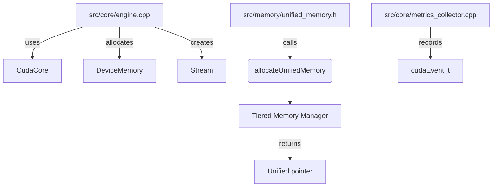

# Compat Module Overview

The headers and source files reside in `src/compat`.

## Header Details

This overview highlights how the engine's compatibility layer (the `compat` headers) is imported by other parts of the code base. Modules pull in CUDA helpers, memory RAII utilities and shim types to remain portable. Below is a summary of the primary connections.

## Key Imports

- **Core module** (`src/core`)
  - `compat/core.h` for the `CudaCore` singleton
  - `compat/memory.h` and `compat/raii.h` for `DeviceMemory` and RAII buffers
  - `compat/stream.h` for the `Stream` wrapper
- **Memory module** (`src/memory` and `src/memory`)
  - `compat/raii.h` and `compat/memory.h` to implement `UnifiedMemory`
- **Quantum and Blender modules**
  - `compat/math_common.h` and `compat/shim.h` to compile kernels or utility code on both CPU and GPU

The `compat` headers expose unified abstractions so that the rest of the project can allocate device buffers, launch kernels and synchronize streams without direct CUDA dependencies.

## Include Relationships



The diagram shows how core engine code instantiates CUDA resources. Memory helpers forward to the tiered memory manager and deliver unified pointers back to the caller. Metrics collection relies on CUDA events when available.

## Implementation Details

This document outlines the main files that implement the CUDA backend under `src/compat/` and shows how other parts of the engine invoke them.

## Overview

The **compat** module provides the GPU implementation and the CPU fallback used when CUDA is not available. The headers live under `src/compat/` and the implementation files are in `src/compat/`.

```
src/compat/   # public headers
src/compat/       # CUDA and fallback implementations
src/memory/       # explicit instantiations for unified memory
```

Modules such as `core` and `quantum` use these interfaces through `CudaCore` or the C API in `cuda_api.cu`.

## Key Implementation Files

| File | Purpose |
| --- | --- |
| `src/compat/core.cu` | Implements the `CudaCore` singleton which manages device state, streams, memory info and launches kernels. |
| `src/compat/core_stub.cpp` | CPU-only stub that satisfies the same interface when `SEP_CUDA_AVAILABLE` is false. |
| `src/compat/cuda_api.cu` | C-style entry points (`sep_cuda_*`) for legacy callers. Internally it allocates device buffers and invokes the kernel wrappers. |
| `src/compat/event.cu` | Light RAII wrapper around `cudaEvent_t`. |
| `src/compat/raii.cpp` | RAII utilities for streams, events, and device buffers. |
| `src/compat/stream.cpp` | `Stream` class that forwards to `impl::StreamImpl` and wraps `cudaStream_t`. |
| `src/compat/utils.cu` | Helper functions such as `checkMemory` and `validateKernelDimensions`. |
| `src/compat/quantum_kernels.cu` | Contains kernels for QBSA, QSH, similarity, and blending along with host launch wrappers. |
| `src/compat/pattern_kernels.cu` | Kernel that processes pattern data with evolution logic. |
| `src/memory/memory.cu` | Provides explicit template instantiations for the `UnifiedMemory` utility. |

### Headers

Relevant headers provide the public API:

- `compat/core.h` – definition of `CudaCore` and metrics structures.
- `compat/kernels.h` – declarations of the kernel launch wrappers.
- `compat/raii.h` – RAII classes (`StreamRAII`, `EventRAII`, `DeviceBufferRAII`).
- `compat/memory.h` – device memory helpers used by other modules.
- `compat/macros.h` and `compat/cuda_common.h` – compile-time macros and error helpers used across the implementation.

## Kernel Launch Flow

1. Callers in `src/core/engine.cpp` or the C API allocate device buffers using the RAII classes.
2. Data is copied to the device with helpers in `compat/memory.h` or direct `cudaMemcpyAsync` calls.
3. `CudaCore` exposes methods like `launchQBSA`, `launchQSH`, `launchSimilarity`, and `launchBlend` which internally call the corresponding wrappers (`launchQBSAKernel`, `launchQSHKernel`, etc.) from `quantum_kernels.cu`.
4. Each wrapper configures the grid, invokes the CUDA kernel, and returns a `cudaError_t` to the caller.
5. Results are copied back to host memory and processed by the calling module.

The pattern kernel is invoked via `launch_pattern_processing` declared in `src/compat/kernels.cuh`. Other modules do not call the CUDA kernels directly; they use these high-level entry points to keep the GPU details isolated within the compat layer.

## Usage by Other Modules

- **Core Engine** – `src/core/engine.cpp` retrieves the singleton `CudaCore::instance()` and uses it to run QBSA and QSH during batch processing. It also uses `Stream` and `DeviceMemory` helpers for transfers.
- **Tests** – `tests/cuda/kernels_test.cpp` allocates `DeviceBufferRAII` objects and calls the kernel launch wrappers directly to validate behavior.
- **C API** – `src/compat/cuda_api.cu` exposes functions like `sep_cuda_process_batch` which allocate buffers, call the launch wrappers, and copy results for consumption by external programs.

By funneling all GPU interaction through this module, the rest of the engine can remain agnostic of the CUDA runtime while still benefiting from accelerated kernels when available.

