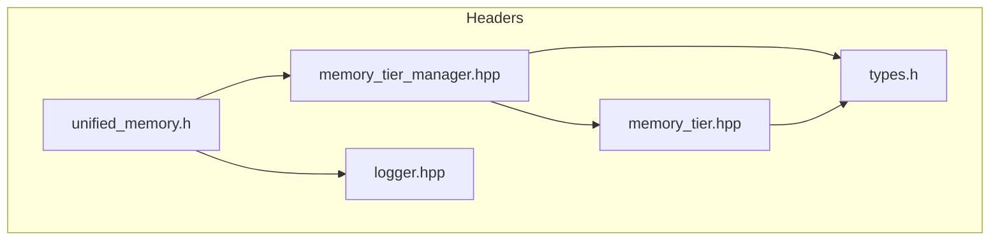

# Memory Module Overview

The headers and source files reside in `src/memory`.

## Header Details

This document diagrams the relationships between the headers in `src/memory` and highlights their APIs. The tiered memory system exposes several classes that coordinate allocations between Short‑Term (STM), Medium‑Term (MTM), and Long‑Term (LTM) memory pools.



## Key APIs

### memory_tier.hpp
- **`MemoryBlock`** – structure describing a block's pointer, size and metadata.
- **`MemoryTier`** – manages a contiguous pool; provides `allocate`, `deallocate`, and `defragment`.

### memory_tier_manager.hpp
- **`MemoryTierManager`** (singleton)
  - `allocate(std::size_t, TierType)` and `deallocate(MemoryBlock*)`
  - `getSTM()`, `getMTM()`, and `getLTM()` to access tier objects
  - Promotion/demotion: `promoteBlock()` and `demoteBlock()`
  - Pattern operations like `launch_pattern_processing()` tie into `quantum` and `core` modules via `dag_graph` and `pattern` APIs.

### unified_memory.h
- **`UnifiedMemory<T>`** – RAII wrapper for CUDA unified memory.
- **CUDA helpers** `allocateDeviceMemory()`, `freeDeviceMemory()`, `allocateUnifiedMemory()`, `freeUnifiedMemory()` use the CUDA runtime when available and fall back to standard allocations on the host when CUDA is disabled.

### logger.hpp
- Minimal logger interface used by the memory subsystem for diagnostics.

### types.h
- Shared types for patterns, relationship metadata, and the `RedisManager` used by the long‑term tier.

## Module Interactions

The memory subsystem collaborates with other modules:

- **`core`** – Supplies the `dag_graph` and hooks for metrics and system events.
- **`quantum`** – Defines `Pattern` structures and coherence calculations used when promoting or pruning blocks.
- **`compat`** – Provides CUDA wrappers and RAII helpers used throughout the memory code.

Each tier monitors fragmentation and utilization. When thresholds are crossed, `MemoryTierManager` triggers promotion or demotion across STM, MTM, and LTM, optionally persisting data via the `RedisManager`.

## Implementation Details

This document illustrates how the `memory` module is organized inside `src/` and how it interacts with the `quantum` and `core` components.

## Tiered Memory System

The engine implements a three‑tier memory hierarchy:

| Tier | Purpose | Backing |
| --- | --- | --- |
| **Short‑Term Memory (STM)** | Fast storage for new or transient patterns. | Host or unified memory. |
| **Medium‑Term Memory (MTM)** | Holds patterns with moderate coherence and stability. | Host, device, or unified memory. |
| **Long‑Term Memory (LTM)** | Persistent storage for highly coherent patterns. Can be backed by Redis. | Device/unified memory + optional Redis. |

Each tier is implemented by `memory::MemoryTier` (see `src/memory/memory_tier.cpp`). The tiers allocate blocks from a dedicated memory pool and track fragmentation, utilization, and pattern metadata.

## MemoryTierManager

`memory::MemoryTierManager` (in `src/memory/memory_tier_manager.cpp`) is a singleton that orchestrates all tiers. Its responsibilities include:

- Allocating and freeing `MemoryBlock` objects in a specific tier.
- Promoting/demoting blocks when coherence, stability, or generation counts cross thresholds.
- Maintaining a lookup table so blocks can be found by pointer.
- Exposing metrics for utilization and fragmentation.
- Managing pattern relationships via a `dag::DagGraph` from the `core` module.
- Optionally persisting LTM patterns through `persistence::RedisManager`.

```
+-------------------------+         +---------------------+
|  quantum algorithms     | <-----> | memory::MemoryTier  |
|  (pattern evolution)    |         | - STM / MTM / LTM   |
+-----------+-------------+         +----------+----------+
            |                                 ^
            | produce PatternData             |
            v                                 |
   +--------+---------+                uses metrics,
   | MemoryTierManager|  --(DAG, logs)-->  core utilities
   +------------------+
```

The quantum module determines the initial tier for a pattern (see `src/quantum/pattern_processor.cpp`). Once stored, the manager monitors coherence and stability to promote from STM → MTM → LTM or demote in the opposite direction. All promotion/demotion decisions rely on configuration values stored in `MemoryTierManager::Config`.

The core module supplies:

- `dag::DagGraph` for tracking relationships between patterns.
- Logging via `logging::Manager`.
- Allocation metrics and error handling utilities.
- Utilization metrics use a small epsilon (~1%) so that tiny rounding
  errors after tier defragmentation don't appear as lingering usage in
  tests.

## File Locations

- `src/memory/memory_tier.cpp` – Implementation of the tier class (allocation, defragmentation, pattern storage).
- `src/memory/memory_tier_manager.cpp` – Singleton manager coordinating tiers and pattern promotion.
- `src/memory/redis_manager.cpp` – Optional persistence layer for LTM.

These files form the backbone of the memory subsystem and are closely tied to the quantum algorithms that generate pattern data and the core services that collect metrics and maintain the DAG.

