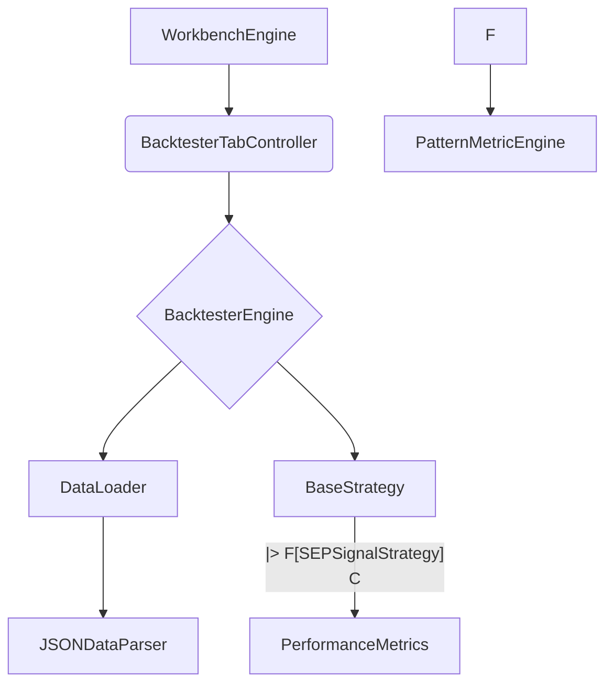

# Backtesting Framework Architecture

This document outlines the architecture for the new backtesting framework.

## 1. Overview

The backtesting framework is designed to test trading strategies against historical data. It will be integrated into the existing `WorkbenchEngine` and accessible through a new tab in the GUI. The framework will be composed of several key components: a data loader, a strategy execution engine, a performance metrics calculator, and a user interface.

## 2. Component Diagram



**Components:**

*   **`WorkbenchEngine`**: The main application engine.
*   **`BacktesterTabController`**: The GUI controller for the backtesting tab.
*   **`BacktesterEngine`**: The core of the backtesting framework.
*   **`DataLoader`**: Loads historical data from various sources.
*   **`JSONDataParser`**: A specific parser for JSON data.
*   **`BaseStrategy`**: An abstract base class for trading strategies.
*   **`SEPSignalStrategy`**: A strategy based on signals from the `PatternMetricEngine`.
*   **`PerformanceMetrics`**: Calculates and stores performance KPIs.
*   **`PatternMetricEngine`**: The existing engine for generating trading signals.

## 3. Data Flow

1.  The user interacts with the `BacktesterTabController` to select a dataset and a strategy, and to start the backtest.
2.  The `BacktesterTabController` instructs the `BacktesterEngine` to start a new backtest.
3.  The `BacktesterEngine` uses the `DataLoader` to load the selected historical data. The `DataLoader` will use the appropriate parser (e.g., `JSONDataParser`) to read the data.
4.  The `BacktesterEngine` iterates through the historical data, and for each data point, it calls the `execute` method of the selected strategy (e.g., `SEPSignalStrategy`).
5.  The `SEPSignalStrategy` uses the `PatternMetricEngine` to generate a trading signal based on the current data point.
6.  The strategy executes trades (buy, sell, hold) based on the signals.
7.  The `BacktesterEngine` records the results of each trade.
8.  After the backtest is complete, the `BacktesterEngine` uses the `PerformanceMetrics` component to calculate KPIs.
9.  The results are then displayed to the user through the `BacktesterTabController`.

## 4. Proposed File Structure

```
src/apps/workbench/backtester/
├── core/
│   ├── backtester_engine.h
│   ├── backtester_engine.cpp
│   ├── performance_metrics.h
│   └── performance_metrics.cpp
├── data/
│   ├── data_loader.h
│   ├── data_loader.cpp
│   └── json_data_parser.h
│   └── json_data_parser.cpp
├── strategies/
│   ├── base_strategy.h
│   └── sep_signal_strategy.h
│   └── sep_signal_strategy.cpp
└── ui/
    ├── backtester_tab_controller.h
    └── backtester_tab_controller.cpp
```
