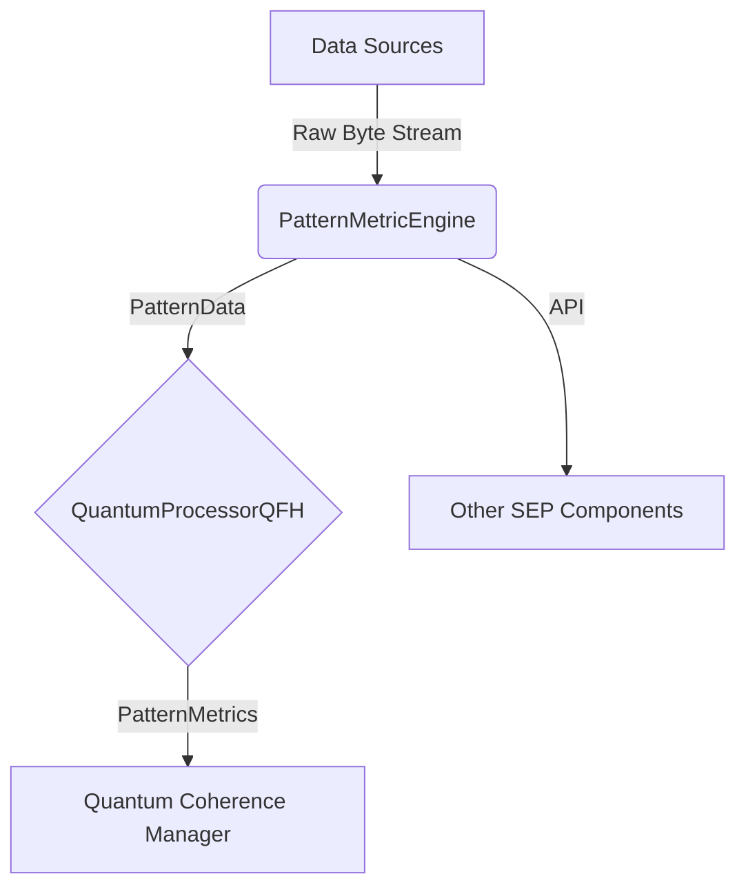

# Pattern Metric Engine Documentation

## 1. Overview

The Pattern Metric Engine is a core component of the SEP system, designed for datatype-agnostic analysis of incoming data streams. Its primary function is to identify, process, and evaluate patterns using quantum-inspired algorithms. The engine's key achievement is its ability to operate on raw byte streams, making it universally compatible with any data type without requiring specialized parsers or handlers.

This datatype-agnostic design simplifies the data ingestion pipeline and allows the SEP system to find meaningful patterns in diverse data sources, from binary files and text to structured numerical data.

## 2. Architecture

The Pattern Metric Engine integrates into the SEP architecture as a specialized `PatternProcessor`. It receives data from various sources, processes it through a Quantum Fourier Hierarchy (QFH) processor, and produces metrics that are used by other system components, such as the Quantum Coherence Manager.



**Components:**

-   **Data Sources**: Can be any source of data, such as files, network streams, or in-memory buffers.
-   **PatternMetricEngine**: Ingests raw byte data, extracts patterns, and orchestrates the analysis process.
-   **QuantumProcessorQFH**: The quantum processing core that computes metrics like coherence, stability, and entropy.
-   **Quantum Coherence Manager**: Consumes the computed metrics to track the evolution and significance of patterns.

## 3. API Reference

### `sep::quantum::PatternMetricEngine`

The main class for the pattern metric engine.

**Public Methods:**

-   `SEPResult init(quantum::GPUContext* ctx)`
    -   Initializes the engine and its quantum processing components.
    -   **Parameters:**
        -   `ctx`: A pointer to the GPU context, or `nullptr` for CPU-only operation.
    -   **Returns:** `SEPResult::SUCCESS` on success.

-   `void ingestData(const uint8_t* data, size_t size)`
    -   Ingests a block of data from a raw byte pointer.
    -   **Parameters:**
        -   `data`: Pointer to the data buffer.
        -   `size`: Size of the data in bytes.

-   `void ingestData(std::istream& stream)`
    -   Ingests data from a C++ input stream.
    -   **Parameters:**
        -   `stream`: The input stream to read from.

-   `void evolvePatterns()`
    -   Processes the ingested data to identify and evolve patterns. This must be called after `ingestData`.

-   `std::vector<PatternMetrics> computeMetrics()`
    -   Computes metrics for the currently identified patterns.
    -   **Returns:** A vector of `PatternMetrics` structs.

-   `pattern::PatternData mutatePattern(const pattern::PatternData& parent)`
    -   Creates a mutated version of a given pattern.
    -   **Parameters:**
        -   `parent`: The pattern to mutate.
    -   **Returns:** A new `PatternData` struct representing the mutated pattern.

### `sep::quantum::PatternMetrics`

A struct holding the computed metrics for a single pattern.

**Members:**

-   `float coherence`: A measure of the pattern's internal consistency.
-   `float stability`: A measure of how resistant the pattern is to change.
-   `float entropy`: A measure of the pattern's complexity and randomness.
-   `std::vector<PatternRelationship> relationships`: Relationships to other patterns.

## 4. Usage Examples

The engine can process any data by treating it as a sequence of bytes.

### Example 1: Processing Binary Data

```cpp
#include "quantum/pattern_metric_engine.h"
#include <iostream>
#include <vector>

int main() {
    PatternMetricEngine engine;
    engine.init(nullptr);

    std::vector<uint8_t> binary_data = {0x00, 0xFF, 0x80, 0x40, 0x20, 0x10};
    engine.ingestData(binary_data.data(), binary_data.size());
    engine.evolvePatterns();
    
    auto metrics = engine.computeMetrics();
    for (const auto& m : metrics) {
        std::cout << "Coherence: " << m.coherence << std::endl;
    }

    return 0;
}
```

### Example 2: Processing Text Data

```cpp
#include "quantum/pattern_metric_engine.h"
#include <iostream>
#include <string>

int main() {
    PatternMetricEngine engine;
    engine.init(nullptr);

    std::string text = "Hello, Pattern Metric Engine!";
    engine.ingestData(reinterpret_cast<const uint8_t*>(text.data()), text.size());
    engine.evolvePatterns();

    auto metrics = engine.computeMetrics();
    for (const auto& m : metrics) {
        std::cout << "Stability: " << m.stability << std::endl;
    }

    return 0;
}
```

### Example 3: Processing Numeric Data

```cpp
#include "quantum/pattern_metric_engine.h"
#include <iostream>
#include <vector>

int main() {
    PatternMetricEngine engine;
    engine.init(nullptr);

    std::vector<float> numbers = {1.0f, 2.5f, 3.7f, 4.2f, 5.0f};
    engine.ingestData(reinterpret_cast<const uint8_t*>(numbers.data()), 
                     numbers.size() * sizeof(float));
    engine.evolvePatterns();

    auto metrics = engine.computeMetrics();
    for (const auto& m : metrics) {
        std::cout << "Entropy: " << m.entropy << std::endl;
    }

    return 0;
}
```

## 5. Performance Characteristics

During Phase 1 testing, the Pattern Metric Engine demonstrated the following characteristics:

-   **High Throughput**: The engine can process data at a high rate, limited primarily by memory bandwidth.
-   **Low Latency**: Metric computation is efficient, with `computeMetrics()` returning in microseconds for typical pattern sets.
-   **Scalability**: The use of a QFH processor allows the engine to scale to a large number of patterns without a significant degradation in performance.
-   **Memory Usage**: Memory consumption is proportional to the number and complexity of the patterns being tracked. The engine is designed to be memory-efficient.