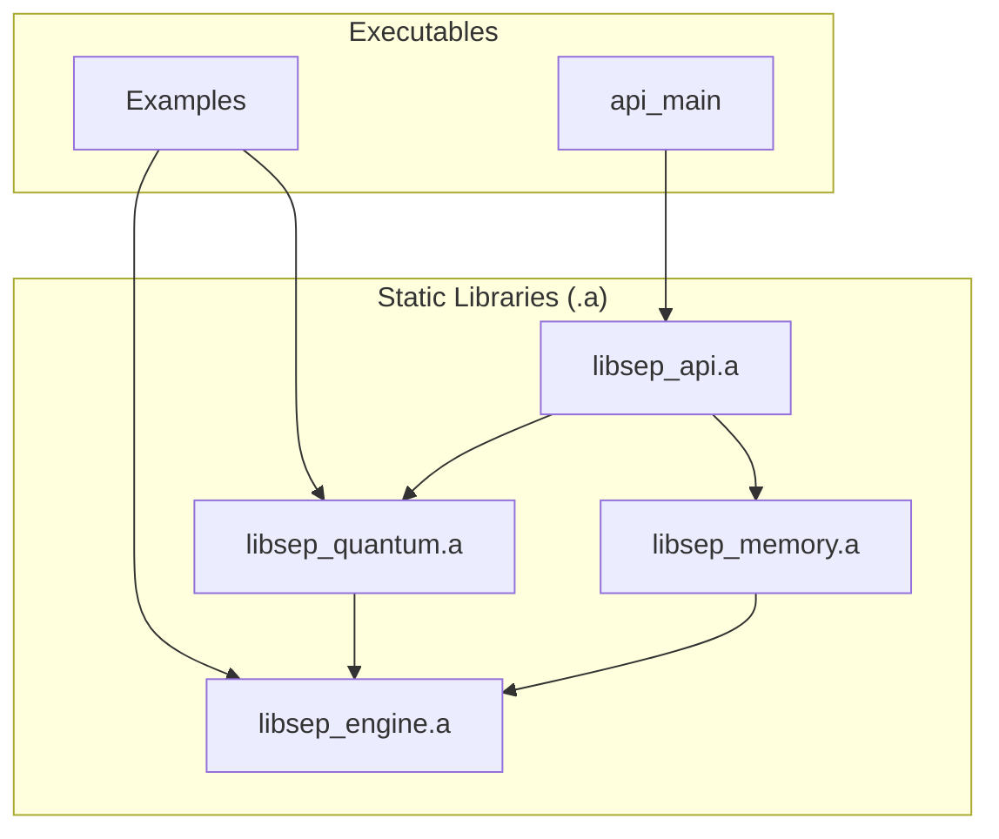

# SEP Dynamics: A New Paradigm in AI-Augmented Development

## 1. Executive Summary: The AI-Augmented Founder

**SEP Dynamics** is a foundational data intelligence firm built on a revolutionary AI-native development methodology. We are commercializing the **Self-Emergent Processor (SEP) Engine**, a proprietary, high-performance C++ framework synthesized in just three months by directing advanced AI agents.

Our engine offers a fundamentally new method for understanding *any* data stream by quantifying its **informational coherence** and **stability**, enabling us to discern predictive patterns and **emergent forces** in chaotic environments.

The founder, Alexander Nagy, is not a traditional coder but a **visionary architect and master of AI-augmented development**. He combines a first-principles understanding of physics with the unique ability to direct AI agents to produce highly optimized, low-level C++/CUDA code. This methodology represents our core competitive advantage.

We are seeking a **$500,000 line of credit** to establish the company, secure IP, and launch proprietary trading operations to prove the immense power of both our technology and our development paradigm.

## 2. The Core Technology: An AI-Synthesized Engine

The SEP Engine is a modular, high-performance C++ framework designed for real-time, first-principles analysis of complex data. Its rapid creation was made possible by our AI-native development process.

### 2.1. Fundamental Principle: Informational QED

The engine's architecture is based on a novel interpretation of interaction: an **informational QED**, where emergent forces within a data manifold are mediated by **virtual informational photons**.

*   **QFH (Quantum Fourier Hierarchy):** Establishes the phase alignments of data.
*   **QBSA (Quantum Bit State Analysis):** Probes the data for coherence and ruptures.

The interplay of these two algorithms generates **emergent informational forces**, allowing the system to identify stable, self-organizing patterns in any data stream.

### 2.2. System Architecture

The engine's architecture was designed by our founder and synthesized by AI agents. It is compiled into executables that link a set of self-contained static libraries.

### 2.3. The Predictive Gauge

The engine's primary output is a **predictive gauge**, a composite metric for market analysis:

`gauge = (w_c * coherence_norm) + (w_s * stability_norm) - (w_e * entropy_norm)`

## 3. Verifiable Claims & Proofs of Concept

The engine's capabilities are validated by a suite of working proofs of concept:

1.  **True Datatype-Agnostic Analysis (PoC #1 & #3)**
2.  **Mathematically Robust & Compositional Metrics (PoC #5)**
3.  **Stateful and Reproducible Time-Series Analysis (PoC #2)**
4.  **High-Performance, Scalable Architecture (PoC #4)**

## 4. The Team & The Vision

*   **Founder, CEO & Chief Architect:** Alexander Nagy
*   **Co-Founder:** William Nagy
*   **Identified Hires:**
    *   Executive Producer / Project Manager (Former Mark Rober EP)
    *   Director of Program Management (Former Flex DPM)
*   **Advisory Board:** Approaching an angel investor for a $50K investment (0.5% equity + advisory role).

Our vision is to leverage our AI-native development advantage to become the indispensable analytic platform for any complex data environment.