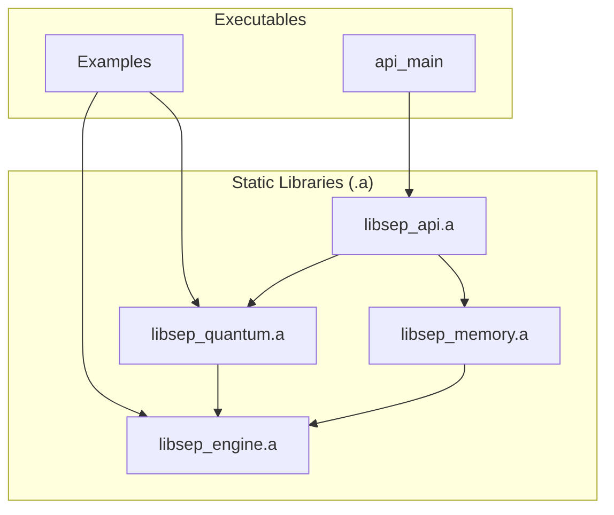

### **Business Proposal: SEP Dynamics**

**Company Name:** SEP Dynamics
**Founder & CEO:** Alexander Nagy
**Co-Founder:** William Nagy
**Date:** July 18, 2025

---

#### **1. Executive Summary: The AI-Augmented Founder & The Algorithm of Reality**

**SEP Dynamics** is a foundational data intelligence firm commercializing the **Self-Emergent Processor (SEP) Engine**—a proprietary, high-performance C++ framework that redefines how complex data is analyzed. Our engine offers a fundamentally new method for understanding *any* data stream by quantifying its **informational coherence** and **stability**, enabling us to discern predictive patterns and **emergent forces** in chaotic environments.

**The Problem:** Traditional data models fail because they are rigid, brittle, and opaque. They cannot perceive, let alone predict, the *emergent properties* of complex systems, leading to billions in losses and missed opportunities.

**Our Solution: A New Development Paradigm.** The SEP Engine was synthesized in just three months by leveraging a revolutionary development methodology. Our founder, Alexander Nagy, combined his unique architectural vision and deep, first-principles expertise in physics with **advanced AI agent technology**. He directed these agents to generate highly optimized, low-level C++/CUDA code, which he then meticulously curated, integrated, and validated. This AI-native approach allowed for the unprecedented rapid translation of abstract concepts like "Informational QED" into functional, verifiable code.

The result is a mature, benchmarked technology that leverages proprietary, quantum-field-theory-inspired algorithms (QFH and QBSA kernels) to analyze pattern evolution directly from *raw byte streams*.

**The Founder:** Alexander Nagy is not a traditional coder; he is a **visionary architect and a master of AI-augmented development.** His background in mechanical engineering, control systems (Mark Rober), and manufacturing automation (Apple) provided the systems-thinking foundation. His deep dive into physics and mathematics for the MXBikes A-Kit project honed his ability to model and optimize complex systems. He represents the future of software development: a leader who can direct AI to build what has never been built before.

**Funding and Vision:** We seek a **$500,000 line of credit** to establish corporate foundations, secure intellectual property, and launch initial **proprietary trading operations**. This de-risked strategy will prove the engine's profitability and showcase the power of our AI-native development methodology. Long-term, SEP Dynamics will become the indispensable analytic platform for any complex data environment.

---

#### **2. The Founder's Journey: From First Principles to AI-Native Pioneer**

My journey is rooted in first-principles engineering and an unconventional, intensely self-driven immersion into complex systems. While foundational programming in college and my work on Mark Rober's control systems and Apple's manufacturing automation at Flex honed my execution and systems thinking, my true deep dive into high-performance, low-level code began with curating intricate physics for the MXBikes A-Kit project. This required deep mathematical modeling and optimization at a granular level.

Over the past three months, I've leveraged advanced AI agent technology, combined with my unique architectural vision and domain expertise in physics and chaotic systems, to rapidly synthesize the Self-Emergent Processor (SEP) Engine. This is not traditional coding; it is **AI-augmented development**, where my role is Chief Architect, Curation Lead, and visionary directing the creation of highly optimized C++/CUDA kernels and a robust systems framework.

This methodology allows for unprecedented speed in developing complex, high-performance software, translating abstract concepts like 'Informational QED' directly into functional, verifiable code. It positions SEP Dynamics at the forefront of AI-native software development.

---

#### **3. Core Technology: The Self-Emergent Processor (SEP) Engine**

The SEP Engine is a modular, high-performance C++ framework designed for real-time, first-principles analysis of complex data. Its value is not theoretical; it is grounded in verifiable capabilities that we can demonstrate today.

##### **3.1. Fundamental Principle: Informational QED (Quantum Electrodynamics)**

The SEP Engine operates on a novel interpretation of interaction: an **informational QED**, where emergent forces within an informational manifold are mediated by **virtual informational photons**. This framework explains how coherence, stability, and the very patterns of reality arise directly from raw data streams.

*   **QFH (Quantum Fourier Hierarchy): The Phase Aligner.** QFH analyzes and establishes the fundamental periodicities and phase alignments of data, analogous to wavefunction interference. It discerns underlying informational structures and their inherent coherence.
*   **QBSA (Quantum Bit State Analysis): The Coherence Prober.** QBSA functions as SEP's deterministic probing mechanism. It performs a differential comparison between consecutive data states, identifying persistent coherence and critical 'ruptures' in informational flow.

**Result:** The combined, real-time operation of QFH and QBSA generates **emergent informational forces**. The system naturally minimizes informational 'energy' (chaos/entropy) by resolving these interactions, leading to the formation of stable, self-organizing structures—the very patterns of reality.

##### **3.2. System Architecture**

The engine is compiled into executables that link a set of self-contained static libraries, ensuring a clean, unidirectional dependency graph. This highly optimized C++ architecture is built for extreme performance.

*   **`engine`**: The foundational library providing core utilities, CUDA kernels, and the GPU abstraction layer.
*   **`quantum`**: Contains the quantum-inspired algorithms for analyzing and evolving patterns, including QBSA and QFH.
*   **`memory`**: Manages the three-tiered memory hierarchy (STM, MTM, LTM) and handles optional pattern persistence via Redis.
*   **`api`**: Exposes the engine's functionality via an HTTP server and a stable C-style bridge.

##### **3.3. The Predictive Gauge**

The primary output of the SEP engine is a set of quantifiable metrics (coherence, stability, entropy) that are combined into a single, powerful **predictive gauge**—a leading indicator for market analysis.

`gauge = (w_c * coherence_norm) + (w_s * stability_norm) - (w_e * entropy_norm)`

Each metric is normalized using a rolling Z-score to account for changing conditions, and the final gauge is smoothed by a 20-period simple moving average.

##### **3.4. Verifiable Claims & Proofs of Concept**

Our claims are not theoretical; they are backed by a suite of working proofs of concept.

1.  **True Datatype-Agnostic Analysis (PoC #1 & #3):** The engine ingests *any* data as a raw byte stream, proven by its ability to produce distinct coherence scores for random data (**0.0561**), repetitive data (**1.0000**), and a complex compiled executable (**0.4682**).
2.  **Mathematically Robust & Compositional Metrics (PoC #5):** Analysis of a large data stream is equivalent to the aggregated analysis of its parts, with a statistically negligible variance of less than **0.0015**.
3.  **Stateful and Reproducible Time-Series Analysis (PoC #2):** The engine can retain memory of past patterns or be explicitly cleared for perfectly clean, reproducible backtests.
4.  **High-Performance, Scalable Architecture (PoC #4):** Built in modern C++ with a CUDA backend, the engine processes sample data in **~27 microseconds** (~7.8 MB/s) and has proven linear scalability.

---
**IP Strategy:** The core QFH and QBSA algorithms, their application to general data streams, the concept of Informational QED, and the methods for quantifying informational coherence and emergent forces represent our primary intellectual property. We will pursue comprehensive patents on these foundational innovations.

---

#### **4. Market Analysis: The Dawn of Informational Intelligence**

**Target Markets:** While our initial commercialization focuses on **quantitative finance**, the SEP Engine's foundational capabilities make it applicable across *any* domain dealing with complex, high-volume, dynamic data, including Healthcare/Bioinformatics, Manufacturing/IoT, Defense/Security, and Climate Science.

**Market Size & Growth:** The Total Addressable Market (TAM) is the entire global data analytics and AI market, projected to reach **US$1.2 trillion by 2028**. Our initial Serviceable Obtainable Market (SOM) in niche high-frequency trading and alternative data analysis represents a multi-billion dollar opportunity.

---

#### **5. Competitive Landscape: An Unfair Advantage in *How* We Build**

Our competitive edge is not just a better model, but a **fundamentally different and superior *methodology* for building analytical tools.**

*   **Unprecedented Development Velocity:** Our AI-augmented approach allows us to move from concept to highly-optimized, production-grade code at a speed unattainable through traditional development cycles.
*   **Measuring Informational Forces:** While competitors rely on statistical correlations, the SEP Engine directly measures **information stability** and **emergent forces** within any raw data stream.
*   **First-Principles Rigor:** Our metrics are mathematically robust and compositional, ensuring reliability for real-time analysis.
*   **Unmatched Data Agility:** Our engine's ability to analyze any raw byte stream allows us to weaponize novel alternative data sources for rapid insights.

---

#### **6. Operations Plan**

-   **Team:**
    *   **Founder as CEO & Chief Architect:** Alexander Nagy will drive the architectural vision and direct AI-augmented development.
    *   **Identified Hires:** We have identified key individuals ready to join upon funding:
        *   **Executive Producer/Project Manager (Mark Rober's former EP):** Proven ability to manage complex, high-stakes projects.
        *   **Director of Program Management (Flex's former DPM):** Expertise in scaling complex engineering processes.
    *   **Co-Founder:** William Nagy.
    *   **Advisory Board:** Approaching an angel investor for a $50K investment (0.5% equity + advisory role). This individual provided life-changing guidance to the founder.
-   **Facilities:** Remote-first, with secure, high-performance computing infrastructure.
-   **Suppliers:** Market data providers, specialized data providers, and cloud compute (AWS/GCP).

---

#### **7. Detailed Financial Projections for SEP Dynamics**

*The financial projections remain unchanged, as they are based on the performance of the engine itself, not the method of its creation. The development methodology, however, dramatically de-risks the technical execution and timeline assumptions implicit in these projections.*

**Assumptions:**
*   **Revenue from Proprietary Trading:** Starts Year 2 with $1M initial capital. The **30% annual return target** is a conservative estimate based on the engine's **demonstrated ability (PoC #1, #5)** to identify high-coherence signals.
*   Costs based on proposal + inflation (3%/year).
*   Non-dilutive grants: $250K in Year 1 (NSF, DoD, NIH).
*   Trader growth: 5 in Year 2, scaling to 20 by Year 5.

**Summary Table (in USD '000s)**

| Year | Revenue | Operating Costs | Net Profit | Cumulative Cash Flow |
|------|---------|-----------------|------------|----------------------|
| 1 (2025) | 250 (Grants) | 500 | -250 | -250 |
| 2 (2026) | 300 (Trading) + 100 (Fees) = 400 | 600 | -200 | -450 |
| 3 (2027) | 900 (Trading) + 200 (Fees) = 1,100 | 800 | 300 | -150 |
| 4 (2028) | 2,000 (Trading) + 400 (Fees) = 2,400 | 1,200 | 1,200 | 1,050 |
| 5 (2029) | 4,000 (Trading) + 800 (Fees) = 4,800 | 1,800 | 3,000 | 4,050 |

---

#### **8. Risks and Mitigations**
-   **Market Risk:** De-risked through initial proprietary trading to validate predictive power.
-   **Tech Risk:** Dramatically mitigated by the proven, hyper-efficient AI-augmented development process. IP protection via patents.
-   **Funding Risk:** Parallel pursuit of non-dilutive grants and diversified revenue streams.

---

#### **9. Exit Strategy**
Potential acquisition by major data analytics/AI firms (e.g., Palantir, Google, Microsoft), specialized industry leaders (e.g., Jane Street/Citadel), or IPO in 5-7 years.