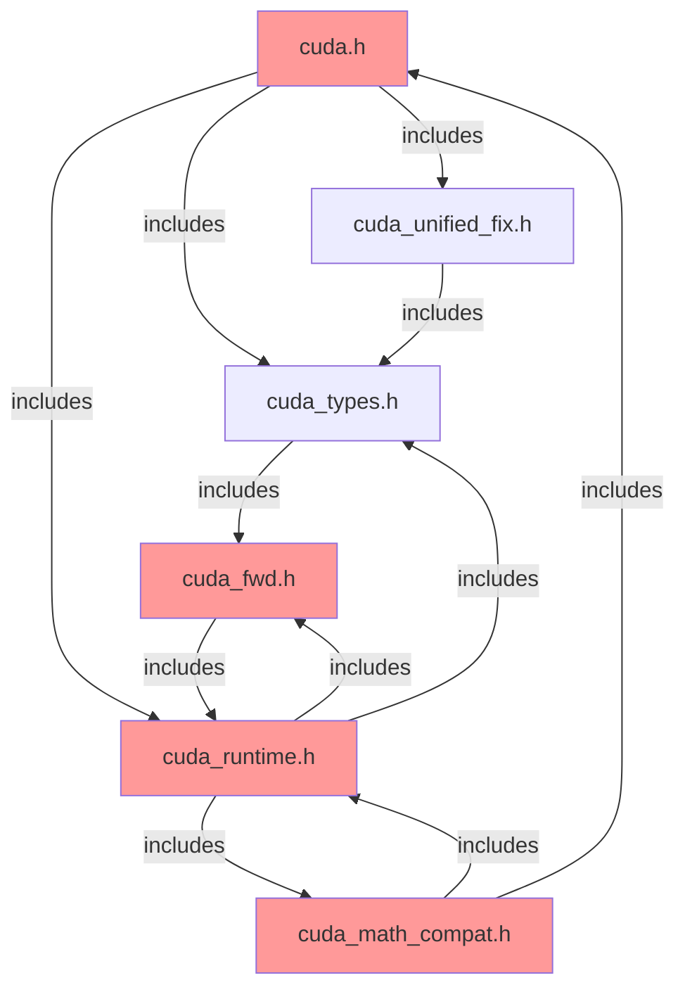
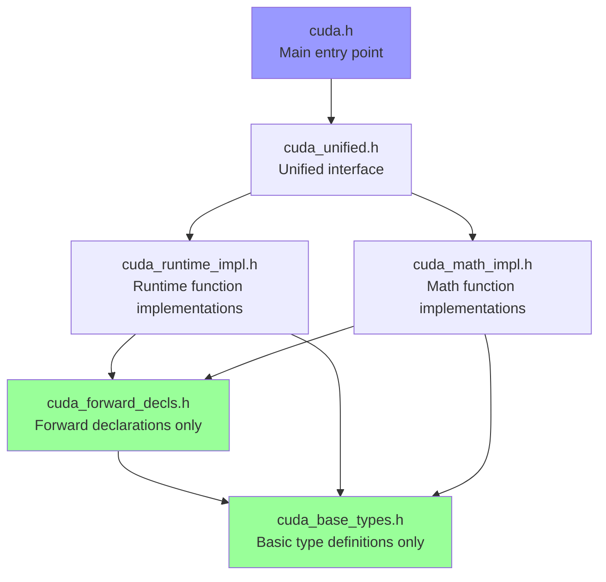

## CUDA Compatibility Layer Fix Plan

Based on my analysis of the static analysis report and the CUDA compatibility layer code, I can see the main issues:

1. **Circular header dependencies** - Multiple circular include cycles between cuda.h, cuda_runtime.h, cuda_math_compat.h, cuda_fwd.h, and cuda_types.h
2. **Missing CUDA type definitions** - Types like `cudaError_t`, `cudaStream_t`, `cudaEvent_t` are not being properly defined when included
3. **Undefined CUDA functions** - Functions like `cudaGetDeviceCount`, `cudaSuccess`, etc. are not found in the global namespace
4. **Redefinition errors** - Functions are being defined multiple times in different files
5. **Include path issues** - Some files are trying to include CUDA headers with incorrect paths

The root cause appears to be a complex circular dependency issue in the header include order, combined with improper namespace management and conditional compilation issues.

Based on my analysis of the static analysis report and examination of the CUDA compatibility layer code, I've identified the core issues causing the 50 critical errors and 27 low-severity warnings. Here's a visual representation of the current problem:

The red nodes indicate headers involved in circular dependencies.

### Key Issues Identified:

1. **Circular Dependencies**: The most critical issue is the circular include pattern between:
   - `cuda_runtime.h` ↔ `cuda_fwd.h`
   - `cuda_runtime.h` ↔ `cuda_math_compat.h`
   - `cuda.h` ↔ `cuda_runtime.h` (via cuda_math_compat.h)

2. **Type Definition Issues**: 
   - CUDA types (`cudaError_t`, `cudaStream_t`, etc.) are not being properly defined before use
   - The `cuda_fwd.h` file tries to include `<cuda_runtime.h>` which creates a circular dependency

3. **Namespace Confusion**:
   - Functions are being looked up in the global namespace (`::cudaGetDeviceCount`) when CUDA is available
   - But the types might not be properly imported from the global namespace

4. **Duplicate Definitions**:
   - Functions like `cudaStreamDestroy` are defined in both `cuda_runtime.h` and `raii.cpp`

### Proposed Solution Architecture:

This new structure eliminates circular dependencies by establishing a clear hierarchy.