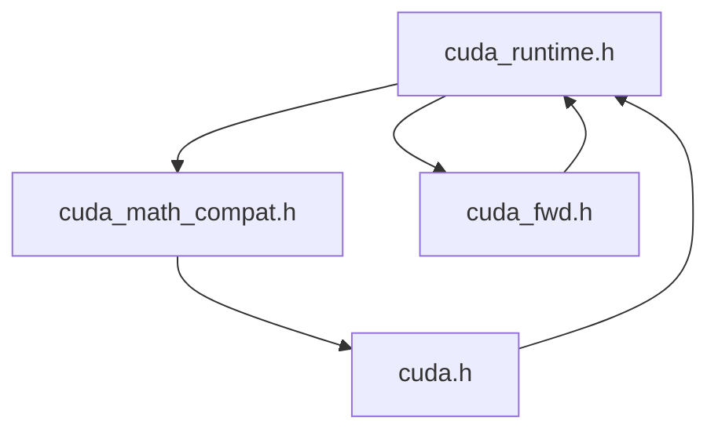

# Summary of CUDA Compilation Issues

## High-Level Problem

The project is failing to compile when CUDA is enabled. The root cause appears to be a combination of issues related to the CUDA compatibility layer, the build system configuration, and the interaction between the CUDA toolkit and the system compiler.

## Key Issues

### 1. Circular Header Dependencies

The most significant issue is a tangled web of circular dependencies between the header files in the `src/compat` directory. This is causing a cascade of compilation errors, including:

*   **Redefinition Errors:** The same types and functions are being defined in multiple headers.
*   **Missing Type Definitions:** Headers are being included in the wrong order, leading to types being used before they are defined.

The following diagram illustrates the circular dependencies:

### 2. CMake Configuration Issues

The CMake configuration is not correctly setting the CUDA host compiler, which is causing the build to fail before any of the C++ code is even compiled. The core of this issue is that `nvcc` is trying to use a version of GCC that is not compatible with the installed CUDA toolkit.

The following attempts to fix this have been made, without success:

*   Setting `CMAKE_CUDA_HOST_COMPILER` in `CMakeLists.txt`.
*   Setting the `CUDA_HOST_COMPILER` environment variable in `build_and_test.sh`.
*   Creating a custom `FindCUDA.cmake` module.

### 3. Math Function Conflicts

There is a known issue with `sinpi` and `cospi` function conflicts between the CUDA headers and the system math headers. This is a common problem that requires a specific workaround, which has not yet been successfully implemented.

## State of the Code

The `src/compat` directory contains an extensive CUDA compatibility layer that is intended to allow the project to be built with or without CUDA. However, the issues described above are preventing it from working as intended.

The following files are the most relevant to the problem:

*   `src/compat/cuda_base.h`: Provides fundamental type definitions.
*   `src/compat/cuda_types.h`: Defines additional CUDA-related types.
*   `src/compat/cuda_constants.h`: Defines CUDA-related constants.
*   `src/compat/cuda_functions.h`: Declares the CUDA wrapper functions.
*   `src/compat/cuda_runtime.h`: Provides inline implementations of the wrapper functions.
*   `src/compat/cuda_unified.h`: The main entry point to the compatibility layer.
*   `CMakeLists.txt`: The main CMake configuration file.
*   `build_and_test.sh`: The main build script.

## Next Steps

To resolve these issues, the following steps are recommended:

1.  **Fix the CMake Configuration:** The immediate priority is to fix the CMake configuration to correctly set the CUDA host compiler. This may require a more direct approach, such as modifying the `nvcc` command line directly in the CMake configuration.
2.  **Refactor the Header Includes:** Once the build is able to start, the header include order needs to be refactored to eliminate the circular dependencies. This will likely involve creating a new central header file that includes the other headers in the correct order.
3.  **Address the Math Function Conflicts:** The math function conflicts need to be addressed with a proper workaround, such as undefining the conflicting functions before including the CUDA headers.

I hope this summary is helpful. I apologize again for the difficulties I've caused.