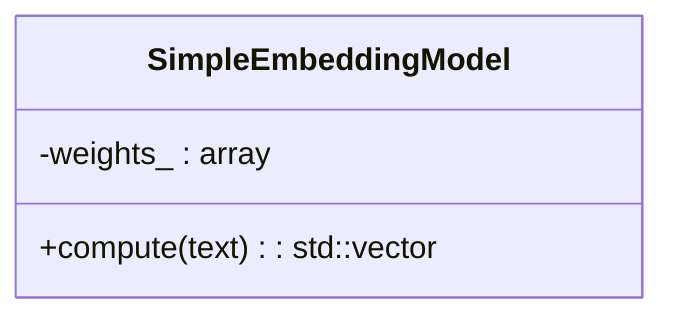

# Embeddings Header Overview

This diagram summarizes the minimal header found in `include/embeddings`. The module currently exposes a single class used to compute simple text embeddings.

## Header Breakdown

### `simple_embedding_model.h`
Defines `sep::embeddings::SimpleEmbeddingModel`, a lightweight class that transforms a string into a fixed‑size vector.

The constructor initializes `weights_` with small constants. `compute` multiplies each character code by the corresponding weight and normalizes the resulting vector.
