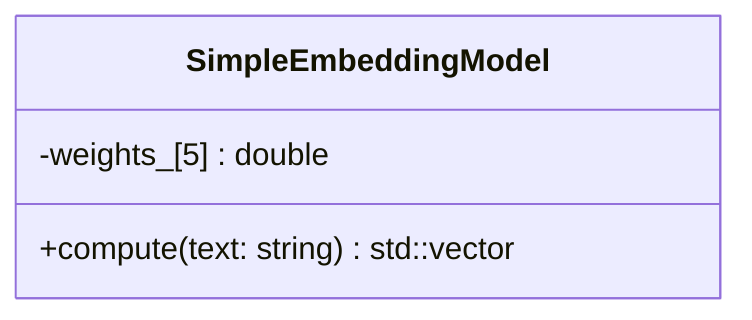

# Embedding Headers Overview

This document summarizes the header files under `include/embeddings/` and how they are used throughout the engine.

`SimpleEmbeddingModel` provides a tiny, deterministic embedding implementation used primarily for tests and simple pattern generation. The header is included by the API layer to compute embeddings from incoming text requests.
