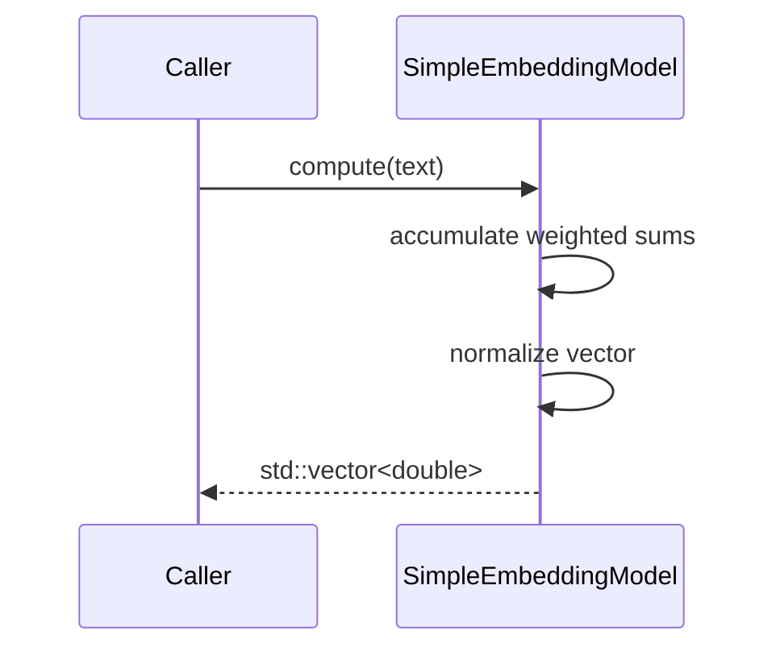

# Embeddings Implementation Flow

`src/embeddings` contains the implementation of the `SimpleEmbeddingModel`. While compact, it illustrates the basic pattern used for derived embedding models.

## Processing Steps

1. **Initialization**: The constructor fills `weights_` with deterministic constants.
2. **Accumulation**: `compute` iterates over characters, multiplies by each weight and sums into a vector of length `kDim`.
3. **Normalization**: After accumulation the vector is normalized to unit length.

The CMake file exports this object as `sep_embeddings`, allowing other modules to link against the library.
