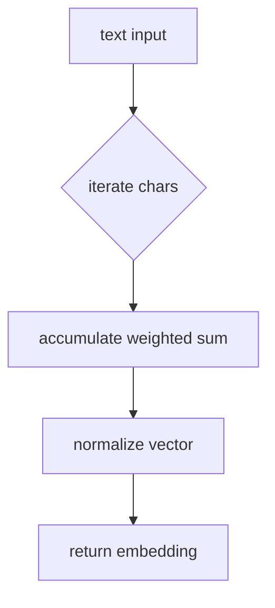

# Embedding Source Flow

The `src/embeddings` folder currently contains a single implementation file providing a toy text embedding model.

`simple_embedding_model.cpp` multiplies each character code by a constant weight vector and normalizes the result. The function is deterministic and serves as a placeholder until a real model is integrated.
