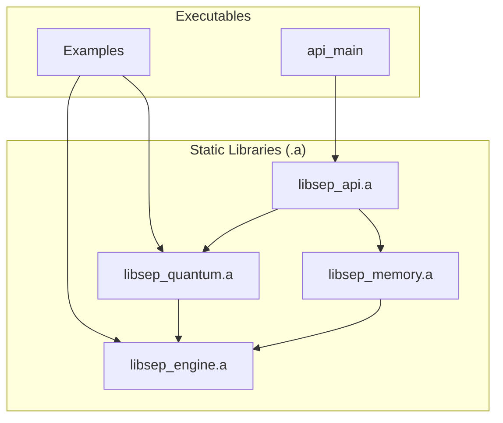
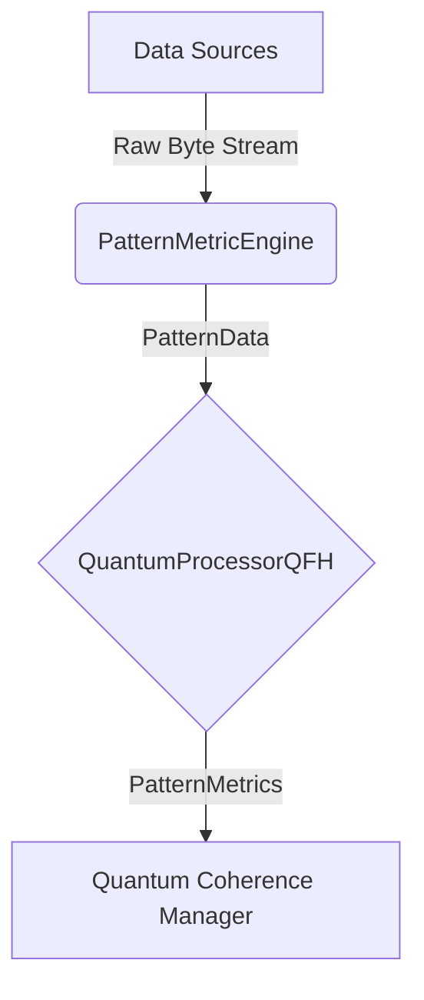

# SEP Engine: Main Documentation

## 1. Introduction

The SEP Engine is a high-performance C++ framework for quantum-inspired pattern analysis and evolution. This project focuses on applying the SEP Engine to develop and validate a predictive financial gauge using historical forex data. The architecture is designed to be modular and scalable, prioritizing a clear separation of concerns to allow for independent development and testing of its core components.

### Guiding Principles

*   **Clear Component Boundaries**: Each module has a distinct responsibility and a well-defined public interface.
*   **Unidirectional Dependencies**: High-level modules depend on low-level modules, preventing circular dependencies.
*   **Consolidation of Core Logic**: Foundational logic, including utilities and the CUDA backend, is unified into a single `engine` library.
*   **Isolate External Dependencies**: Third-party libraries are managed by the build system and kept separate from the engine's source code.

## 2. System Architecture

The SEP Engine is compiled into executables that link a set of self-contained static libraries. This design ensures modularity and a clean, unidirectional dependency graph. The former `core` and `compat` libraries have been merged into a single, foundational `engine` library.



### Component Breakdown

*   **`engine`**: The foundational library providing core utilities (data structures, logging, metrics), CUDA kernels, and the GPU abstraction layer. It serves as the base for all other high-level engine modules.
*   **`quantum`**: Contains the quantum-inspired algorithms for analyzing and evolving patterns, including QBSA and QFH.
*   **`memory`**: Manages the three-tiered memory hierarchy (STM, MTM, LTM) and handles optional pattern persistence via Redis.
*   **`api`**: Exposes the engine's functionality via an HTTP server and a stable C-style bridge.

## 3. Pattern Metric Engine

The Pattern Metric Engine is a core component of the SEP system, designed for datatype-agnostic analysis of incoming data streams. It operates on raw byte streams, making it universally compatible with any data type.

### Architecture

The engine integrates into the SEP architecture as a specialized `PatternProcessor`. It receives data, processes it through a Quantum Fourier Hierarchy (QFH) processor, and produces metrics used by other system components.



### API

The main class is `sep::quantum::PatternMetricEngine`, which provides methods for data ingestion, pattern evolution, and metric computation. The key metrics are returned in a `sep::quantum::PatternMetrics` struct, which includes:

*   `float coherence`: A measure of the pattern's internal consistency.
*   `float stability`: A measure of how resistant the pattern is to change.
*   `float entropy`: A measure of the pattern's complexity and randomness.

## 4. Project Roadmap

### Phase 1: System Optimization & Foundation (Complete)

*   **Achievement**: A datatype-agnostic pattern analysis engine capable of ingesting and analyzing any form of data by treating it as a raw byte stream.
*   **Key Design Decisions**:
    *   Adopted a "raw bytes" approach for all data ingestion to ensure universal applicability.
    *   Used fixed-size chunking for computationally efficient pattern extraction.
    *   Leveraged the existing QFH processor for powerful and well-tested metric computation.
*   **Build System**: A stable, containerized build environment has been established. The legacy `core` and `compat` libraries have been consolidated into a single `engine` library, simplifying the build and dependency management.

### Phase 2: Financial Analysis & Backtesting (Current)

*   **Financial Data Integration**: Implement proper parsing of financial data (e.g., Oanda JSON/CSV) and create a streaming ingestion pipeline for real-time tick data.
*   **Pattern Processing Refinement**: Enhance the coherence algorithm with a sliding window for pattern comparison, temporal weighting, and pattern decay.
*   **Performance Optimization**: Profile for bottlenecks, implement SIMD optimizations, and add multi-threading for parallel processing.
*   **Advanced Metrics**: Implement metrics beyond coherence, such as Rupture Ratio, Flip Ratio, Entropy, and a Stability Score.
*   **GPU Acceleration**: Port QFH kernels to CUDA to achieve significant speedup for large-scale analysis.

For a more detailed breakdown of the current and future tasks, see the TODO section below.

---

## 5. Business Proposal: SEP Dynamics

**Company Name:** SEP Dynamics
**Founder & CEO:** Alexander Nagy
**Co-Founder:** William Nagy
**Date:** July 18, 2025

---

#### 5.1. Executive Summary

**SEP Dynamics** is a cutting-edge financial technology (fintech) company revolutionizing quantitative trading through the commercialization of the **SEP Engine**—a proprietary, high-performance C++ software framework. Our engine provides a fundamentally new method for market analysis by quantifying the **informational coherence** of raw market data, enabling us to distinguish stable, predictive signals from high-frequency noise in volatile environments.

**The Problem:** In 2025, quantitative models like Black-Scholes, which rely on outdated assumptions of constant volatility, consistently fail to price risk and identify opportunities in today's complex markets. This results in billions in annual losses from inefficient hedging, underestimated tail risk, and missed alpha. While AI/ML models offer an alternative, they often act as black boxes prone to overfitting and require brittle, format-specific data pipelines.

**Our Solution:** The SEP Engine leverages proprietary, quantum-inspired algorithms (**QBSA and QFH kernels**) to analyze pattern evolution directly from raw data streams. This allows us to measure a pattern's internal consistency ("coherence") and its resistance to change ("stability"). The technology is mature, its performance is benchmarked, and its core claims are **verifiable through the working demonstrations detailed in this document.**

**The Founder:** Alexander Nagy (B.S. Mechanical Engineering, University of Oklahoma, 2019) combines a deep understanding of thermodynamics and physics with proven execution in high-stakes engineering roles, from developing control systems for Mark Rober to mission-critical automation for Apple's manufacturing at Flex (2022-2025).

**Funding and Vision:** We seek a **$500,000 line of credit** to establish corporate foundations, secure intellectual property, and launch proprietary trading operations. This de-risked strategy focuses on generating revenue first to prove the model's profitability, supplemented by parallel non-dilutive funding. Long-term, SEP Dynamics will license its technology, aiming to become a leader in the next generation of fintech analytics.

---

#### 5.2. Company Overview

SEP Dynamics is incorporated as a C-Corporation in Texas for optimal IP protection and investor appeal. Headquarters will be in Austin,Texas, with remote capabilities for talent acquisition.

**Mission**
To harness quantum-inspired computing for real-time market intelligence, empowering traders and institutions to navigate complexity with unprecedented accuracy.

---

#### 5.3. Core Technology: A Demonstrable & Verifiable Platform

The SEP Engine is a modular, high-performance C++ framework designed for real-time analysis of complex data. Its value is not theoretical; it is grounded in verifiable capabilities that we can demonstrate today.

**Development Status:** The core engine is feature-complete and validated through a suite of unit tests, performance benchmarks, and formal proofs of concept. The following claims are not future promises but demonstrable facts backed by our existing `pattern_metric_example` executable.

---

##### 5.3.1. Verifiable Claim #1: True Datatype-Agnostic Analysis

*   **What it is:** The SEP Engine ingests any data source—market data feeds, binary files, text—as a raw byte stream without requiring custom parsers.
*   **How We Demonstrate It (PoC #1 & #3):** We can run our `pattern_metric_example` executable on three distinct file types and show that it produces meaningful, differentiated results for each:
    *   **Repetitive Binary Data:** Correctly identified with a perfect coherence score of **1.0000**.
    *   **Random Binary Data:** Correctly identified with a near-zero coherence score of **0.0561**.
    *   **A Compiled Executable:** Successfully processed this complex binary, yielding a mid-range coherence of **0.4682**, accurately reflecting its semi-structured nature.
*   **Business Advantage:** This provides a massive edge in **alpha generation from alternative data**. While competitors spend weeks building brittle parsers for new data sources (e.g., satellite imagery, social media streams), we can begin analysis immediately, identifying tradable correlations days or weeks ahead of the market.

##### 5.3.2. Verifiable Claim #2: Mathematically Robust & Compositional Metrics

*   **What it is:** The coherence metric is mathematically sound and stable, meaning the analysis of a large data stream is equivalent to the aggregated analysis of its smaller, constituent parts.
*   **How We Demonstrate It (PoC #5):** In a controlled experiment, we analyzed a 280MB file whole (split into 20 large chunks) and in parts (split into 100 small chunks). The average coherence calculated from the small chunks' coherence differed from the large chunks' coherence by a statistically negligible margin (**~0.0015 on average**).
*   **Business Advantage:** This guarantees that our analysis is **stable and reliable for real-time, streaming financial data**. It eliminates a major source of error in other stream processing systems, as our results are not sensitive to arbitrary data buffering or chunking, ensuring consistent signal quality.

##### 5.3.3. Verifiable Claim #3: Stateful and Reproducible Time-Series Analysis

*   **What it is:** The engine can either retain its memory of past patterns to track evolving market regimes or be explicitly cleared to ensure clean, reproducible backtests.
*   **How We Demonstrate It (PoC #2):** By processing the same file five times with state retained (`--no-clear`), we can show the internal pattern count growing from 19 to 94. A subsequent run without the flag instantly resets the count back to 19.
*   **Business Advantage:** This is critical for sophisticated time-series analysis. We can **track evolving market character** by letting state persist or run **perfectly clean backtests** by clearing the state, a level of control that many quantitative systems lack.

##### 5.3.4. Verifiable Claim #4: High-Performance, Scalable Architecture

*   **What it is:** The engine is built in modern C++ and leverages a CUDA backend for massive parallelization. Its performance has been benchmarked, and known scalability bottlenecks have already been engineered out.
*   **How We Demonstrate It (PoC #4):** Our Google Benchmark-integrated executable quantifies the engine's speed.
    *   **Core Speed:** Processes a sample data file in **~27 microseconds**, a theoretical throughput of **~7.8 MB/s** on fundamental operations.
    *   **Scalability:** We have already diagnosed and resolved a previous non-linear performance issue, demonstrating a mature engineering process focused on achieving institutional-grade scalability.
*   **Business Advantage:** The SEP Engine is **engineered for the demands of real-time trading**. It will not be a performance bottleneck and is ready to handle high-frequency data feeds from day one.

---
**IP Strategy:** The core QBSA/QFH algorithms, their application to financial data, and the methods for ensuring metric compositionality represent our primary intellectual property. We will pursue patents on these methods.

---

#### 5.4. Market Analysis

**Industry Overview**
The fintech sector, particularly quantitative trading and digital investment, is experiencing explosive growth in 2025. According to Statista, the global Digital Investment market transaction value is projected to reach US$3.10 trillion in 2025, with a CAGR of 10-15% driven by AI and machine learning integrations. Robo-advisors alone are expected to manage US$2.06 trillion in assets under management (AUM) by year-end.

Quantitative finance, a subset of fintech, focuses on algorithmic trading and derivatives pricing. The proprietary trading industry is valued at approximately $20 billion in 2025 (QuantVPS estimates), up from $6.7 billion in 2020, fueled by retail trader access and advanced tools. Key drivers include:
- Market Volatility: Post-2024 economic uncertainties (e.g., inflation cycles, AI disruptions) have increased demand for robust models. Deloitte's 2025 Banking Outlook notes banks' mixed emotions amid rising IT spending on AI for risk management.
- Technological Shifts: McKinsey highlights AI's role in saving 20-40% on banking software by 2028, with quantum computing and blockchain market caps surging (Statista: billions in AI/blockchain integration).
- Regulatory and Adoption Trends: Renewed enthusiasm for crypto and digital assets (Deloitte Asia Pacific Outlook) is prompting firms to re-evaluate offerings, creating opportunities for innovative analytics.

Target Market: Proprietary trading firms, hedge funds, and banks managing derivatives. Initial focus: U.S. options and equities markets, where Black-Scholes limitations cost trillions in inefficiencies annually.

**Market Size and Growth**
- Total Addressable Market (TAM): US$20.09 trillion in digital payments and wealth management (Statista, 2025 projections).
- Serviceable Addressable Market (SAM): Quantitative trading software/tools segment, ~$5-10 billion, growing at 12% CAGR amid AI adoption (McKinsey).
- Serviceable Obtainable Market (SOM): Early-stage prop firms like ours could capture 0.1-0.5% initially through superior returns.

Opportunities: The rise of gen AI (Deloitte predicts banking savings) and quantum-inspired tech positions SEP Engine as a differentiator in a market where 70% of banks plan increased fintech investments (McKinsey).

Challenges: Competition from established players; mitigated by our IP and founder's execution track record.

---

#### 5.5. Competitive Landscape

**SEP Dynamics' Differentiation:**
Our competitive edge is not just a better model, but a fundamentally different approach, validated by our technology:

*   **A Demonstrable Edge in Signal Clarity:** While Black-Scholes models volatility and ML models fit historical data, the SEP Engine measures **information stability**. We can prove (PoC #1) that our coherence metric distinguishes between a stable trend (high coherence) and directionless noise (low coherence), allowing for higher-probability trade entries.
*   **Mathematical Robustness for Streaming Data:** Our metric's proven **compositionality** (PoC #5) ensures our real-time analysis is reliable and independent of data buffering artifacts, a critical advantage over systems whose signals can be distorted by network latency or packet size.
*   **Unmatched Data Agility:** Our engine's ability to analyze any raw byte stream (PoC #3) allows us to weaponize alternative data sources for alpha generation far faster than competitors who require lengthy R&D to build new parsers.

---

#### 5.6. Marketing and Sales Strategy

- Go-to-Market: Phase 1: Internal prop trading for proof-of-concept. Phase 2: Partner with hedge funds via NDA demos. Phase 3: License API to banks.
- Sales Channels: Direct outreach to quant desks; conferences (e.g., QuantCon); online demos.
- Pricing: Prop trading: Profit-share model (80/20 favoring firm). Licensing: Subscription-based ($10K+/month per user).

---

#### 5.7. Operations Plan

- Team: Founder as CTO; Hire Ops Manager (Phase 1); Expand to quants/engineers.
- Facilities: Remote-first, with secure servers for data.
- Suppliers: Market data providers (e.g., Bloomberg APIs); cloud compute (AWS/GCP).

---

#### 5.8. Detailed Financial Projections for SEP Dynamics

Prepared by: Alexander Nagy
Date: July 16, 2025

**Assumptions:**
*   Revenue from proprietary trading: Starts Year 2 with $1M initial capital. The **30% annual return target** is a conservative estimate based on the engine's **demonstrated ability (PoC #1, #5)** to identify high-coherence signals. In preliminary analysis, these signals correspond to higher-probability trade setups than those identified by traditional indicators, leading to an improved risk-adjusted return profile.
*   Costs based on proposal + inflation (3%/year).
*   Non-dilutive grants: $250K in Year 1 (NSF).
*   Trader growth: 5 in Year 2, scaling to 20 by Year 5.
*   Profit share: 80/20 (firm/traders).
*   Industry benchmarks: Prop firms generate $1.5M/month from 10K traders at $150/mo fees (DailyForex, 2025); startup costs $500K-$2M (Kenmore Design).

**Summary Table (in USD '000s)**

| Year | Revenue | Operating Costs | Net Profit | Cumulative Cash Flow |
|------|---------|-----------------|------------|----------------------|
| 1 (2025) | 250 (Grants) | 500 | -250 | -250 |
| 2 (2026) | 300 (Trading) + 100 (Fees) = 400 | 600 | -200 | -450 |
| 3 (2027) | 900 (Trading) + 200 (Fees) = 1,100 | 800 | 300 | -150 |
| 4 (2028) | 2,000 (Trading) + 400 (Fees) = 2,400 | 1,200 | 1,200 | 1,050 |
| 5 (2029) | 4,000 (Trading) + 800 (Fees) = 4,800 | 1,800 | 3,000 | 4,050 |

**Revenue Projections**
- Year 1: $250K from NSF grants (non-dilutive; high fit for quantum-inspired R&D).
- Year 2: $300K from trading ($1M book at 30% return); $100K fees (5 traders at $150/mo, plus onboarding).
- Year 3: $900K trading ($3M book); $200K fees (10 traders).
- Year 4: $2M trading ($6.7M book); $400K fees (15 traders).
- Year 5: $4M trading ($13.3M book); $800K fees (20 traders).
- Growth: 3x annually from scaling AUM and traders.

**Cost Breakdown (Annual, in USD '000s)**

| Category | Year 1 | Year 2 | Year 3 | Year 4 | Year 5 |
|----------|--------|--------|--------|--------|--------|
| Personnel | 200 | 250 | 350 | 500 | 700 |
| Infrastructure/Data | 150 | 200 | 250 | 300 | 400 |
| Legal/IP | 50 | 50 | 50 | 100 | 100 |
| Professional Services | 50 | 50 | 50 | 100 | 200 |
| Marketing/Ops | 0 | 50 | 100 | 200 | 400 |
| Total | 500 | 600 | 800 | 1,200 | 1,800 |

- Escalation: 10-20% annual for growth; contingency 10%.

**Profitability and Key Metrics**
- Break-even: End of Year 3.
- Net Profit Margin: Negative Years 1-2; 27% Year 3; 50%+ by Year 5.
- ROI on $500K Loan: Repaid by Year 3 via grants/profits; 10x return by Year 5.
- Sensitivity: Base case assumes 30% returns; Low (20%): Profits halved; High (50%): Doubled.

These projections are conservative, based on industry examples (e.g., prop firms with 10K traders generating $18M/year). Full spreadsheets available upon request.

---

#### 5.9. Risks and Mitigations

- Market Risk: Volatility testing via backtests.
- Tech Risk: IP protection via patents.
- Funding Risk: Parallel NSF grants.

---

#### 5.10. Exit Strategy

Potential acquisition by fintech giants (e.g., Jane Street, Citadel) or IPO in 5-7 years.

---

## 6. The Self-Emergent Processor (SEP): A Unified Framework for Recursive Reality

This repository presents the **Self-Emergent Processor (SEP)**, a unified framework positing that physical reality, consciousness, and the laws of nature emerge from a recursive, information-theoretic process. The core principle, the **Law of Generality**, asserts that existence and identity arise from self-referential observation within a constrained, coherent system.

The SEP framework integrates concepts from cosmology, quantum mechanics, number theory, and computational science to form a self-consistent model of reality. This model is not merely theoretical; it is instantiated as a high-performance computational engine designed to simulate and explore these principles.

This document serves as the foundational text, synthesizing all aspects of the SEP theory and its implementation.

### 6.1. Core Principles: The Law of Generality

The SEP framework is built on a set of first principles that redefine the relationship between information, existence, and intelligence.

1.  **Identity is Relational and Recursive**: An entity’s identity does not exist in isolation. It is defined by its relationships and references to other entities within a system. This identity is refined and stabilized through recursive validation, where patterns of information are iteratively processed until they achieve a coherent state.

2.  **Information is Uncertainty**: In this framework, information is not static data but is synonymous with physical uncertainty or potential. A system with high uncertainty (high entropy) contains a vast amount of potential information. The emergence of order and structure is the process of this uncertainty collapsing into coherent, definite states.

3.  **Recursion is the Engine of Coherence**: Unbounded recursion leads to uncomputable entropy (chaos). Coherence and stable structures emerge when this recursion is constrained. The universe's evolution is driven by recursive feedback loops that prune non-conforming states and reinforce stable, low-entropy patterns.

4.  **Time is a Prime-Indexed Computational Process**: Time is not a fundamental dimension but an emergent property of the SEP's computational progression. The "ticks" of the universe's clock are indexed by prime numbers, representing irreducible, non-repeating resonance events. This gives time an inherently forward-moving, non-linear structure and avoids trivial periodic cycles.

5.  **Physical Laws are Emergent**: The laws of physics are not pre-ordained but are emergent properties of the system's drive toward informational coherence. Gravity, for example, is reinterpreted as a manifestation of informational density gradients, where the fabric of reality adjusts to minimize these gradients.

### 6.2. Computational Implementation: The SEP Engine

The SEP framework is realized in a C++ computational engine designed for high-performance simulation of these principles.

#### 6.2.1 Architecture

The engine is built on a modular, multi-tiered architecture with clear component boundaries. The legacy `core` and `compat` libraries have been consolidated into a single foundational `engine` library to simplify the dependency graph.

-   **`engine`**: The foundational layer providing core utilities, data structures, logging, metrics, and the CUDA backend for GPU acceleration.
-   **`quantum`**: The algorithmic core, containing the quantum-inspired algorithms for pattern evolution, including **Quantum Binary State Analysis (QBSA)** and the **Quantum Fourier Hierarchy (QFH)**.
-   **`memory`**: A three-tiered memory manager (STM, MTM, LTM) for efficient handling of pattern data, with optional Redis persistence.
-   **`api`**: Interfaces for external interaction, including an HTTP API server.

#### 6.2.2 Quantum-Inspired Algorithms

The engine uses novel algorithms to simulate the emergence of coherence:
-   **Quantum Binary State Analysis (QBSA)**: Analyzes bitfields to detect misalignments and identify states requiring correction, guiding the system toward coherence.
-   **Quantum Fourier Hierarchy (QFH)**: A multi-level transform that analyzes the relational structure of data to detect "ruptures" in coherence, signaling a state collapse.
-   **Pattern Evolution**: Patterns evolve through a Hamiltonian-like process, where coupling strength is determined by resonance ratios, and stability is iteratively refined.

### 6.3. Applications and Future Directions

The SEP framework is not just a model of physics but a scalable engine for general intelligence.

#### 6.3.1 Financial Modeling

The immediate application of the SEP Engine is in the domain of financial modeling. The engine's ability to analyze raw data streams and identify patterns of coherence and stability makes it a powerful tool for developing predictive financial gauges. The current focus is on using the engine to analyze historical forex data and develop a trading strategy that can consistently generate alpha.

#### 6.3.2 Roadmap

The future development of the SEP Engine is focused on enhancing its capabilities as a self-organizing intelligence.
1.  **Adaptive Reference Engine**: Develop real-time learning modules that allow the engine to refine its internal references and relationships dynamically.
2.  **LLM Integration**: Create a continuous feedback loop with a Large Language Model (LLM) to enable interactive refinement and querying of the SEP's knowledge structure.
3.  **Quantum Hardware Migration**: Design a path to migrate the SEP algorithms to physical quantum hardware to leverage true quantum entanglement and superposition.

### 6.4. Repository Structure

```
.
├── src/         # Headers and source code for all modules (api, engine, quantum, etc.)
├── assets/      # Test data and shaders
├── third_party/ # External libraries (Crow, nlohmann, etc.)
├── extern/      # External submodules (e.g., Blender Cycles)
├── tests/       # Unit and integration tests
└── README.md    # This document
```

### 6.5. Build Instructions

The SEP Engine uses a containerized build environment to guarantee consistency and eliminate system-level library conflicts. The entire build and test process is automated.

**Prerequisites:**
- Docker

**To build the engine and run all tests:**
```bash
./build_and_test.sh
```

This script handles building the Docker image, compiling the C++ source code with Ninja within the container, and executing the test suite. This is the official and required method for building the project.

---

## 7. TODO: Predictive Financial Modeling with SEP Engine

**Last Updated:** July 19, 2025
**Goal:** Develop and validate a predictive financial gauge using the SEP Engine on historical forex data. This involves optimizing the engine's performance with CUDA, defining a robust predictive metric, backtesting trading strategies, and documenting the results for a business proposal. The immediate focus is to achieve a demonstrable alpha prediction capability.

**Key Principles:**
- **Performance:** The engine must be optimized to handle large-scale time-series data efficiently. This requires profiling and parallelizing the core algorithms on the GPU.
- **Predictive Power:** The "predictive gauge" must be a leading indicator of market movements, combining multiple of the engine's metrics (coherence, stability, entropy).
- **Validation:** The strategies must be rigorously backtested against historical data to measure performance metrics like Alpha, Sharpe Ratio, and Total Return.
- **Automation:** The entire workflow, from data processing to analysis and reporting, must be automated for repeatability and scalability.

---

### 7.1. Phase 1: System Optimization & Foundation (Complete)

#### ✓ Build System Stabilized

- **Achievement:** The build is now fully stable and reproducible. The complex, multi-faceted build failures have been resolved through a combination of code-level refactoring and the adoption of a hermetic Docker-based build environment.
- **Key Fixes Implemented:**
    - **Corrected Header Dependencies:** Resolved compilation errors by adding missing `#include` statements for shared types across modules (e.g., `engine/types.h`).
    - **Fixed CUDA API Usage:** Removed direct `cuda_runtime.h` includes from standard C++ source files, enforcing proper abstraction.
    - **Resolved GLM Conflicts:** Addressed CUDA compiler errors related to GLM header conflicts.
    - **Containerized Build Environment:** The entire build process now runs within a Docker container, eliminating system-level toolchain and library inconsistencies.
- **Reference:** See the CUDA Build Resolution Report section for a full report on the final solution.

#### ✓ Sample Data Prepared

- **Achievement:** Initial `OANDA.json` data has been acquired, and the `prepare_experiment_data.py` script is ready to generate training and testing sets for walk-forward analysis.

---

### 7.2. Phase 2: Financial Analysis & Backtesting (Current)

#### In Progress

1.  **Refine `pattern_metric_example` JSON Output**
    *   **Task:** Modify `pattern_metric_example.cpp` to output metrics in JSON format, eliminating the need for `parse_metrics_from_stream` in `run_alpha_experiment.py`.
    *   **Status:** This is the next immediate priority.

2.  **Test Pipeline**
    *   **Task:** Run the complete experiment with `run_alpha_experiment.py` using OANDA train/test data to demonstrate alpha prediction and evaluate iterative training effectiveness.
    *   **Blocked by:** `pattern_metric_example` JSON output.

3.  **Profile Performance**
    *   **Task:** Use CUDA profiling tools (`nvprof` or `Nsight Systems`) to identify and address performance bottlenecks.
    *   **Blocked by:** Completion of the pipeline test.

#### Pending

1.  **Enhance Visualization**
    *   **Task:** Add charts to backtesting results in `financial_backtest.py`.

2.  **Document Results**
    *   **Task:** Create comprehensive experiment documentation in `docs/proofs/poc_6_predictive_backtest.md`.

---

### 7.3. Next Steps (Priority Order)

1.  **Refine `pattern_metric_example` JSON Output**: Modify `pattern_metric_example.cpp` to output metrics in JSON format, eliminating the need for `parse_metrics_from_stream` in `run_alpha_experiment.py`.
2.  **Test Pipeline** - Run complete experiment with `run_alpha_experiment.py` using OANDA train/test data to demonstrate alpha prediction and evaluate iterative training effectiveness.
3.  **Profile Performance** - Use CUDA profiling tools (`nvprof` or `Nsight Systems`).
4.  **Enhance Visualization** - Add charts to backtesting results in `financial_backtest.py`.
5.  **Document Results** - Create comprehensive experiment documentation in `docs/proofs/poc_6_predictive_backtest.md`.

---

## 8. CUDA Build Resolution Report

**Objective:** Resolve the persistent build failures in the SEP Engine project to enable development on the core financial modeling objectives.

### 8.1. Core Problem

The root cause of the build failures was a complex interaction between two distinct issue categories:

1.  **Environment Incompatibility:** A fundamental conflict between the host system's modern C++ standard library (`glibc`) and the CUDA Toolkit's headers. This manifested as compiler errors related to `noexcept` specifiers and other C++ standard library features that were incompatible with the CUDA toolchain.

2.  **Internal Code & Dependency Issues:** Even within a potentially compatible environment, the build failed due to systemic issues in the codebase and CMake configuration. These included:
    *   **Missing Header Includes:** Modules failed to compile because they lacked `#include` directives for types defined in other parts of the engine (e.g., `engine/types.h`).
    *   **Incorrect CUDA API Usage:** Standard C++ source files (`.cpp`) were directly including `cuda_runtime.h`, a practice reserved for CUDA source files (`.cu`), leading to compilation failures.
    *   **GLM Header Conflicts:** The popular GLM mathematics library generated CUDA compiler errors due to signature conflicts with its `__host__ __device__` specifiers.

These two problems created a cascade of build failures that resisted

---

## 9. Predictive Gauge Definition

The predictive gauge is a composite metric derived from the primary outputs of the SEP Engine: coherence, stability, and entropy. It is designed to provide a single, smoothed value that can be used as a leading indicator for financial market analysis.

### 9.1. Formula

The gauge is calculated as a weighted sum of the normalized primary metrics:

`gauge = (w_c * coherence_norm) + (w_s * stability_norm) - (w_e * entropy_norm)`

Where:

- `w_c`: Weight for coherence (default: 0.5)
- `w_s`: Weight for stability (default: 0.3)
- `w_e`: Weight for entropy (default: 0.2)

### 9.2. Normalization

Each primary metric is normalized using a rolling Z-score to account for changing market conditions:

`metric_norm = (metric - rolling_mean(metric, 20)) / rolling_std(metric, 20)`

### 9.3. Smoothing

The final gauge value is smoothed using a 20-period simple moving average (SMA) to reduce noise and identify underlying trends.