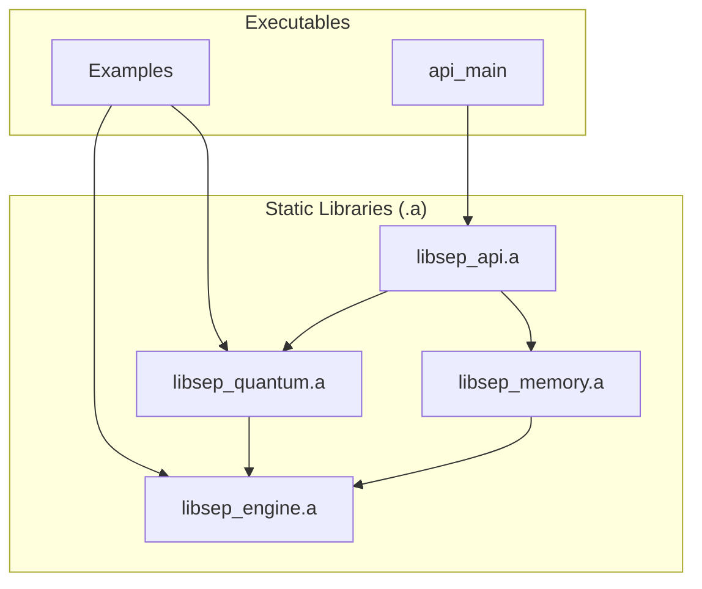

# SEP Dynamics: A New Paradigm in Data Intelligence

## 1. Executive Summary: The Algorithm of Reality. Quantified.

**SEP Dynamics** is not just a fintech company; we are a **foundational data intelligence firm** commercializing the **Self-Emergent Processor (SEP) Engine**—a proprietary, high-performance C++ framework that redefines how complex data is analyzed. Our engine offers a fundamentally new method for understanding *any* data stream by quantifying its **informational coherence** and **stability**, enabling us to discern predictive patterns and **emergent forces** in chaotic environments, far beyond the limits of conventional analytics.

**The Problem:** Traditional data models—from Black-Scholes to modern AI—are inherently limited. They rely on rigid assumptions, demand brittle, format-specific data, and operate as opaque "black boxes." This fundamental inadequacy leads to billions in annual losses, underestimated risks, and critical missed opportunities across every data-driven industry. They cannot perceive, let alone predict, the *emergent properties* of complex systems.

**Our Solution:** The SEP Engine leverages proprietary, **quantum-field-theory-inspired algorithms (QFH and QBSA kernels)** to analyze pattern evolution directly from *raw byte streams*. This allows us to mechanistically measure a data stream's intrinsic consistency ("coherence") and its resistance to change ("stability"). The technology is mature, its performance is benchmarked, and its core claims are **verifiable through working proofs of concept** rooted in a unified theory of informational forces.

**The Founder:** Alexander Nagy (B.S. Mechanical Engineering, University of Oklahoma, 2019) combines a deep, first-principles understanding of thermodynamics, systems engineering, and fundamental physics with a proven track record in high-stakes execution, from developing control systems for Mark Rober to mission-critical automation for Apple's manufacturing at Flex (2022-2025). Seven months ago, he built the SEP Engine from scratch, driven by the conviction that reality itself is algorithmic.

**Funding and Vision:** We seek a **$500,000 line of credit** to establish corporate foundations, secure intellectual property, and launch initial **proprietary trading operations**. This de-risked strategy focuses on generating revenue first to prove the model's profitability in a high-stakes market, supplemented by parallel non-dilutive funding. Long-term, SEP Dynamics will license its foundational technology, aiming to become the indispensable analytic platform for any complex data environment.

## 2. The Core Technology: The Self-Emergent Processor (SEP) Engine

The SEP Engine is a modular, high-performance C++ framework designed for real-time, first-principles analysis of complex data.

### 2.1. Fundamental Principle: Informational QED

The SEP Engine operates on a novel interpretation of interaction: an **informational QED**, where emergent forces within an informational manifold are mediated by **virtual informational photons**. This framework explains how coherence, stability, and the very patterns of reality arise directly from raw data streams.

*   **QFH (Quantum Fourier Hierarchy): The Phase Aligner.** QFH analyzes and establishes the fundamental periodicities and phase alignments of data, analogous to wavefunction interference. It discerns underlying informational structures and their inherent coherence.
*   **QBSA (Quantum Bit State Analysis): The Coherence Prober.** QBSA functions as SEP's deterministic probing mechanism. It performs a differential comparison between consecutive data states, identifying persistent coherence and critical 'ruptures' in informational flow.

### 2.2. System Architecture

The engine is compiled into executables that link a set of self-contained static libraries, ensuring a clean, unidirectional dependency graph.

*   **`engine`**: The foundational library providing core utilities, CUDA kernels, and the GPU abstraction layer.
*   **`quantum`**: Contains the quantum-inspired algorithms for analyzing and evolving patterns, including QBSA and QFH.
*   **`memory`**: Manages the three-tiered memory hierarchy (STM, MTM, LTM) and handles optional pattern persistence via Redis.
*   **`api`**: Exposes the engine's functionality via an HTTP server and a stable C-style bridge.

### 2.3. The Predictive Gauge

The primary output of the SEP engine is a set of quantifiable metrics (coherence, stability, entropy) that are combined into a single, powerful **predictive gauge**—a leading indicator for market analysis.

`gauge = (w_c * coherence_norm) + (w_s * stability_norm) - (w_e * entropy_norm)`

Each metric is normalized using a rolling Z-score, and the final gauge is smoothed by a 20-period simple moving average.

## 3. Verifiable Claims & Proofs of Concept

1.  **True Datatype-Agnostic Analysis (PoC #1 & #3):** Ingests *any* data as a raw byte stream, proven with distinct coherence scores for random (**0.0561**), repetitive (**1.0000**), and compiled executable (**0.4682**) data.
2.  **Mathematically Robust & Compositional Metrics (PoC #5):** Analysis of a large data stream is equivalent to its parts, with <**0.0015** variance, ensuring reliability for streaming data.
3.  **Stateful and Reproducible Time-Series Analysis (PoC #2):** Can retain pattern memory or be cleared for clean backtesting.
4.  **High-Performance, Scalable Architecture (PoC #4):** Processes sample data in **~27 microseconds** (~7.8 MB/s) with proven linear scalability.

## 4. Go-to-Market & Project Status

Our strategy is to first prove commercial viability via proprietary trading and then expand. The project is currently in the **Financial Analysis & Backtesting** phase.

*   **Phase 1: Proprietary Trading Validation (Months 1-6):** Deploy the engine in-house to trade options and forex, targeting a 30% annual return.
*   **Phase 2: Institutional Partnerships (Months 6-12):** License to 2-3 hedge funds at $50K-$100K/month per seat.
*   **Phase 3: Platform Expansion (Year 2+):** Offer broader API access to other data-intensive markets.

## 5. The Team

*   **Founder, CEO & Chief Scientist:** Alexander Nagy
*   **Co-Founder:** William Nagy
*   **Identified Hires:**
    *   Executive Producer / Project Manager (Former Mark Rober EP)
    *   Director of Program Management (Former Flex DPM)
    *   Operations Manager (Fintech experience)
*   **Advisory Board:** Approaching an angel investor for a $50K investment (0.5% equity + advisory role).