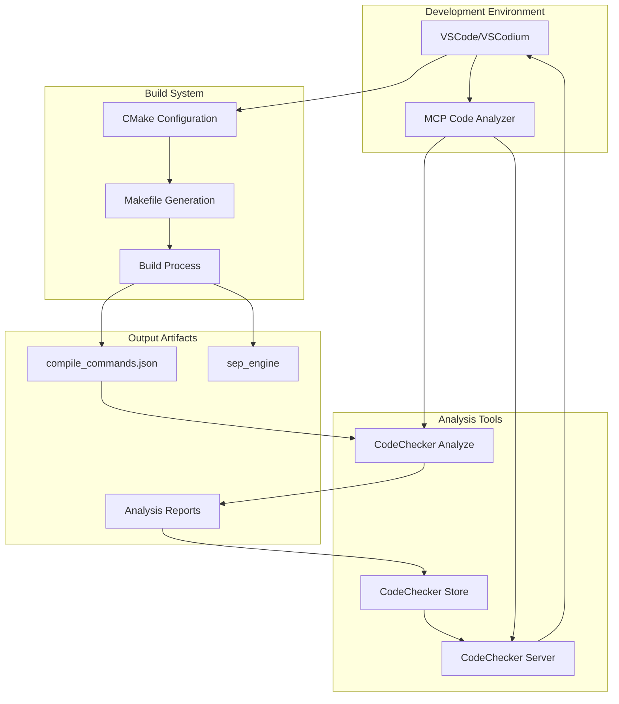
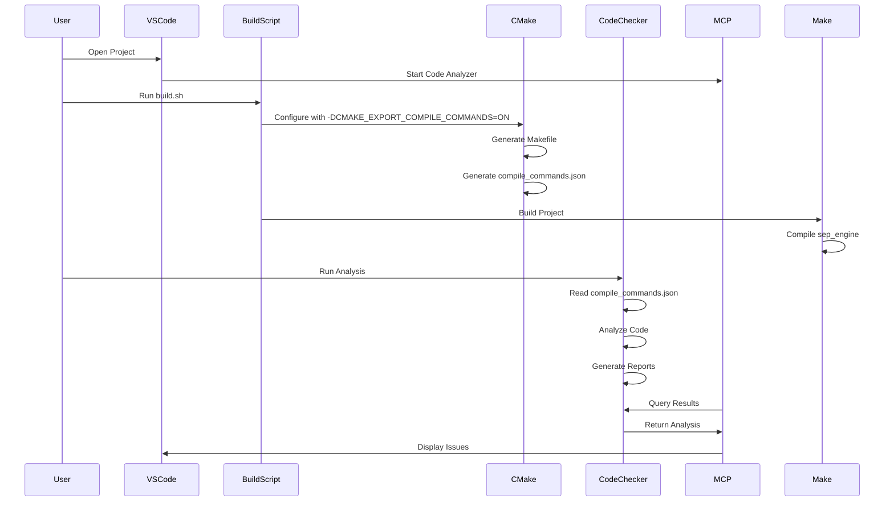
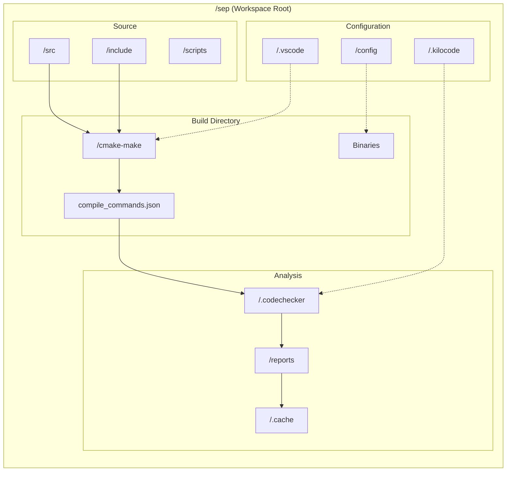
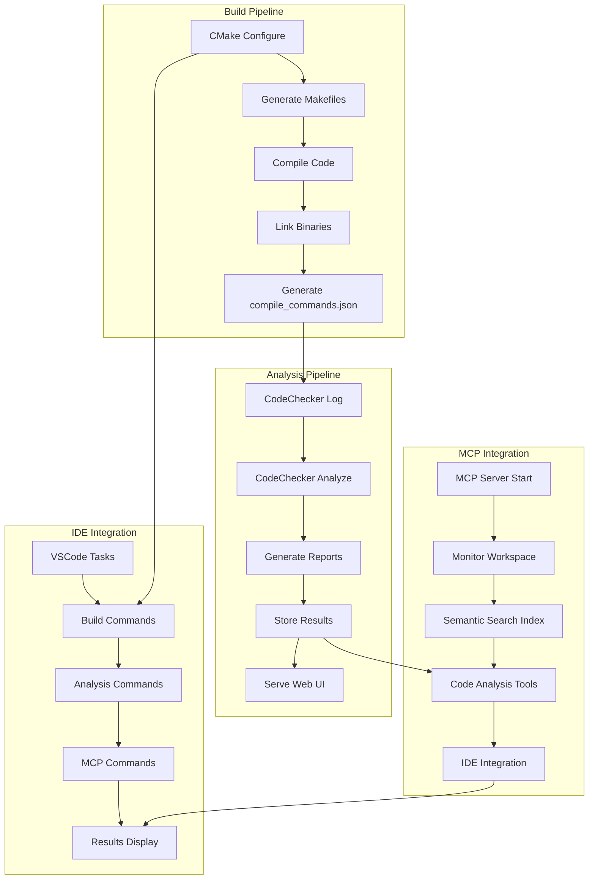
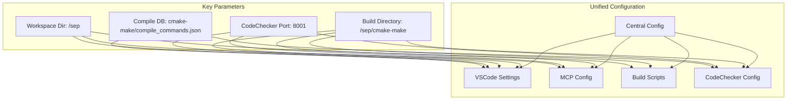

## Current Issues Identified

1. **Build Directory Inconsistency**:
   - MCP config: `/sep/cmake-make`
   - build.sh: `/sep/cmake-make`
   - VSCode: `${workspaceFolder}/cmake-make`
   - CodeChecker helper: `$PWD/cmake-make/compile_commands.json`

2. **Compile Commands Location**:
   - VSCode settings: `${workspaceFolder}/compile_commands.json` (symlink)
   - CodeChecker expects: `cmake-make/compile_commands.json`
   - CMake generates: in the build directory

3. **Path References**: Mix of absolute (`/sep`) and relative paths

## Proposed Integration Architecture

Let me create a multi-dimensional Mermaid diagram showing how these components should integrate:

### 1. System-Level Integration Flow

### 2. Configuration Synchronization Flow

### 3. Directory Structure and Data Flow

### 4. Process Integration Architecture

### 5. Configuration Harmonization Plan

## Detailed Integration Plan

### 1. **Standardize Build Directory**
   - Use `/sep/cmake-make` consistently across all tools
   - `build.sh` outputs to `cmake-make` and symlinks `compile_commands.json` to the repo root
   - Analysis scripts read `cmake-make/compile_commands.json`

### 2. **Update Configuration Files**
   - Synchronize paths in all configuration files
   - Use consistent environment variables
   - Create symlinks where necessary for compatibility

### 3. **Create Integration Scripts**
   - Unified startup script that:
     - Starts CodeChecker server
     - Launches MCP code analyzer
     - Sets up proper environment variables
   
### 4. **VSCode Task Integration**
   - Update tasks to use consistent paths
   - Add tasks for full workflow automation
   - Integrate MCP tools with build pipeline

### 5. **MCP Server Enhancement**
   - Configure to use correct build directory
   - Set up proper tool permissions
   - Enable semantic search on analysis results
