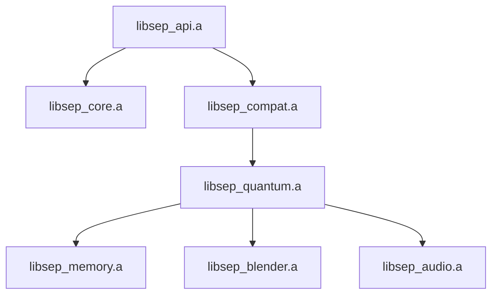

# SEP Engine: A GPU-Accelerated Framework for Simulating Emergent Systems

**Author:** [Your Name]

## Vision

Experience from developing physics-heavy simulations has shown the limitations of traditional, single-threaded game engine architectures. The SEP Engine is a forward-looking solution, designed from first principles in C++/CUDA to model complex, emergent phenomena by treating information itself as a physical entity. It is a foundational platform for research into everything from material science to cosmological models.

### Core Demonstration

**Minimal Viable Product: The sep_engine_cli**

To validate the core architecture, a minimal, runnable command-line application demonstrates the foundational core and quantum modules processing a pattern through an evolution loop.

[Watch the live demo here](https://example.com)

---

## System Architecture

### Module Breakdown
- **libsep_core.a:** The foundational layer. Consolidates cross-cutting concerns like logging, metrics, configuration, and the core DAG implementation.
- **libsep_compat.a:** GPU abstraction layer encapsulating all CUDA-specific code, kernels, and RAII wrappers, allowing CPU-only fallback compilation.
- **libsep_quantum.a:** Implements the quantum-inspired QBSA and QFH algorithms for pattern analysis and evolution.
- **libsep_memory.a:** Manages the STM/MTM/LTM hierarchy and optional Redis persistence, promoting and demoting data based on coherence and stability metrics.
- **libsep_blender.a & libsep_audio.a:** Optional integration modules providing visualization and sensory input.
- **libsep_api.a:** Public interface exposing engine functionality through a multi-threaded HTTP server and a stable C-API bridge for external tools.

---

## Technical Deep Dive - Key Engineering Challenges

### Managing Extreme Dependency Complexity
Integrating massive third-party libraries like Blender/Cycles, OSL, OIIO, and TBB alongside a custom CUDA backend creates significant risks of header conflicts and linking errors. A strict, unidirectional dependency graph and the use of precompiled headers ensure a stable build process via CMake.

### Building a Portable High-Performance Backend
Leveraging GPU acceleration is critical for performance, but hard-coding CUDA calls throughout the engine would make it non-portable and difficult to maintain. The `libsep_compat.a` library serves as a hardware abstraction layer so the rest of the engine remains GPU-agnostic.

### Real-Time Visualization of Abstract Data
Visualizing an abstract, N-dimensional "quantum state" requires mapping engine metrics directly to material properties in Blender's Cycles renderer, providing immediate feedback on system state.

---

## The Path Forward & Contact

The next logical step for this framework is the **SEP Workbench**, a standalone application showcasing demos like the Genesis Pattern, the Audio-Visual Synthesizer, and the Memory Garden. This will transform the engine from a foundational technology into a demonstrative platform.

**Contact**

[Your Name]

[Phone Number]

[Professional Email]

[LinkedIn Profile URL]
